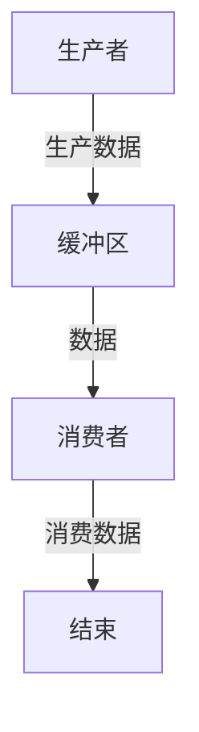

# 操作系统进程同步

## 介绍

在多任务操作系统中，多个进程可能会同时运行并共享系统资源。如果这些进程没有正确协调，可能会导致**竞态条件**（Race Condition）或**数据不一致**等问题。为了解决这些问题，操作系统引入了**进程同步**的概念。

进程同步是指通过某种机制，确保多个进程在访问共享资源时能够有序、协调地执行，从而避免冲突和数据损坏。常见的同步机制包括**互斥锁**、**信号量**、**条件变量**等。

---

## 为什么需要进程同步？

假设有两个进程 A 和 B，它们都需要访问同一个共享变量 `counter`。如果它们同时尝试修改 `counter`，可能会导致以下问题：

1. **竞态条件**：进程 A 和 B 同时读取 `counter` 的值，然后分别对其进行修改，最终结果可能不符合预期。
2. **数据不一致**：由于修改顺序不确定，`counter` 的最终值可能无法正确反映两个进程的操作。

为了解决这些问题，我们需要引入同步机制。

---

## 进程同步的基本概念

### 1. 临界区（Critical Section）

临界区是指进程中访问共享资源的代码段。为了保证数据的一致性，任何时候只能有一个进程进入临界区。

```c
// 伪代码示例
void critical_section() {
    // 进入临界区
    // 访问共享资源
    // 退出临界区
}
```

### 2. 互斥锁（Mutex）

互斥锁是一种最简单的同步机制，用于确保同一时间只有一个进程可以进入临界区。

```c
#include <pthread.h>

pthread_mutex_t lock;

void* thread_function(void* arg) {
    pthread_mutex_lock(&lock); // 加锁
    // 临界区代码
    pthread_mutex_unlock(&lock); // 解锁
    return NULL;
}
```

### 3. 信号量（Semaphore）

信号量是一种更通用的同步机制，可以用于控制多个进程对共享资源的访问。信号量的值表示可用资源的数量。

```c
#include <semaphore.h>

sem_t semaphore;

void* thread_function(void* arg) {
    sem_wait(&semaphore); // 等待信号量
    // 临界区代码
    sem_post(&semaphore); // 释放信号量
    return NULL;
}
```

---

## 实际案例：生产者-消费者问题

生产者-消费者问题是经典的进程同步问题。生产者进程生成数据并将其放入缓冲区，而消费者进程从缓冲区中取出数据。如果缓冲区已满，生产者必须等待；如果缓冲区为空，消费者必须等待。

### 解决方案

我们可以使用信号量来解决这个问题：

```c
#include <semaphore.h>
#include <pthread.h>

#define BUFFER_SIZE 10

int buffer[BUFFER_SIZE];
int count = 0;

sem_t empty; // 表示空闲缓冲区数量
sem_t full;  // 表示已用缓冲区数量
pthread_mutex_t mutex; // 互斥锁

void* producer(void* arg) {
    while (1) {
        int item = produce_item(); // 生产数据
        sem_wait(&empty); // 等待空闲缓冲区
        pthread_mutex_lock(&mutex); // 进入临界区
        buffer[count++] = item; // 放入缓冲区
        pthread_mutex_unlock(&mutex); // 退出临界区
        sem_post(&full); // 增加已用缓冲区数量
    }
}

void* consumer(void* arg) {
    while (1) {
        sem_wait(&full); // 等待已用缓冲区
        pthread_mutex_lock(&mutex); // 进入临界区
        int item = buffer[--count]; // 取出数据
        pthread_mutex_unlock(&mutex); // 退出临界区
        sem_post(&empty); // 增加空闲缓冲区数量
        consume_item(item); // 消费数据
    }
}
```

### 流程图



---

## 总结

进程同步是操作系统中非常重要的概念，它确保了多个进程能够安全地访问共享资源，避免了竞态条件和数据不一致的问题。通过互斥锁、信号量等机制，我们可以有效地实现进程同步。

在实际应用中，生产者-消费者问题是一个经典的例子，展示了如何通过同步机制解决并发问题。

---

## 附加资源与练习

### 推荐资源
- 《操作系统概念》（Operating System Concepts）—— Abraham Silberschatz 等
- [Linux 多线程编程指南](https://www.man7.org/linux/man-pages/)

### 练习
1. 实现一个简单的多线程程序，使用互斥锁保护共享变量。
2. 扩展生产者-消费者问题，支持多个生产者和消费者。
3. 研究并实现一个使用条件变量的同步机制。

:::tip
在编写多线程程序时，务必注意死锁问题。死锁是指多个进程或线程相互等待对方释放资源，导致程序无法继续执行。
:::