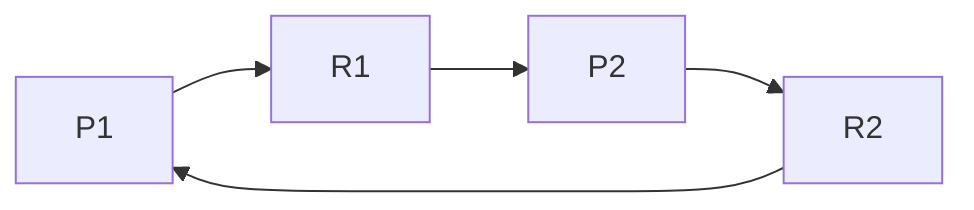

# 操作系统死锁

在操作系统中，**死锁**（Deadlock）是指多个进程或线程在执行过程中，因为争夺资源而造成的一种互相等待的现象，导致这些进程或线程都无法继续执行下去。死锁是并发编程中一个常见且棘手的问题，理解其原理和解决方法对于编写高效、稳定的程序至关重要。

## 什么是死锁？

死锁通常发生在多个进程或线程需要同时访问共享资源时。当每个进程都持有部分资源，并等待其他进程释放它们所需的资源时，就可能陷入死锁状态。这种情况下，所有相关进程都会无限期地等待，无法继续执行。

### 死锁的必要条件

死锁的发生需要满足以下四个必要条件，通常称为**死锁的四个必要条件**：

1. **互斥条件**（Mutual Exclusion）：资源一次只能被一个进程占用。
2. **占有并等待**（Hold and Wait）：进程已经占有了至少一个资源，并且正在等待获取其他被占用的资源。
3. **非抢占条件**（No Preemption）：已分配给进程的资源不能被其他进程强行夺取，必须由进程自行释放。
4. **循环等待条件**（Circular Wait）：存在一个进程等待的循环链，每个进程都在等待下一个进程所占用的资源。

只有当这四个条件同时满足时，死锁才会发生。

## 死锁的示例

为了更好地理解死锁，我们来看一个简单的代码示例。假设有两个线程 `Thread A` 和 `Thread B`，它们分别需要访问两个资源 `Resource 1` 和 `Resource 2`。

```python
import threading

# 定义两个锁
lock1 = threading.Lock()
lock2 = threading.Lock()

def thread_a():
    lock1.acquire()
    print("Thread A acquired Resource 1")
    lock2.acquire()
    print("Thread A acquired Resource 2")
    lock2.release()
    lock1.release()

def thread_b():
    lock2.acquire()
    print("Thread B acquired Resource 2")
    lock1.acquire()
    print("Thread B acquired Resource 1")
    lock1.release()
    lock2.release()

# 创建并启动线程
t1 = threading.Thread(target=thread_a)
t2 = threading.Thread(target=thread_b)
t1.start()
t2.start()
t1.join()
t2.join()
```

在这个例子中，`Thread A` 首先获取 `Resource 1`，然后尝试获取 `Resource 2`。与此同时，`Thread B` 首先获取 `Resource 2`，然后尝试获取 `Resource 1`。如果两个线程同时执行，它们可能会陷入死锁状态，因为每个线程都在等待另一个线程释放资源。

### 输出示例

```
Thread A acquired Resource 1
Thread B acquired Resource 2
```

此时，程序将无法继续执行，因为两个线程都在等待对方释放资源。

## 死锁的检测与预防

### 死锁检测

操作系统可以通过资源分配图（Resource Allocation Graph）来检测死锁。资源分配图是一种有向图，用于表示进程和资源之间的关系。如果图中存在环路，则说明可能存在死锁。



在上图中，`P1` 和 `P2` 分别代表两个进程，`R1` 和 `R2` 代表两个资源。图中存在一个环路 `P1 -> R1 -> P2 -> R2 -> P1`，说明系统可能发生了死锁。

### 死锁预防

为了避免死锁，可以采取以下策略：

1. **破坏互斥条件**：允许资源被多个进程共享。然而，并非所有资源都可以共享，例如打印机等设备。
2. **破坏占有并等待条件**：要求进程在开始执行前一次性获取所有需要的资源。如果无法获取所有资源，则进程必须等待。
3. **破坏非抢占条件**：允许操作系统强制剥夺进程的资源。这种方法可能会导致进程状态的不一致。
4. **破坏循环等待条件**：对资源进行排序，并要求进程按照顺序请求资源。这样可以避免循环等待的发生。

## 实际应用场景

死锁问题在数据库系统、文件系统、网络协议等许多领域都有可能出现。例如，在数据库事务中，如果两个事务分别锁定了不同的表，并且试图锁定对方已经锁定的表，就可能发生死锁。

:::note
**注意**：在实际开发中，死锁问题往往难以调试和复现。因此，在设计并发程序时，应尽量避免死锁的发生。
:::

## 总结

死锁是操作系统和并发编程中的一个重要概念。理解死锁的必要条件、检测方法和预防策略，对于编写高效、稳定的程序至关重要。通过合理的设计和资源管理，可以有效避免死锁的发生。

## 附加资源与练习

- **练习**：尝试修改上面的代码示例，使其不会发生死锁。你可以通过调整锁的获取顺序来实现。
- **进一步阅读**：推荐阅读《操作系统概念》（Operating System Concepts）一书，深入了解死锁及其相关算法。

希望这篇内容能帮助你更好地理解操作系统中的死锁问题！如果你有任何问题或建议，欢迎在评论区留言。