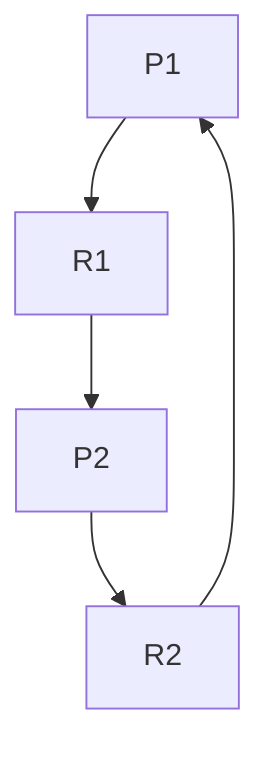

# 操作系统死锁处理

在操作系统中，**死锁**（Deadlock）是指多个进程因竞争资源而陷入无限等待的状态，导致系统无法继续运行。死锁是操作系统设计和实现中需要解决的重要问题之一。本文将详细介绍死锁的概念、原因、检测方法以及预防和恢复策略。

## 什么是死锁？

死锁是指多个进程在执行过程中，因为争夺资源而造成的一种互相等待的现象。如果没有外力干预，这些进程将永远无法继续执行。死锁通常发生在多任务操作系统中，尤其是在资源分配和调度过程中。

### 死锁的四个必要条件

死锁的发生需要满足以下四个必要条件：

1. **互斥条件**（Mutual Exclusion）：资源一次只能被一个进程占用。
2. **占有并等待**（Hold and Wait）：进程已经占有了至少一个资源，并且正在等待获取其他被占用的资源。
3. **非抢占条件**（No Preemption）：已分配给进程的资源不能被其他进程强行抢占，必须由进程自行释放。
4. **循环等待条件**（Circular Wait）：存在一个进程等待的循环链，每个进程都在等待下一个进程所占用的资源。

只有当这四个条件同时满足时，死锁才会发生。

## 死锁的检测

操作系统可以通过**资源分配图**（Resource Allocation Graph）来检测死锁。资源分配图是一种有向图，用于表示进程和资源之间的关系。

### 资源分配图示例



在上图中，`P1` 和 `P2` 是两个进程，`R1` 和 `R2` 是两种资源。箭头表示进程请求资源或资源被进程占用。如果图中存在一个循环，则说明系统可能发生了死锁。

### 死锁检测算法

操作系统可以使用**银行家算法**（Banker's Algorithm）来检测死锁。该算法通过模拟资源分配过程，判断系统是否处于安全状态。如果系统处于不安全状态，则可能发生死锁。

## 死锁的预防

为了防止死锁的发生，操作系统可以采用以下策略：

1. **破坏互斥条件**：允许资源被多个进程共享。然而，某些资源（如打印机）无法共享。
2. **破坏占有并等待条件**：要求进程在请求资源时，必须释放所有已占用的资源。
3. **破坏非抢占条件**：允许操作系统强行抢占进程占用的资源。
4. **破坏循环等待条件**：对资源进行编号，要求进程按照编号顺序请求资源。

### 实际案例：资源顺序分配

假设系统中有两种资源 `R1` 和 `R2`，并且规定所有进程必须先请求 `R1`，再请求 `R2`。这样可以避免循环等待条件的发生。

```python
# 进程请求资源的顺序
def request_resources(process):
    process.request(R1)
    process.request(R2)
```

## 死锁的恢复

如果系统已经发生死锁，操作系统可以采取以下措施进行恢复：

1. **终止进程**：终止一个或多个死锁进程，释放其占用的资源。
2. **资源抢占**：从某些进程中抢占资源，分配给其他进程。

### 实际案例：终止死锁进程

假设系统中有两个进程 `P1` 和 `P2` 发生了死锁。操作系统可以选择终止 `P1`，释放其占用的资源，从而使 `P2` 能够继续执行。

```python
# 终止死锁进程
def terminate_process(process):
    process.terminate()
    release_resources(process)
```

## 总结

死锁是操作系统中一个复杂但重要的问题。通过理解死锁的四个必要条件，我们可以采取相应的预防和恢复策略来避免或解决死锁问题。死锁检测算法和资源分配图是检测死锁的有效工具，而资源顺序分配和进程终止则是常用的预防和恢复方法。

## 附加资源与练习

- **练习**：尝试编写一个简单的多线程程序，模拟死锁的发生，并使用资源顺序分配策略避免死锁。
- **进一步阅读**：推荐阅读《操作系统概念》（Operating System Concepts）一书，深入了解死锁及其处理策略。

:::tip
死锁处理是操作系统设计中的核心问题之一。通过本文的学习，你应该能够理解死锁的基本概念，并掌握一些常见的预防和恢复策略。继续深入学习操作系统相关知识，将有助于你更好地理解计算机系统的运行机制。
:::