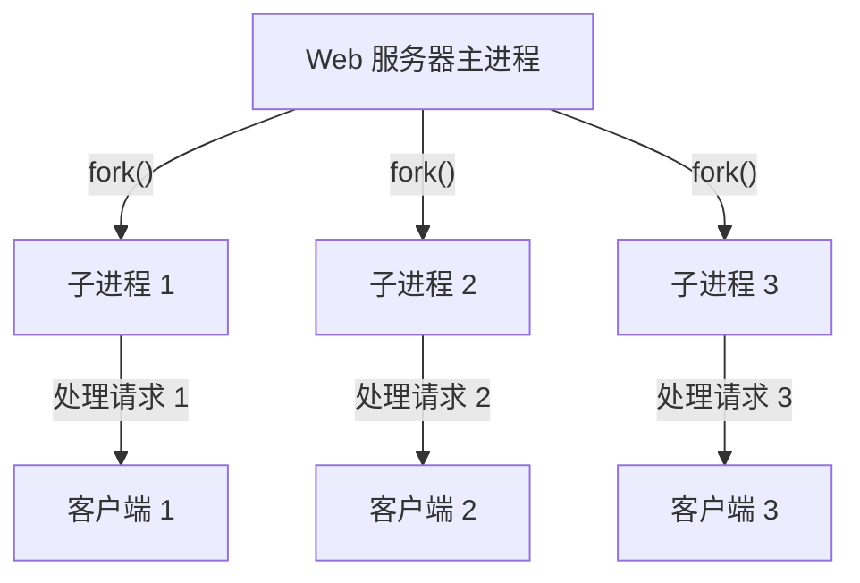

## 介绍

在操作系统中，**进程**是程序执行的实例。每个进程都有自己的内存空间、资源和执行状态。进程创建是操作系统管理任务的核心功能之一，它允许系统同时运行多个程序，并为每个程序提供独立的执行环境。

本文将逐步讲解进程创建的基本概念、步骤以及实际应用场景，帮助你理解操作系统如何管理和调度进程。

## 什么是进程创建？

进程创建是指操作系统通过复制现有进程或加载新程序来生成一个新进程的过程。新进程通常被称为**子进程**，而创建它的进程被称为**父进程**。子进程继承了父进程的许多属性，但也可以拥有自己独立的资源和执行路径。

### 进程创建的基本步骤

1. **分配资源**：操作系统为新进程分配内存、文件描述符等资源。
2. **复制父进程**：子进程通常通过复制父进程的地址空间来创建。
3. **加载新程序**（可选）：如果子进程需要执行不同的程序，操作系统会加载新程序到子进程的内存空间。
4. **设置执行环境**：操作系统为子进程设置初始状态，包括程序计数器、堆栈指针等。
5. **调度执行**：子进程被放入就绪队列，等待调度器分配 CPU 时间片。

## 进程创建的实际应用

### 1. 使用 `fork()` 系统调用

在类 Unix 系统中，`fork()` 是最常用的进程创建方法。它通过复制当前进程来创建一个子进程。子进程从 `fork()` 的返回值开始执行。

```c
#include <stdio.h>
#include <unistd.h>

int main() {
    pid_t pid = fork(); // 创建子进程

    if (pid == 0) {
        // 子进程
        printf("这是子进程，PID: %d\n", getpid());
    } else if (pid > 0) {
        // 父进程
        printf("这是父进程，PID: %d，子进程 PID: %d\n", getpid(), pid);
    } else {
        // fork 失败
        printf("fork 失败\n");
    }

    return 0;
}
```

**输出示例：**
```
这是父进程，PID: 1234，子进程 PID: 1235
这是子进程，PID: 1235
```

:::note
`fork()` 的返回值在父进程中返回子进程的 PID，在子进程中返回 0。如果 `fork()` 失败，则返回 -1。
:::

### 2. 使用 `exec()` 系列函数

`exec()` 系列函数用于加载新程序到当前进程的内存空间，并替换当前进程的执行内容。通常与 `fork()` 结合使用。

```c
#include <stdio.h>
#include <unistd.h>

int main() {
    pid_t pid = fork();

    if (pid == 0) {
        // 子进程
        execlp("/bin/ls", "ls", NULL); // 替换为 ls 命令
        printf("如果 execlp 成功，这行不会执行\n");
    } else if (pid > 0) {
        // 父进程
        printf("父进程继续执行\n");
    } else {
        printf("fork 失败\n");
    }

    return 0;
}
```

**输出示例：**
```
父进程继续执行
file1.txt file2.txt file3.txt
```

:::tip
`exec()` 系列函数不会创建新进程，而是替换当前进程的执行内容。因此，通常与 `fork()` 结合使用以实现新程序的执行。
:::

## 进程创建的实际案例

### 案例：Web 服务器中的进程创建

Web 服务器（如 Apache 或 Nginx）通常使用进程创建来处理多个客户端请求。当一个新的客户端连接到服务器时，服务器会创建一个子进程来处理该请求，而父进程继续监听新的连接。



通过这种方式，Web 服务器可以同时处理多个客户端请求，而不会阻塞主进程。

## 总结

进程创建是操作系统中的核心功能之一，它允许系统同时运行多个程序并为每个程序提供独立的执行环境。通过 `fork()` 和 `exec()` 等系统调用，操作系统可以高效地管理进程的创建和执行。

在实际应用中，进程创建广泛用于多任务处理、服务器编程等场景。理解进程创建的机制对于深入学习操作系统和系统编程至关重要。

## 附加资源与练习

- **练习 1**：编写一个程序，使用 `fork()` 创建 3 个子进程，并让每个子进程打印自己的 PID。
- **练习 2**：修改上述程序，使用 `exec()` 让每个子进程执行不同的命令（如 `ls`、`pwd` 等）。
- **推荐阅读**：
  - 《操作系统概念》（Abraham Silberschatz 等）
  - 《UNIX 环境高级编程》（W. Richard Stevens）

通过实践和阅读，你将更深入地理解进程创建的机制及其在操作系统中的应用。