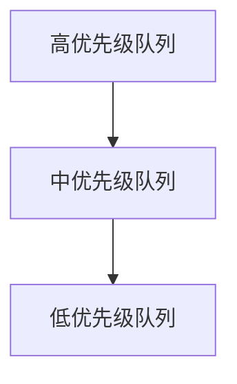

# 操作系统调度优化

操作系统调度优化是计算机科学中的一个重要领域，它关注如何高效地分配系统资源（如 CPU 时间）给多个任务或进程。通过优化调度算法，操作系统可以显著提高系统的响应速度、吞吐量和资源利用率。本文将逐步介绍操作系统调度的基本概念、常见调度算法以及优化方法。

## 什么是操作系统调度？

操作系统调度是指操作系统决定哪个进程或线程在何时使用 CPU 的过程。在多任务操作系统中，多个进程可能同时竞争 CPU 资源，调度器的任务就是公平、高效地分配这些资源。

### 调度的目标
- **公平性**：确保每个进程都能获得一定的 CPU 时间。
- **响应时间**：减少用户交互式任务的等待时间。
- **吞吐量**：在单位时间内完成尽可能多的任务。
- **资源利用率**：最大化 CPU 和其他资源的使用效率。

## 常见的调度算法

以下是几种常见的调度算法及其特点：

### 1. 先来先服务（FCFS）
FCFS 是最简单的调度算法，按照进程到达的顺序分配 CPU 时间。它的优点是实现简单，但可能导致“饥饿”问题，即长任务阻塞短任务。

### 2. 最短作业优先（SJF）
SJF 选择预计运行时间最短的进程优先执行。这种算法可以最大化吞吐量，但需要预先知道每个任务的运行时间。

### 3. 时间片轮转（RR）
RR 算法为每个进程分配一个固定的时间片（如 10ms），当时间片用完后，调度器切换到下一个进程。这种方法适合交互式系统，但时间片的选择会影响性能。

### 4. 优先级调度
优先级调度根据进程的优先级分配 CPU 时间。高优先级的进程会优先执行，但可能导致低优先级进程的“饥饿”问题。

## 调度优化技术

### 1. 动态优先级调整
通过动态调整进程的优先级，可以避免低优先级进程长时间得不到执行。例如，Linux 的 CFS（完全公平调度器）会根据进程的等待时间动态调整优先级。

### 2. 多级反馈队列（MLFQ）
MLFQ 结合了多种调度算法的优点，将进程分为多个队列，每个队列使用不同的调度策略。进程可以根据其行为在不同队列之间迁移。

### 3. 负载均衡
在多核系统中，负载均衡技术可以将任务均匀分配到各个 CPU 核心上，避免某些核心过载而其他核心空闲。

## 实际应用案例

### 案例 1：Web 服务器的请求调度
在高流量的 Web 服务器中，操作系统需要快速响应大量并发请求。通过使用时间片轮转和优先级调度，可以确保关键请求（如登录请求）优先处理，同时避免低优先级请求被完全忽略。

### 案例 2：实时操作系统（RTOS）
在实时操作系统中，调度优化至关重要。例如，自动驾驶系统需要确保关键任务（如传感器数据处理）在严格的时间限制内完成。优先级调度和动态优先级调整是常用的优化手段。

## 总结

操作系统调度优化是提升系统性能的关键技术之一。通过合理选择调度算法和优化策略，可以显著提高系统的响应速度、吞吐量和资源利用率。对于初学者来说，理解这些基本概念是进一步学习操作系统和性能优化的基础。

## 附加资源与练习

### 资源
- 《操作系统概念》（Abraham Silberschatz 等）
- Linux 内核调度器文档

### 练习
1. 实现一个简单的 FCFS 调度器，模拟多个进程的执行顺序。
2. 修改上述调度器，加入优先级调度功能，观察高优先级进程的执行情况。
3. 研究 Linux 的 CFS 调度器，尝试理解其动态优先级调整机制。

:::tip
尝试在实际环境中观察操作系统的调度行为，例如使用 `top` 或 `htop` 工具监控进程的 CPU 使用情况。
:::