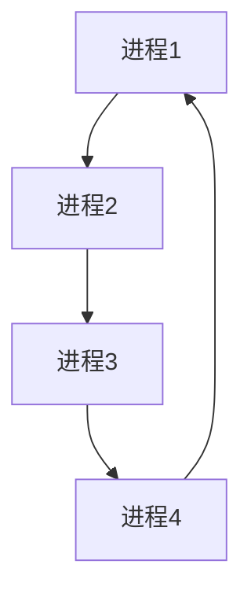

## 介绍

操作系统（OS）是计算机系统的核心，负责管理和分配硬件资源，如 CPU、内存、磁盘和网络等。资源利用是指操作系统如何有效地使用这些资源来运行应用程序。理解资源利用的原理，可以帮助你编写更高效的程序，并优化系统性能。

在本节中，我们将探讨操作系统如何管理资源，以及如何通过优化资源利用来提升程序的性能。

## 操作系统资源管理

操作系统的主要任务之一是管理硬件资源。以下是操作系统管理的几种关键资源：

1. **CPU 时间**：操作系统通过调度算法分配 CPU 时间给不同的进程。
2. **内存**：操作系统管理物理内存和虚拟内存，确保每个进程都有足够的内存空间。
3. **磁盘 I/O**：操作系统管理磁盘读写操作，优化数据存取速度。
4. **网络带宽**：操作系统管理网络连接，确保数据传输的效率和稳定性。

### CPU 时间管理

操作系统使用调度算法来决定哪个进程可以使用 CPU。常见的调度算法包括：

- **先来先服务（FCFS）**：按照进程到达的顺序分配 CPU 时间。
- **短作业优先（SJF）**：优先分配 CPU 时间给执行时间最短的进程。
- **轮转调度（Round Robin）**：每个进程分配一个固定的时间片，轮流使用 CPU。



### 内存管理

操作系统使用虚拟内存技术来扩展物理内存。虚拟内存将磁盘空间作为内存的扩展，允许系统运行比物理内存更大的程序。


### 磁盘 I/O 管理

操作系统通过缓存和预读技术来优化磁盘 I/O 操作。缓存将频繁访问的数据存储在内存中，减少磁盘访问次数。


## 实际案例

### 案例 1：CPU 密集型任务

假设你有一个 CPU 密集型的任务，如视频编码。为了优化性能，你可以使用多线程技术，将任务分解为多个子任务，并行执行。

```python
import threading

def encode_video(start, end):
    # 模拟视频编码
    print(f"Encoding from {start} to {end}")

threads = []
for i in range(4):
    t = threading.Thread(target=encode_video, args=(i*25, (i+1)*25))
    threads.append(t)
    t.start()

for t in threads:
    t.join()
```

**输出：**
```
Encoding from 0 to 25
Encoding from 25 to 50
Encoding from 50 to 75
Encoding from 75 to 100
```

### 案例 2：内存优化

假设你有一个内存密集型的应用程序，如图像处理。为了优化内存使用，你可以使用内存池技术，预先分配内存块，减少内存分配和释放的开销。

```python
class MemoryPool:
    def __init__(self, block_size, num_blocks):
        self.block_size = block_size
        self.num_blocks = num_blocks
        self.pool = [bytearray(block_size) for _ in range(num_blocks)]
        self.used = [False] * num_blocks

    def allocate(self):
        for i in range(self.num_blocks):
            if not self.used[i]:
                self.used[i] = True
                return self.pool[i]
        raise MemoryError("No available blocks")

    def deallocate(self, block):
        index = self.pool.index(block)
        self.used[index] = False

pool = MemoryPool(1024, 10)
block = pool.allocate()
pool.deallocate(block)
```

## 总结

操作系统资源利用是优化程序性能的关键。通过理解操作系统如何管理 CPU、内存、磁盘和网络资源，你可以编写更高效的程序，并优化系统性能。

:::tip
**附加资源：**
- [操作系统概念](https://example.com/os-concepts)
- [性能优化指南](https://example.com/performance-optimization)
:::

:::caution
**练习：**
1. 编写一个多线程程序，模拟 CPU 密集型任务，并观察 CPU 使用率。
2. 使用内存池技术优化一个内存密集型的应用程序，比较优化前后的内存使用情况。
:::