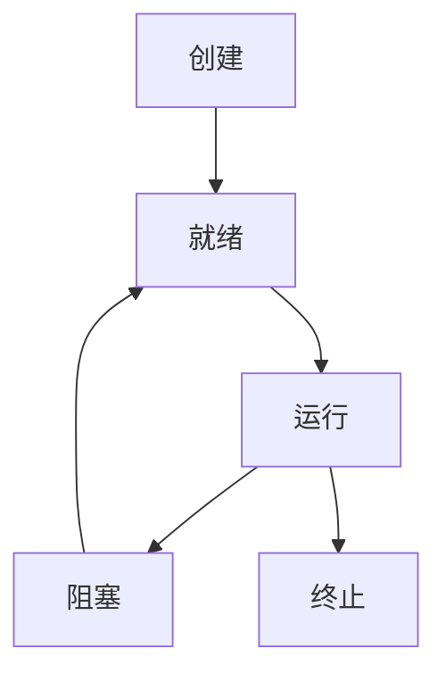

# 操作系统进程优化

在现代计算机系统中，操作系统负责管理硬件资源和运行应用程序。进程是操作系统中的一个基本概念，它代表了一个正在运行的程序实例。为了提高系统性能和资源利用率，进程优化是一个至关重要的任务。本文将介绍操作系统进程优化的基本概念、方法和实际应用场景。

## 什么是进程优化？

进程优化是指通过调整进程的创建、调度、执行和终止等行为，以提高系统的整体性能和资源利用率。优化的目标包括减少响应时间、提高吞吐量、降低资源消耗等。

### 进程的生命周期

在深入优化之前，我们需要了解进程的生命周期。一个进程通常经历以下几个阶段：

1. **创建**：进程被创建并分配资源。
2. **就绪**：进程准备好运行，等待CPU调度。
3. **运行**：进程正在CPU上执行。
4. **阻塞**：进程等待某些事件（如I/O操作）完成。
5. **终止**：进程完成执行并释放资源。



## 进程优化的方法

### 1. 进程调度优化

进程调度是操作系统决定哪个进程在何时使用CPU的过程。常见的调度算法包括：

- **先来先服务（FCFS）**：按照进程到达的顺序进行调度。
- **短作业优先（SJF）**：优先调度执行时间短的进程。
- **轮转调度（RR）**：每个进程分配一个时间片，轮流执行。

:::tip
选择合适的调度算法可以显著提高系统的响应时间和吞吐量。
:::

### 2. 进程优先级调整

操作系统通常为每个进程分配一个优先级，优先级高的进程会优先获得CPU资源。通过调整进程的优先级，可以确保关键任务得到及时处理。

```bash
# 在Linux中，可以使用nice命令调整进程优先级
nice -n 10 ./my_program
```

### 3. 进程间通信优化

进程间通信（IPC）是进程之间交换数据的方式。常见的IPC机制包括管道、消息队列、共享内存等。优化IPC可以减少通信开销，提高系统性能。

```c
// 使用共享内存进行进程间通信
#include <sys/ipc.h>
#include <sys/shm.h>
#include <stdio.h>

int main() {
    int shmid = shmget(IPC_PRIVATE, 1024, 0666|IPC_CREAT);
    char *str = (char*) shmat(shmid, NULL, 0);
    sprintf(str, "Hello, shared memory!");
    printf("Data written in memory: %s\n", str);
    shmdt(str);
    shmctl(shmid, IPC_RMID, NULL);
    return 0;
}
```

### 4. 资源管理优化

操作系统需要管理进程使用的资源，如内存、文件描述符等。通过合理分配和回收资源，可以避免资源浪费和系统崩溃。

:::caution
资源泄漏是常见的问题，务必确保进程在终止时释放所有分配的资源。
:::

## 实际应用场景

### 案例1：Web服务器的进程优化

在一个高流量的Web服务器中，进程优化可以显著提高响应速度和并发处理能力。通过使用多进程模型（如Apache的Prefork MPM），可以并行处理多个请求。

```bash
# 在Apache配置中调整进程数
<IfModule mpm_prefork_module>
    StartServers          5
    MinSpareServers       5
    MaxSpareServers      10
    MaxRequestWorkers   150
    MaxConnectionsPerChild   0
</IfModule>
```

### 案例2：数据库系统的进程优化

数据库系统通常需要处理大量的并发查询。通过优化数据库进程的调度和资源分配，可以提高查询性能和系统稳定性。

```sql
-- 在MySQL中调整线程池大小
SET GLOBAL thread_pool_size = 16;
```

## 总结

操作系统进程优化是提升系统性能的关键技术之一。通过优化进程调度、调整优先级、改进进程间通信和资源管理，可以显著提高系统的响应速度、吞吐量和资源利用率。

## 附加资源

- [操作系统概念（第10版）](https://www.os-book.com/) - 一本经典的操作系统教材，深入讲解了进程管理和优化。
- [Linux进程管理](https://www.kernel.org/doc/html/latest/) - Linux内核文档，提供了关于进程管理的详细信息。

## 练习

1. 编写一个简单的多进程程序，使用共享内存进行进程间通信。
2. 在Linux系统中，使用`nice`命令调整一个进程的优先级，并观察其行为变化。
3. 研究一个开源Web服务器的进程管理机制，并尝试优化其配置。

通过以上学习和实践，你将能够更好地理解和应用操作系统进程优化的技术。