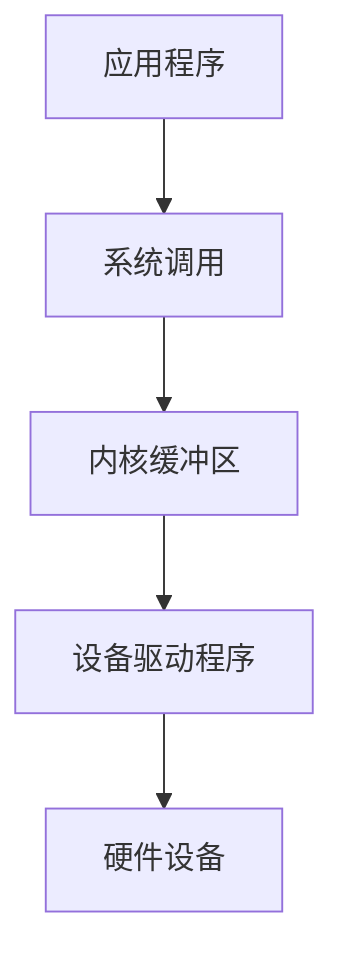

# 操作系统I/O优化

在计算机系统中，I/O（输入/输出）操作是程序与外部设备（如磁盘、网络、键盘等）进行数据交换的关键环节。然而，I/O操作通常比内存访问慢得多，因此优化I/O性能是提升程序整体效率的重要手段。本文将介绍操作系统中的I/O优化技术，帮助初学者理解并应用这些策略。

## 什么是I/O优化？

I/O优化是指通过调整程序或操作系统的行为，减少I/O操作的延迟和开销，从而提高程序的执行效率。常见的优化手段包括缓存、异步I/O、批量处理等。

## I/O操作的基本流程

在深入优化之前，我们需要了解I/O操作的基本流程。以下是一个典型的I/O操作流程：



1. **应用程序**发起I/O请求。
2. **系统调用**将请求传递给操作系统内核。
3. **内核缓冲区**暂存数据，以减少直接访问硬件的次数。
4. **设备驱动程序**负责与硬件设备通信。
5. **硬件设备**执行实际的I/O操作。

## I/O优化的常见策略

### 1. 缓存

缓存是减少I/O操作次数的有效方法。通过将频繁访问的数据存储在内存中，程序可以避免重复访问较慢的存储设备。

:::tip
**示例：文件读取缓存**
```python
# 未使用缓存
with open('large_file.txt', 'r') as file:
    data = file.read()  # 每次读取都需要访问磁盘

# 使用缓存
import io
with open('large_file.txt', 'r') as file:
    buffer = io.BufferedReader(file)
    data = buffer.read()  # 数据被缓存在内存中，减少磁盘访问
```
:::

### 2. 异步I/O

异步I/O允许程序在等待I/O操作完成的同时继续执行其他任务，从而提高CPU利用率。

:::note
**示例：Python中的异步I/O**
```python
import asyncio

async def read_file():
    with open('large_file.txt', 'r') as file:
        data = await file.read()  # 异步读取文件
        print(data)

asyncio.run(read_file())
```
:::

### 3. 批量处理

批量处理是指将多个I/O操作合并为一个操作，以减少系统调用的次数。

:::caution
**示例：批量写入文件**
```python
# 未使用批量处理
with open('output.txt', 'w') as file:
    for i in range(1000):
        file.write(f'Line {i}\n')  # 每次写入都调用系统调用

# 使用批量处理
lines = [f'Line {i}\n' for i in range(1000)]
with open('output.txt', 'w') as file:
    file.writelines(lines)  # 一次性写入所有数据
```
:::

## 实际案例：数据库查询优化

在数据库系统中，I/O优化尤为重要。以下是一个常见的优化场景：

1. **索引**：通过创建索引，数据库可以快速定位数据，减少全表扫描的次数。
2. **预读取**：数据库系统会预读取相邻的数据块，以减少未来的I/O操作。

:::warning
**示例：SQL查询优化**
```sql
-- 未优化查询
SELECT * FROM users WHERE age > 30;  -- 可能需要全表扫描

-- 优化查询
CREATE INDEX idx_age ON users(age);  -- 创建索引
SELECT * FROM users WHERE age > 30;  -- 使用索引快速定位数据
```
:::

## 总结

I/O优化是提升程序性能的重要手段。通过缓存、异步I/O和批量处理等策略，可以显著减少I/O操作的延迟和开销。在实际应用中，结合具体场景选择合适的优化方法，能够有效提升程序的执行效率。

## 附加资源与练习

- **资源**：
  - [操作系统概念](https://example.com/os-concepts)
  - [Python异步编程指南](https://example.com/async-python)
- **练习**：
  - 尝试在Python中实现一个简单的文件缓存系统。
  - 使用异步I/O优化一个网络请求密集型的程序。

通过学习和实践，你将能够更好地理解和应用I/O优化技术，提升程序的性能。