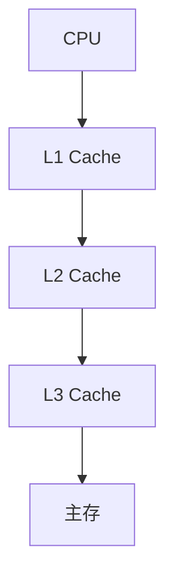

## 介绍

操作系统缓存是计算机系统中用于提高数据访问速度的关键组件。它通过将频繁访问的数据存储在高速缓存中，减少了对较慢的主存储器（如 RAM 或硬盘）的访问次数，从而显著提升了系统性能。缓存优化是指通过合理配置和管理缓存，使其在特定场景下发挥最大效能。

在本篇文章中，我们将探讨操作系统缓存的基本原理、常见的优化策略，以及如何在实际应用中利用这些策略来提升系统性能。

## 缓存的基本原理

操作系统缓存的工作原理可以概括为以下几点：

1. **缓存层级**：现代计算机系统通常采用多级缓存（L1、L2、L3），每一级缓存的速度和容量不同。L1 缓存速度最快但容量最小，L3 缓存速度较慢但容量较大。
2. **缓存命中与未命中**：当 CPU 请求的数据在缓存中找到时，称为“缓存命中”；如果未找到，则需要从主存中加载数据，称为“缓存未命中”。
3. **缓存替换策略**：当缓存已满时，系统需要决定哪些数据被替换出去。常见的替换策略包括最近最少使用（LRU）、先进先出（FIFO）等。



## 缓存优化策略

### 1. 数据局部性优化

数据局部性是指程序倾向于重复访问相同或相邻的数据。优化数据局部性可以显著提高缓存命中率。以下是两种主要的数据局部性：

- **时间局部性**：如果一个数据被访问过，那么它很可能在不久的将来再次被访问。
- **空间局部性**：如果一个数据被访问过，那么它附近的数据也很可能被访问。

:::tip
**示例**：在编写循环时，尽量让循环访问连续的内存区域，而不是跳跃式访问。
:::

```c
// 优化前：跳跃式访问
for (int i = 0; i < N; i++) {
    sum += array[i * stride];
}

// 优化后：连续访问
for (int i = 0; i < N; i++) {
    sum += array[i];
}
```

### 2. 缓存行对齐

缓存行是缓存与主存之间数据传输的最小单位。如果数据没有对齐到缓存行边界，可能会导致额外的缓存未命中。通过确保数据结构对齐到缓存行边界，可以减少这种问题。

:::note
**注意**：缓存行的大小通常为 64 字节，但具体大小取决于硬件架构。
:::

```c
// 未对齐的数据结构
struct Data {
    int a;
    char b;
    int c;
};

// 对齐到缓存行的数据结构
struct AlignedData {
    int a;
    char b;
    int c;
    char padding[56]; // 填充到 64 字节
};
```

### 3. 减少缓存冲突

缓存冲突发生在多个数据项映射到同一个缓存行时，导致频繁的缓存替换。通过调整数据结构或使用缓存友好的算法，可以减少缓存冲突。

:::caution
**警告**：缓存冲突在高并发场景下尤为明显，可能导致性能急剧下降。
:::

```c
// 优化前：可能导致缓存冲突
int array[1024][1024];

// 优化后：减少缓存冲突
int array[1024][1024 + 16]; // 增加填充以避免冲突
```

## 实际案例

### 案例 1：数据库查询优化

在数据库系统中，查询操作通常涉及大量的数据访问。通过优化查询计划，使其尽可能利用缓存，可以显著提高查询性能。

:::tip
**示例**：在 SQL 查询中，使用索引可以减少对全表扫描的需求，从而提高缓存命中率。
:::

```sql
-- 未优化的查询
SELECT * FROM users WHERE age > 30;

-- 优化后的查询
CREATE INDEX idx_age ON users(age);
SELECT * FROM users WHERE age > 30;
```

### 案例 2：图像处理中的缓存优化

在图像处理中，像素数据通常以二维数组的形式存储。通过优化数据访问模式，可以减少缓存未命中，从而提高处理速度。

```c
// 未优化的图像处理
for (int y = 0; y < height; y++) {
    for (int x = 0; x < width; x++) {
        process_pixel(image[y][x]);
    }
}

// 优化后的图像处理
for (int x = 0; x < width; x++) {
    for (int y = 0; y < height; y++) {
        process_pixel(image[y][x]);
    }
}
```

## 总结

操作系统缓存优化是提升系统性能的重要手段。通过理解缓存的基本原理，并应用数据局部性优化、缓存行对齐和减少缓存冲突等策略，可以显著提高程序的运行效率。在实际应用中，缓存优化需要结合具体的场景和需求，灵活运用各种技术手段。

## 附加资源与练习

- **资源**：
  - [《计算机体系结构：量化研究方法》](https://example.com) - 深入了解缓存和内存层次结构。
  - [操作系统缓存优化指南](https://example.com) - 提供更多实际案例和优化技巧。

- **练习**：
  1. 编写一个程序，比较不同数据访问模式对缓存性能的影响。
  2. 尝试优化一个现有的数据库查询，观察缓存命中率的变化。

通过不断实践和探索，你将能够更好地掌握操作系统缓存优化的技巧，并将其应用到实际项目中。