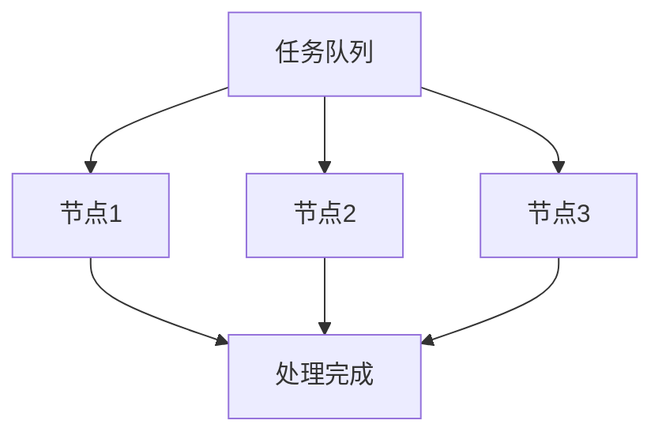

## 介绍

操作系统负载管理是指操作系统如何分配和管理计算资源（如 CPU、内存、磁盘 I/O 等）以满足不同任务的需求。负载管理的主要目标是确保系统在高负载情况下仍能高效运行，同时避免资源浪费。

对于初学者来说，理解负载管理是优化系统性能的关键。通过合理分配资源，操作系统可以确保多个应用程序同时运行而不会相互干扰。

## 什么是负载？

负载通常指的是系统当前正在处理的任务量。在操作系统中，负载可以分为以下几类：

1. **CPU 负载**：CPU 正在处理的任务数量。
2. **内存负载**：系统内存的使用情况。
3. **I/O 负载**：磁盘或网络 I/O 的繁忙程度。

:::tip
负载管理不仅仅是处理高负载，还包括在低负载时如何优化资源分配。
:::

## 负载管理的基本原理

### 1. 任务调度

操作系统通过任务调度算法来决定哪个任务应该优先使用 CPU。常见的调度算法包括：

- **先来先服务（FCFS）**：按任务到达的顺序处理。
- **最短作业优先（SJF）**：优先处理耗时最短的任务。
- **轮转调度（Round Robin）**：每个任务轮流使用 CPU 一段时间。

```python
# 示例：简单的轮转调度模拟
tasks = ["Task1", "Task2", "Task3"]
time_slice = 2  # 每个任务运行的时间片

for task in tasks:
    print(f"Running {task} for {time_slice} seconds")
```

**输出：**
```
Running Task1 for 2 seconds
Running Task2 for 2 seconds
Running Task3 for 2 seconds
```

### 2. 资源分配

操作系统需要动态分配内存、磁盘空间和网络带宽等资源。资源分配的策略包括：

- **固定分区**：将内存划分为固定大小的区域。
- **动态分区**：根据任务需求动态分配内存。

### 3. 负载均衡

负载均衡是指将任务分配到多个处理器或服务器上，以避免单个节点过载。常见的负载均衡算法包括：

- **轮询**：依次将任务分配给每个节点。
- **最少连接**：将任务分配给当前连接最少的节点。



## 实际案例

### 案例 1：Web 服务器的负载管理

假设你运行一个 Web 服务器，处理来自用户的请求。当请求量激增时，服务器可能会过载，导致响应变慢甚至崩溃。通过负载均衡，可以将请求分发到多个服务器上，确保每个服务器的负载在可控范围内。

:::note
负载均衡器可以根据服务器的当前负载动态调整请求分配。
:::

### 案例 2：多任务操作系统的 CPU 调度

在一个多任务操作系统中，多个应用程序同时运行。操作系统需要确保每个应用程序都能获得足够的 CPU 时间。通过轮转调度算法，操作系统可以公平地分配 CPU 时间，避免某个应用程序独占资源。

## 总结

操作系统负载管理是确保系统高效运行的关键。通过任务调度、资源分配和负载均衡，操作系统可以优化资源使用，提高系统性能。对于初学者来说，理解这些概念是进一步学习系统优化和性能调优的基础。

## 附加资源

- **书籍推荐**：
  - 《操作系统概念》 by Abraham Silberschatz
  - 《现代操作系统》 by Andrew S. Tanenbaum
- **练习**：
  - 编写一个简单的任务调度模拟程序，尝试实现不同的调度算法。
  - 研究 Linux 系统中的 `top` 命令，了解如何监控系统负载。

:::caution
在实际生产环境中，负载管理需要结合具体场景进行调整，避免过度优化导致资源浪费。
:::