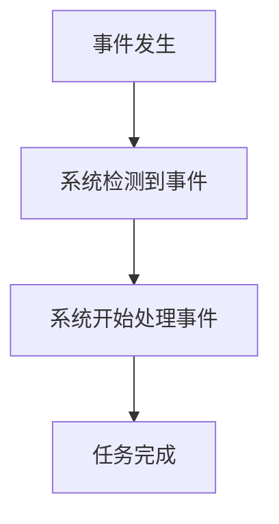

# 操作系统实时概念

实时操作系统（RTOS，Real-Time Operating System）是一种专门设计用于处理实时任务的操作系统。与通用操作系统不同，RTOS 的核心目标是确保任务在严格的时间限制内完成。本文将详细介绍实时操作系统的核心概念，帮助初学者理解其工作原理和应用场景。

## 什么是实时操作系统？

实时操作系统是一种能够保证任务在规定时间内完成的操作系统。它广泛应用于需要高可靠性和确定性的领域，如航空航天、工业自动化、医疗设备和汽车电子等。

:::note
**实时性** 是 RTOS 的核心特性，指的是系统能够在规定的时间内响应外部事件并完成任务。
:::

## 实时操作系统的分类

实时操作系统通常分为两类：

1. **硬实时系统（Hard Real-Time System）**：任务必须在严格的时间限制内完成，否则会导致严重后果。例如，飞机的飞行控制系统必须在毫秒级内响应传感器数据。
2. **软实时系统（Soft Real-Time System）**：任务的时间限制相对宽松，偶尔的延迟是可以接受的。例如，多媒体播放器需要在一定时间内处理音频和视频数据，但偶尔的延迟不会导致系统崩溃。

## 实时操作系统的核心概念

### 1. 任务调度

任务调度是 RTOS 的核心功能之一。它决定了任务的执行顺序和时间分配。常见的调度算法包括：

- **优先级调度**：每个任务都有一个优先级，高优先级的任务会优先执行。
- **轮转调度**：任务按照时间片轮流执行，确保每个任务都能获得一定的 CPU 时间。

以下是一个简单的优先级调度示例：

```c
#include <stdio.h>
#include <FreeRTOS.h>
#include <task.h>

void highPriorityTask(void *pvParameters) {
    while (1) {
        printf("High Priority Task Running\n");
        vTaskDelay(1000 / portTICK_PERIOD_MS);
    }
}

void lowPriorityTask(void *pvParameters) {
    while (1) {
        printf("Low Priority Task Running\n");
        vTaskDelay(1000 / portTICK_PERIOD_MS);
    }
}

int main() {
    xTaskCreate(highPriorityTask, "HighPriorityTask", 1000, NULL, 2, NULL);
    xTaskCreate(lowPriorityTask, "LowPriorityTask", 1000, NULL, 1, NULL);
    vTaskStartScheduler();
    return 0;
}
```

**输出：**
```
High Priority Task Running
Low Priority Task Running
High Priority Task Running
Low Priority Task Running
...
```

### 2. 响应时间

响应时间是指从事件发生到系统开始处理该事件的时间间隔。在实时系统中，响应时间必须尽可能短且可预测。



### 3. 任务同步与通信

在 RTOS 中，多个任务可能需要共享资源或进行通信。常见的同步机制包括信号量、互斥锁和消息队列。

以下是一个使用信号量进行任务同步的示例：

```c
#include <stdio.h>
#include <FreeRTOS.h>
#include <task.h>
#include <semphr.h>

SemaphoreHandle_t xSemaphore;

void task1(void *pvParameters) {
    while (1) {
        xSemaphoreTake(xSemaphore, portMAX_DELAY);
        printf("Task 1 is running\n");
        xSemaphoreGive(xSemaphore);
        vTaskDelay(1000 / portTICK_PERIOD_MS);
    }
}

void task2(void *pvParameters) {
    while (1) {
        xSemaphoreTake(xSemaphore, portMAX_DELAY);
        printf("Task 2 is running\n");
        xSemaphoreGive(xSemaphore);
        vTaskDelay(1000 / portTICK_PERIOD_MS);
    }
}

int main() {
    xSemaphore = xSemaphoreCreateMutex();
    xTaskCreate(task1, "Task1", 1000, NULL, 1, NULL);
    xTaskCreate(task2, "Task2", 1000, NULL, 1, NULL);
    vTaskStartScheduler();
    return 0;
}
```

**输出：**
```
Task 1 is running
Task 2 is running
Task 1 is running
Task 2 is running
...
```

## 实际应用场景

### 1. 工业自动化

在工业自动化中，RTOS 用于控制机器人、传感器和执行器。例如，一个自动化生产线需要实时监控和控制多个设备，以确保生产过程的顺利进行。

### 2. 医疗设备

医疗设备如心脏起搏器和呼吸机需要实时操作系统来确保设备的可靠性和安全性。任何延迟都可能导致严重的后果。

### 3. 汽车电子

现代汽车中的电子控制单元（ECU）使用 RTOS 来管理发动机控制、刹车系统和安全气囊等关键功能。

## 总结

实时操作系统是处理实时任务的关键工具，广泛应用于需要高可靠性和确定性的领域。通过理解任务调度、响应时间和任务同步等核心概念，初学者可以更好地掌握 RTOS 的工作原理和应用场景。

## 附加资源与练习

- **推荐书籍**：
  - 《Real-Time Systems: Design Principles for Distributed Embedded Applications》 by Hermann Kopetz
  - 《Real-Time Operating Systems: Book 1 - The Theory》 by Jim Cooling

- **练习**：
  - 尝试在 FreeRTOS 中创建一个多任务应用程序，并使用信号量进行任务同步。
  - 研究并实现一个简单的优先级调度算法。

:::tip
深入学习 RTOS 的最佳方法是动手实践。尝试在嵌入式开发板上运行简单的 RTOS 程序，并观察其行为。
:::