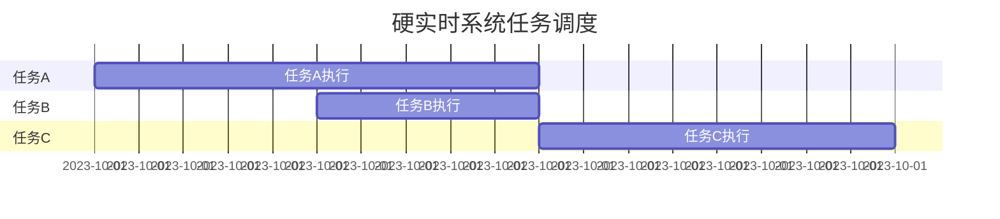

## 什么是硬实时系统？

硬实时系统（Hard Real-Time System）是一种对时间要求极为严格的计算机系统。在这类系统中，任务的执行必须在严格的时间限制内完成，否则可能会导致系统失效或产生严重后果。硬实时系统的核心特点是**确定性**，即系统必须在预定的时间内响应并完成任务。

与软实时系统（Soft Real-Time System）不同，硬实时系统不允许任何时间上的偏差。例如，在航空航天、医疗设备或工业控制系统中，任务的延迟可能会导致灾难性后果。

## 硬实时系统的特点

1. **时间确定性**：硬实时系统必须在严格的时间限制内完成任务，否则系统将失效。
2. **高可靠性**：系统必须能够在各种条件下稳定运行，确保任务的及时完成。
3. **任务优先级**：硬实时系统通常采用优先级调度算法，确保高优先级任务能够及时执行。
4. **资源管理**：系统需要高效管理资源（如CPU、内存、I/O设备），以确保任务的及时完成。

## 硬实时系统的调度算法

硬实时系统的调度算法是确保任务按时完成的关键。常见的调度算法包括：

- **速率单调调度（Rate-Monotonic Scheduling, RMS）**：根据任务的周期分配优先级，周期越短的任务优先级越高。
- **最早截止时间优先（Earliest Deadline First, EDF）**：根据任务的截止时间分配优先级，截止时间越早的任务优先级越高。

以下是一个简单的EDF调度算法的伪代码示例：

```python
def edf_scheduler(tasks):
    # 按截止时间排序
    tasks.sort(key=lambda x: x.deadline)
    for task in tasks:
        if not task.completed:
            task.execute()
```

:::note
在实际应用中，调度算法需要结合具体的硬件和操作系统进行优化。
:::

## 硬实时系统的实际应用

### 1. 航空航天

在航空航天领域，硬实时系统用于控制飞行器的姿态、导航和通信。例如，飞行控制系统必须在毫秒级的时间内响应传感器的输入，并调整飞行器的姿态，以确保飞行安全。

### 2. 医疗设备

医疗设备如心脏起搏器和呼吸机也依赖于硬实时系统。这些设备必须在严格的时间限制内响应患者的生理信号，以确保患者的生命安全。

### 3. 工业控制

在工业控制系统中，硬实时系统用于控制机器人、自动化生产线等。例如，机器人必须在精确的时间内完成焊接、装配等操作，以确保产品质量。

## 硬实时系统的实现

实现硬实时系统通常需要以下步骤：

1. **任务分析**：确定系统中所有任务的执行时间和截止时间。
2. **调度算法选择**：根据任务特性选择合适的调度算法（如RMS或EDF）。
3. **资源分配**：确保系统有足够的资源（如CPU、内存）来支持任务的执行。
4. **测试与验证**：通过模拟和测试验证系统是否满足硬实时性要求。

以下是一个简单的硬实时系统任务分析的示例：



:::tip
在实际开发中，可以使用实时操作系统（RTOS）如FreeRTOS、VxWorks等来简化硬实时系统的实现。
:::

## 总结

硬实时系统是一种对时间要求极为严格的计算机系统，广泛应用于航空航天、医疗设备和工业控制等领域。实现硬实时系统需要仔细的任务分析、合适的调度算法和高效的资源管理。通过使用实时操作系统（RTOS），开发者可以更轻松地构建满足硬实时性要求的系统。

## 附加资源与练习

- **推荐阅读**：
  - 《Real-Time Systems: Design Principles for Distributed Embedded Applications》 by Hermann Kopetz
  - 《Real-Time Systems》 by Jane W. S. Liu

- **练习**：
  1. 设计一个简单的硬实时系统，包含三个任务，分别具有不同的周期和截止时间。使用EDF调度算法进行任务调度。
  2. 使用FreeRTOS实现一个简单的硬实时系统，控制LED灯的闪烁频率。

通过学习和实践，你将能够更好地理解硬实时系统的原理和应用。