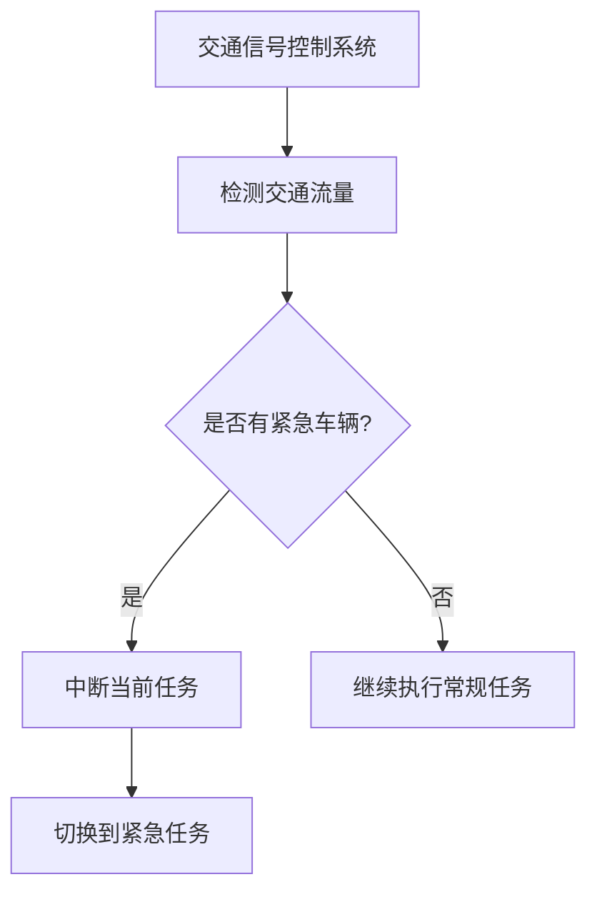

# 操作系统抢占内核

## 介绍

在操作系统中，**抢占内核**（Preemptive Kernel）是一种允许操作系统在任何时刻中断当前正在运行的任务，并将 CPU 资源分配给更高优先级任务的内核设计。与非抢占内核（Non-Preemptive Kernel）相比，抢占内核能够更好地支持实时任务和多任务处理，确保高优先级任务能够及时响应。

抢占内核的核心思想是：操作系统能够“抢占”当前正在运行的任务，强制切换到另一个任务。这种机制对于实时操作系统（RTOS）尤为重要，因为它可以保证关键任务能够在规定的时间内完成。

## 抢占内核的工作原理

抢占内核的实现依赖于操作系统调度器的支持。调度器会根据任务的优先级、时间片轮转等策略，决定何时中断当前任务并切换到另一个任务。以下是抢占内核的基本工作流程：

1. **任务调度**：操作系统调度器定期检查任务队列，判断是否有更高优先级的任务需要运行。
2. **中断当前任务**：如果发现更高优先级的任务，调度器会中断当前任务，保存其上下文（如寄存器状态、程序计数器等）。
3. **切换任务**：调度器将 CPU 资源分配给更高优先级的任务，并恢复其上下文。
4. **继续执行**：新任务开始执行，直到被更高优先级的任务抢占或主动释放 CPU。

### 代码示例

以下是一个简单的伪代码示例，展示了抢占内核的基本逻辑：

```c
void scheduler() {
    Task* current_task = get_current_task();
    Task* next_task = find_highest_priority_task();

    if (next_task != current_task) {
        save_context(current_task); // 保存当前任务的上下文
        switch_to_task(next_task);  // 切换到新任务
    }
}

void interrupt_handler() {
    // 处理硬件中断
    scheduler(); // 调用调度器
}
```

在这个示例中，`scheduler` 函数负责检查是否有更高优先级的任务需要运行，并在必要时进行任务切换。`interrupt_handler` 函数则模拟了硬件中断的处理过程，触发调度器的调用。

## 抢占内核的优势

抢占内核的主要优势包括：

1. **实时性**：能够及时响应高优先级任务，适合实时操作系统。
2. **公平性**：通过时间片轮转，确保所有任务都能获得 CPU 资源。
3. **灵活性**：支持动态调整任务优先级，适应不同的应用场景。

## 实际应用场景

抢占内核广泛应用于需要高实时性和多任务处理的系统中，例如：

1. **嵌入式系统**：如智能家居设备、工业控制系统等，需要快速响应外部事件。
2. **实时操作系统**：如 VxWorks、FreeRTOS 等，用于航空航天、汽车电子等领域。
3. **多任务操作系统**：如 Linux、Windows 等，支持多用户、多任务并发执行。

### 案例：实时交通信号控制系统

假设我们有一个实时交通信号控制系统，需要根据交通流量动态调整信号灯的状态。使用抢占内核可以确保高优先级的任务（如紧急车辆通过）能够立即中断低优先级任务（如常规信号灯切换），从而避免交通拥堵或事故。



## 总结

抢占内核是现代操作系统中不可或缺的一部分，它通过允许操作系统中断当前任务并切换到更高优先级的任务，确保了系统的实时性和多任务处理能力。对于初学者来说，理解抢占内核的工作原理是掌握操作系统调度机制的重要一步。

## 附加资源与练习

1. **推荐阅读**：
   - 《操作系统概念》（Operating System Concepts）
   - 《深入理解 Linux 内核》（Understanding the Linux Kernel）
2. **练习**：
   - 编写一个简单的任务调度器，模拟抢占内核的工作流程。
   - 研究 Linux 内核的调度算法，了解其如何实现抢占机制。

通过学习和实践，你将能够更好地理解抢占内核的设计思想，并将其应用到实际项目中。