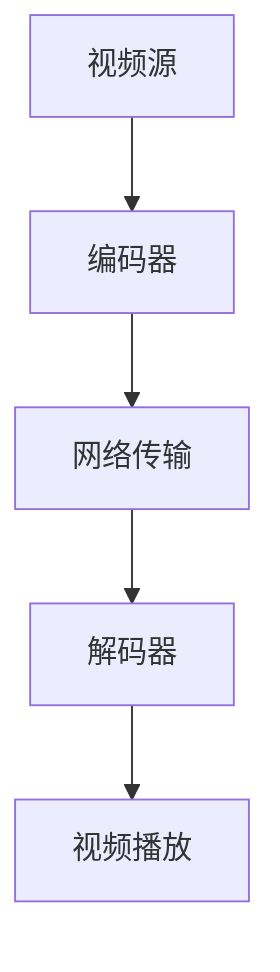

## 什么是软实时系统？

软实时系统（Soft Real-Time System）是实时操作系统（RTOS）的一种类型。与硬实时系统（Hard Real-Time System）不同，软实时系统允许任务在截止时间之后完成，而不会导致系统崩溃或产生严重后果。软实时系统的核心目标是尽可能在截止时间前完成任务，但如果任务稍有延迟，系统仍然可以正常运行。

:::note
软实时系统的典型特点是任务的截止时间可以有一定的弹性，而硬实时系统则要求任务必须严格在截止时间前完成。
:::

## 软实时系统的特点

1. **时间弹性**：任务的截止时间可以有一定的延迟，系统不会因为任务未按时完成而崩溃。
2. **优先级调度**：系统会根据任务的优先级进行调度，高优先级的任务会优先执行。
3. **资源管理**：系统会合理分配和管理资源，以确保高优先级任务能够及时完成。
4. **容错性**：即使某些任务未能按时完成，系统仍然可以继续运行。

## 软实时系统的应用场景

软实时系统广泛应用于以下领域：

- **多媒体处理**：例如视频播放、音频处理等，即使某些帧或音频数据稍有延迟，用户通常也不会察觉到。
- **网络通信**：例如实时聊天、视频会议等，数据包的传输可以有一定的延迟。
- **游戏开发**：游戏中的物理引擎、动画渲染等任务可以有一定的延迟，不会影响游戏的整体体验。

## 代码示例：软实时任务调度

以下是一个简单的软实时任务调度示例，使用 Python 编写：

```python
import time
import threading

def task(name, priority, duration):
    print(f"Task {name} started with priority {priority}")
    time.sleep(duration)
    print(f"Task {name} completed")

# 创建任务
task1 = threading.Thread(target=task, args=("Task1", 1, 2))
task2 = threading.Thread(target=task, args=("Task2", 2, 1))
task3 = threading.Thread(target=task, args=("Task3", 3, 3))

# 启动任务
task1.start()
task2.start()
task3.start()

# 等待所有任务完成
task1.join()
task2.join()
task3.join()

print("All tasks completed")
```

**输出：**

```
Task Task1 started with priority 1
Task Task2 started with priority 2
Task Task3 started with priority 3
Task Task2 completed
Task Task1 completed
Task Task3 completed
All tasks completed
```

:::tip
在实际的软实时系统中，任务的调度通常由操作系统内核完成，开发者只需定义任务的优先级和截止时间。
:::

## 实际案例：视频流媒体服务

假设你正在开发一个视频流媒体服务，用户可以通过网络观看实时视频。由于网络延迟和带宽限制，视频帧的传输可能会稍有延迟。在这种情况下，软实时系统可以确保视频播放的流畅性，即使某些帧稍有延迟，用户也不会察觉到。



:::caution
在实际应用中，软实时系统需要合理设置任务的优先级和截止时间，以确保系统的整体性能和用户体验。
:::

## 总结

软实时系统是一种允许任务在截止时间之后完成的实时操作系统。它广泛应用于多媒体处理、网络通信、游戏开发等领域。通过合理设置任务的优先级和截止时间，软实时系统可以确保系统的整体性能和用户体验。

## 附加资源

- [实时操作系统（RTOS）入门指南](https://example.com/rtos-guide)
- [Python 多线程编程教程](https://example.com/python-threading)
- [软实时系统与硬实时系统的区别](https://example.com/soft-vs-hard-rtos)

## 练习

1. 修改上述代码示例，增加一个低优先级任务，并观察其执行顺序。
2. 尝试在实际项目中应用软实时系统的概念，例如开发一个简单的视频播放器。
