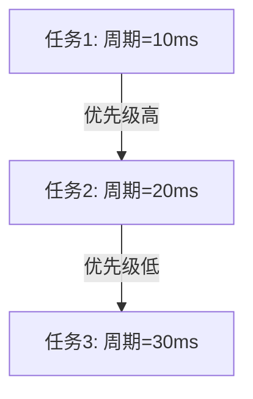
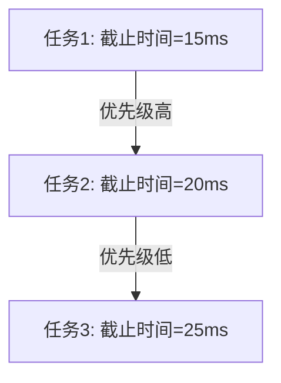
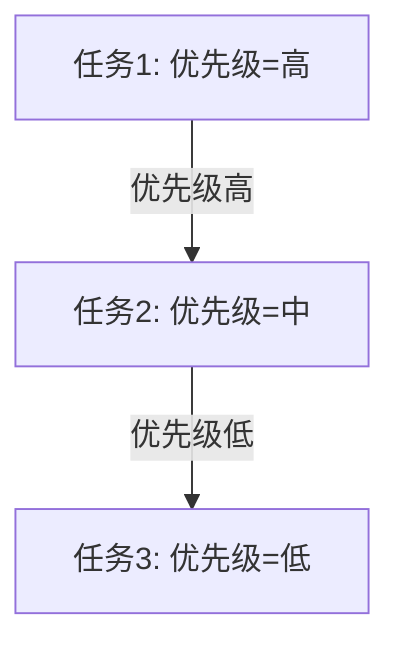

# 操作系统实时调度

实时操作系统（RTOS）是一种专门设计用于处理实时任务的操作系统。实时任务是指那些必须在特定时间限制内完成的任务，否则可能会导致系统失效或产生严重后果。实时调度是实时操作系统的核心功能之一，它决定了任务执行的顺序和时间，以确保所有任务都能在截止时间前完成。

## 什么是实时调度？

实时调度是指在实时操作系统中，根据任务的优先级、截止时间和其他约束条件，决定任务的执行顺序和时间的过程。实时调度的目标是确保所有任务都能在指定的时间内完成，从而满足系统的实时性要求。

实时调度可以分为两种类型：
1. **硬实时调度**：任务必须在严格的截止时间内完成，否则会导致系统失效或产生严重后果。
2. **软实时调度**：任务在截止时间后完成可能会导致性能下降，但不会导致系统失效。

## 实时调度算法

实时调度算法是实时操作系统中用于决定任务执行顺序的算法。以下是几种常见的实时调度算法：

### 1. 速率单调调度（Rate-Monotonic Scheduling, RMS）

速率单调调度是一种静态优先级调度算法，任务的优先级根据其周期决定。周期越短的任务优先级越高。



### 2. 最早截止时间优先（Earliest Deadline First, EDF）

最早截止时间优先是一种动态优先级调度算法，任务的优先级根据其截止时间决定。截止时间越早的任务优先级越高。



### 3. 固定优先级调度（Fixed-Priority Scheduling）

固定优先级调度是一种静态优先级调度算法，任务的优先级在系统设计时确定，并且在运行时不会改变。



## 实际案例

### 案例1：自动驾驶汽车

在自动驾驶汽车中，实时调度用于确保各种传感器数据的处理和控制指令的执行能够在严格的时间限制内完成。例如，雷达和摄像头数据的处理必须在几毫秒内完成，以确保车辆能够及时做出反应。

### 案例2：工业控制系统

在工业控制系统中，实时调度用于确保各种控制任务能够在规定的时间内完成。例如，温度控制、压力控制和流量控制等任务必须在特定的时间间隔内执行，以确保生产过程的稳定性和安全性。

## 代码示例

以下是一个简单的实时调度算法的伪代码示例，展示了如何根据任务的截止时间进行调度：

```python
def schedule_tasks(tasks):
    # 按照截止时间排序
    tasks.sort(key=lambda x: x.deadline)
    
    for task in tasks:
        if current_time + task.execution_time <= task.deadline:
            execute_task(task)
            current_time += task.execution_time
        else:
            raise Exception("任务无法在截止时间内完成")
```

**输入**：
- `tasks`: 包含任务对象的列表，每个任务对象包含 `execution_time`（执行时间）和 `deadline`（截止时间）属性。

**输出**：
- 任务按照截止时间顺序执行，如果任务无法在截止时间内完成，则抛出异常。

## 总结

实时调度是实时操作系统的核心功能之一，它确保了任务能够在严格的时间限制内完成。通过使用不同的调度算法，如速率单调调度、最早截止时间优先和固定优先级调度，可以满足不同实时系统的需求。在实际应用中，实时调度被广泛应用于自动驾驶汽车、工业控制系统等领域。

## 附加资源与练习

- **资源**：
  - [实时操作系统调度算法详解](https://example.com/real-time-scheduling)
  - [实时系统设计与实现](https://example.com/real-time-systems)

- **练习**：
  1. 实现一个简单的速率单调调度算法，并测试其在不同任务周期下的表现。
  2. 修改上述代码示例，使其支持任务的动态优先级调整。
  3. 设计一个实时调度系统，模拟自动驾驶汽车中的传感器数据处理任务。

通过学习和实践，你将能够更好地理解实时调度的原理和应用，为开发实时系统打下坚实的基础。