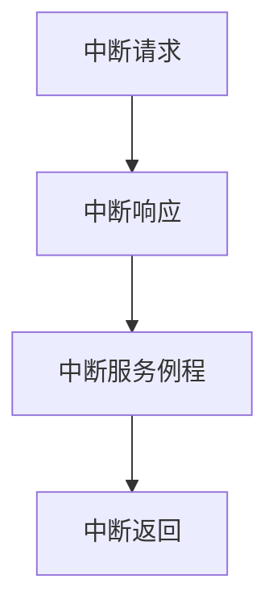

# 操作系统中断处理

## 介绍

在操作系统中，**中断**是一种硬件或软件发出的信号，用于通知 CPU 需要立即处理某个事件。中断处理是操作系统的核心功能之一，它允许系统在运行过程中快速响应外部事件，例如硬件设备的输入、定时器到期或软件异常等。

中断处理的主要目的是提高系统的响应速度和效率。通过中断机制，操作系统可以在不浪费 CPU 资源的情况下，及时处理紧急任务。

## 中断的类型

中断可以分为两大类：

1. **硬件中断**：由硬件设备触发，例如键盘输入、鼠标点击、网络数据包到达等。
2. **软件中断**：由软件程序触发，例如系统调用、异常处理等。

:::tip
硬件中断通常由外部设备发起，而软件中断则由正在运行的程序或操作系统自身发起。
:::

## 中断处理流程

当中断发生时，操作系统会按照以下步骤进行处理：

1. **中断请求（IRQ）**：硬件或软件发出中断信号，通知 CPU 需要处理某个事件。
2. **中断响应**：CPU 暂停当前任务，保存当前执行状态（如程序计数器、寄存器等）。
3. **中断服务例程（ISR）**：CPU 跳转到预先定义的中断处理程序，执行相应的处理逻辑。
4. **中断返回**：中断处理完成后，CPU 恢复之前保存的执行状态，继续执行被中断的任务。



## 中断处理的实际应用

### 案例：键盘输入处理

假设用户按下键盘上的一个键，操作系统需要立即响应并处理该输入。以下是键盘中断处理的简化流程：

1. 键盘控制器检测到按键动作，向 CPU 发送中断请求。
2. CPU 暂停当前任务，保存当前状态，并跳转到键盘中断处理程序。
3. 中断处理程序读取键盘缓冲区中的数据，并将其传递给应用程序。
4. 处理完成后，CPU 恢复之前的状态，继续执行被中断的任务。

:::note
键盘中断处理是一个典型的硬件中断应用场景，展示了操作系统如何通过中断机制快速响应用户输入。
:::

## 代码示例：简单的中断处理程序

以下是一个简化的中断处理程序示例，展示了如何编写一个基本的中断服务例程（ISR）：

```c
#include <stdio.h>

// 模拟中断服务例程
void keyboard_isr() {
    printf("键盘中断处理程序：检测到按键输入！\n");
    // 这里可以添加处理键盘输入的逻辑
}

int main() {
    // 模拟中断发生
    printf("主程序正在运行...\n");
    keyboard_isr();  // 模拟中断触发
    printf("主程序继续运行...\n");

    return 0;
}
```

**输出：**
```
主程序正在运行...
键盘中断处理程序：检测到按键输入！
主程序继续运行...
```

:::caution
在实际操作系统中，中断处理程序通常由汇编语言编写，并且需要非常高效，以避免影响系统的整体性能。
:::

## 总结

中断处理是操作系统中至关重要的机制，它使系统能够快速响应外部事件，同时保持高效的资源利用。通过理解中断的类型、处理流程以及实际应用场景，初学者可以更好地掌握操作系统的工作原理。

## 附加资源与练习

- **推荐阅读**：
  - 《操作系统概念》（Operating System Concepts）中关于中断处理的章节。
  - Linux 内核源码中的中断处理实现。

- **练习**：
  1. 编写一个简单的程序，模拟硬件中断的发生和处理。
  2. 研究 Linux 内核中的中断处理机制，并尝试理解其实现细节。

通过不断学习和实践，你将能够深入理解中断处理在操作系统中的重要性，并掌握相关的编程技巧。