## 介绍

在实时操作系统（RTOS）中，**周期性任务**是指按照固定的时间间隔重复执行的任务。这类任务通常用于需要定期执行的操作，例如传感器数据采集、控制系统中的反馈调节或定时器中断处理。周期性任务是实时系统中确保任务按时完成的关键机制之一。

周期性任务的核心特点是其执行频率是固定的，任务必须在规定的时间间隔内完成，否则可能会导致系统失效或性能下降。因此，理解如何设计和实现周期性任务对于开发可靠的实时系统至关重要。

---

## 周期性任务的基本概念

### 任务周期（Period）
任务的周期是指任务两次执行之间的时间间隔。例如，如果一个任务的周期是 100 毫秒，那么该任务每 100 毫秒就会被调度执行一次。

### 任务执行时间（Execution Time）
任务执行时间是指任务从开始到完成所需的时间。在实时系统中，任务的执行时间必须小于其周期，否则会导致任务无法按时完成。

### 任务截止时间（Deadline）
任务的截止时间是指任务必须完成的时间点。对于周期性任务，截止时间通常等于任务的周期。

---

## 周期性任务的实现

在实时操作系统中，周期性任务通常通过定时器中断或调度器来实现。以下是一个简单的伪代码示例，展示如何实现一个周期性任务：

```c
void periodic_task() {
    while (true) {
        // 任务逻辑
        collect_sensor_data();
        process_data();
        
        // 等待下一个周期
        sleep(TASK_PERIOD);
    }
}
```

在这个示例中，`TASK_PERIOD` 是任务的周期，`sleep` 函数用于让任务休眠直到下一个周期开始。

---

## 实际案例：温度监控系统

假设我们正在开发一个温度监控系统，需要每秒钟采集一次温度数据并进行分析。我们可以将温度采集任务设计为一个周期性任务，周期为 1 秒。

```c
#define TEMPERATURE_TASK_PERIOD 1000 // 1秒

void temperature_task() {
    while (true) {
        float temperature = read_temperature_sensor();
        analyze_temperature(temperature);
        
        sleep(TEMPERATURE_TASK_PERIOD);
    }
}
```

在这个案例中，`read_temperature_sensor` 函数用于读取温度传感器的数据，`analyze_temperature` 函数用于分析数据并采取相应的措施（例如触发警报）。

---

## 周期性任务的调度

在实时操作系统中，周期性任务的调度通常由调度器负责。调度器会根据任务的周期和优先级来决定任务的执行顺序。以下是一个简单的调度器示例：

```mermaid
gantt
    title 周期性任务调度示例
    dateFormat  HH:mm:ss
    axisFormat  %H:%M:%S
    section 任务A
    任务A执行 :a1, 00:00:00, 1s
    任务A执行 :a2, after a1, 1s
    section 任务B
    任务B执行 :b1, 00:00:02, 1s
    任务B执行 :b2, after b1, 1s
```



在这个示例中，任务 A 和任务 B 分别以不同的周期执行，调度器确保它们按时完成。

---

## 总结

周期性任务是实时操作系统中不可或缺的一部分，它们确保系统能够按照预定的时间间隔执行关键操作。通过合理设计任务的周期、执行时间和截止时间，可以构建出高效且可靠的实时系统。

:::tip 提示
在设计周期性任务时，务必确保任务的执行时间小于其周期，以避免任务堆积和系统性能下降。
:::

---

## 附加资源与练习

### 资源
- [实时操作系统调度算法](https://en.wikipedia.org/wiki/Real-time_operating_system)
- [周期性任务设计指南](https://www.embedded.com/periodic-tasks-in-rtos/)

### 练习
1. 设计一个周期性任务，每隔 500 毫秒读取一次光照传感器的数据并打印到控制台。
2. 修改上述温度监控系统的代码，使其在温度超过阈值时触发警报。

通过完成这些练习，你将更深入地理解周期性任务的设计与实现。