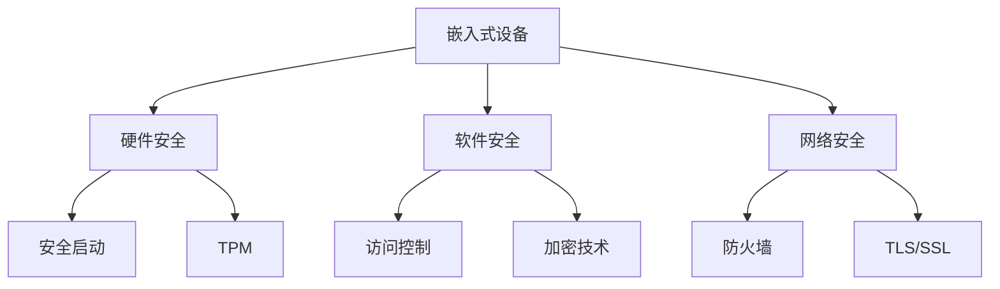

## 介绍

嵌入式操作系统（Embedded Operating System, EOS）是专为嵌入式设备设计的操作系统，广泛应用于智能家居、工业控制、医疗设备和汽车电子等领域。随着物联网（IoT）的快速发展，嵌入式设备的安全性变得越来越重要。操作系统嵌入式安全是指通过硬件和软件的结合，确保嵌入式系统在运行过程中免受恶意攻击、数据泄露和系统故障的影响。

本文将逐步介绍嵌入式操作系统安全的核心概念、常见威胁、防护措施以及实际应用案例。

---

## 嵌入式操作系统安全的核心概念

### 1. 安全需求
嵌入式系统的安全需求通常包括以下几个方面：
- **机密性**：确保数据不被未授权访问。
- **完整性**：防止数据被篡改。
- **可用性**：确保系统在需要时能够正常运行。
- **认证**：验证用户或设备的身份。
- **授权**：控制用户或设备的访问权限。

### 2. 常见威胁
嵌入式系统面临的主要安全威胁包括：
- **恶意软件**：如病毒、蠕虫和特洛伊木马。
- **物理攻击**：通过硬件手段获取系统数据。
- **网络攻击**：如中间人攻击、拒绝服务攻击（DoS）。
- **侧信道攻击**：通过分析系统的功耗、电磁辐射等间接获取信息。

---

## 嵌入式操作系统安全的防护措施

### 1. 硬件安全
硬件是嵌入式系统安全的基础。常见的硬件安全措施包括：
- **安全启动**：确保系统启动时加载的固件和操作系统未被篡改。
- **可信平台模块（TPM）**：提供加密密钥管理和硬件级别的安全功能。
- **内存保护单元（MPU）**：防止非法访问内存区域。

### 2. 软件安全
软件层面的安全措施包括：
- **访问控制**：通过用户权限管理限制对系统资源的访问。
- **加密技术**：使用对称加密（如AES）和非对称加密（如RSA）保护数据。
- **安全更新**：定期更新系统以修复已知漏洞。

### 3. 网络安全
嵌入式设备通常通过网络与其他设备通信，因此网络安全至关重要：
- **防火墙**：过滤恶意流量。
- **TLS/SSL**：加密网络通信。
- **入侵检测系统（IDS）**：监控网络流量以检测异常行为。

---

## 实际案例

### 案例 1：智能家居设备的安全防护
智能家居设备（如智能灯泡、智能门锁）通常通过Wi-Fi连接到互联网。如果未采取适当的安全措施，攻击者可能通过中间人攻击窃取用户数据或控制设备。通过以下措施可以提升安全性：
- 使用TLS加密通信。
- 定期更新设备固件。
- 启用设备认证功能。

### 案例 2：工业控制系统的安全防护
工业控制系统（如PLC）是工业自动化的核心。攻击者可能通过网络攻击导致系统瘫痪。防护措施包括：
- 使用硬件防火墙隔离控制网络。
- 实施严格的访问控制策略。
- 定期进行安全审计。

---

## 代码示例

以下是一个简单的嵌入式系统加密示例，使用AES算法加密数据：

```c
#include <openssl/aes.h>
#include <stdio.h>
#include <string.h>

void encrypt_data(const unsigned char *plaintext, unsigned char *ciphertext, const unsigned char *key) {
    AES_KEY aes_key;
    AES_set_encrypt_key(key, 128, &aes_key);
    AES_encrypt(plaintext, ciphertext, &aes_key);
}

int main() {
    unsigned char key[16] = "mysecretkey1234";
    unsigned char plaintext[16] = "Hello, World!";
    unsigned char ciphertext[16];

    encrypt_data(plaintext, ciphertext, key);

    printf("Encrypted data: ");
    for (int i = 0; i < 16; i++) {
        printf("%02x", ciphertext[i]);
    }
    printf("\n");

    return 0;
}
```

**输入**：`Hello, World!`  
**输出**：加密后的十六进制数据（例如：`4f7e3a1b...`）

---

## 总结

嵌入式操作系统的安全性是确保设备可靠运行和数据安全的关键。通过硬件、软件和网络的多层次防护措施，可以有效抵御各种安全威胁。初学者应从理解基本概念入手，逐步掌握实际应用中的安全技术。

---

## 附加资源与练习

### 资源
- [OpenSSL官方文档](https://www.openssl.org/docs/)
- [嵌入式系统安全指南](https://www.embedded.com/category/security/)

### 练习
1. 尝试修改上述代码示例，实现AES解密功能。
2. 研究一种嵌入式设备（如智能手表）的安全机制，并撰写简要分析报告。
3. 使用Mermaid绘制嵌入式系统安全架构图。



:::tip
建议初学者从简单的加密算法入手，逐步深入学习嵌入式系统的安全机制。
:::