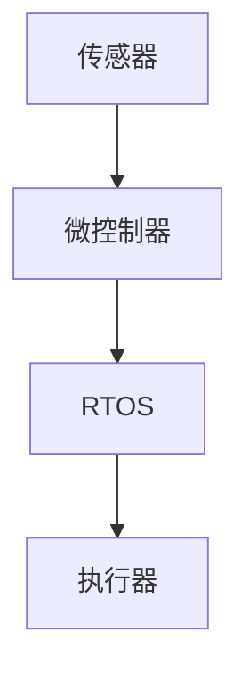

# 操作系统嵌入式开发

## 介绍

嵌入式操作系统（Embedded Operating System）是一种专门为嵌入式设备设计的操作系统。与通用操作系统（如 Windows、Linux）不同，嵌入式操作系统通常运行在资源有限的硬件上，例如微控制器、传感器、智能家居设备等。它的主要特点是高效、实时性强，并且能够适应特定的硬件环境。

嵌入式开发是指在这些设备上开发和部署软件的过程。它涉及硬件与软件的紧密结合，开发者需要了解底层硬件的特性，并编写高效、可靠的代码。

## 嵌入式操作系统的基本概念

### 1. 实时操作系统（RTOS）

实时操作系统（Real-Time Operating System, RTOS）是嵌入式系统中常见的一种操作系统类型。它的核心特点是能够保证任务在规定的时间内完成。RTOS 通常用于对时间要求严格的场景，例如工业控制、汽车电子、医疗设备等。

:::tip
RTOS 的关键特性包括任务调度、中断处理、内存管理和任务间通信。
:::

### 2. 任务调度

任务调度是 RTOS 的核心功能之一。它决定了多个任务如何共享 CPU 资源。常见的调度算法包括：

- **优先级调度**：每个任务分配一个优先级，高优先级任务优先执行。
- **时间片轮转**：每个任务分配固定的时间片，轮流执行。

```c
// 示例：FreeRTOS 任务创建
#include "FreeRTOS.h"
#include "task.h"

void vTaskFunction(void *pvParameters) {
    for (;;) {
        // 任务逻辑
    }
}

int main(void) {
    xTaskCreate(vTaskFunction, "Task1", 100, NULL, 1, NULL);
    vTaskStartScheduler();
    return 0;
}
```

### 3. 中断处理

嵌入式系统通常需要处理外部事件，例如传感器数据或用户输入。中断机制允许系统在事件发生时立即响应，而不需要轮询。

```c
// 示例：STM32 中断处理
void EXTI0_IRQHandler(void) {
    if (EXTI_GetITStatus(EXTI_Line0) != RESET) {
        // 处理中断
        EXTI_ClearITPendingBit(EXTI_Line0);
    }
}
```

### 4. 内存管理

嵌入式系统的内存资源通常有限，因此需要高效的内存管理策略。RTOS 通常提供动态内存分配和静态内存分配两种方式。

```c
// 示例：FreeRTOS 动态内存分配
void *pvBuffer = pvPortMalloc(100);
if (pvBuffer != NULL) {
    // 使用内存
    vPortFree(pvBuffer);
}
```

## 嵌入式开发的流程

### 1. 硬件选型

选择合适的硬件平台是嵌入式开发的第一步。常见的嵌入式硬件包括：

- **微控制器（MCU）**：如 STM32、ESP32。
- **单板计算机（SBC）**：如 Raspberry Pi、BeagleBone。

### 2. 开发环境搭建

嵌入式开发通常需要特定的开发工具链，例如：

- **编译器**：如 GCC、Keil。
- **调试工具**：如 JTAG、GDB。
- **RTOS**：如 FreeRTOS、Zephyr。

### 3. 编写和调试代码

编写代码时，需要充分考虑硬件的特性和资源限制。调试是嵌入式开发中的重要环节，常用的调试方法包括：

- **日志输出**：通过串口输出调试信息。
- **断点调试**：使用调试器设置断点，逐步执行代码。

```c
// 示例：串口调试输出
printf("Debug: Sensor value = %d\n", sensorValue);
```

### 4. 部署和测试

完成代码编写后，需要将程序烧录到目标设备并进行测试。测试过程中需要验证功能是否符合预期，并优化性能。

## 实际应用场景

### 1. 智能家居

嵌入式操作系统广泛应用于智能家居设备中，例如智能灯泡、温控器和安防系统。这些设备通常需要低功耗和实时响应。



### 2. 工业自动化

在工业自动化中，嵌入式系统用于控制机械臂、传送带和传感器网络。RTOS 的实时性确保了生产过程的精确控制。

### 3. 汽车电子

现代汽车中集成了大量的嵌入式系统，例如发动机控制单元（ECU）、车载娱乐系统和自动驾驶模块。这些系统需要高可靠性和实时性。

## 总结

嵌入式操作系统开发是一个涉及硬件和软件紧密结合的领域。通过学习 RTOS 的基本概念、开发流程和实际应用，你可以为嵌入式设备的开发打下坚实的基础。

:::note
**附加资源**：
- [FreeRTOS 官方文档](https://www.freertos.org/)
- [STM32 开发指南](https://www.st.com/)
- [嵌入式系统设计书籍推荐](https://www.amazon.com/)
:::

:::tip
**练习**：
1. 尝试在 FreeRTOS 中创建两个任务，并观察它们的执行顺序。
2. 使用 STM32 开发板实现一个简单的中断处理程序。
:::