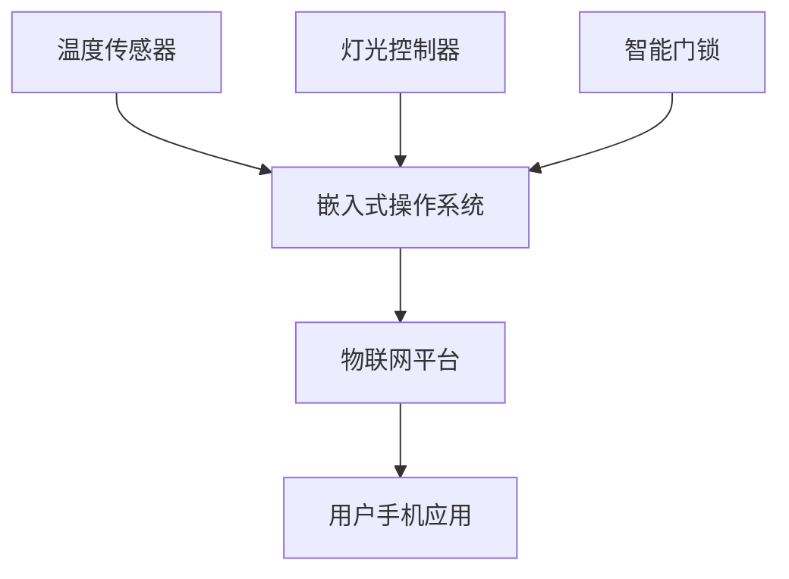

# 操作系统物联网应用

## 介绍

物联网（Internet of Things, IoT）是指通过互联网将各种设备连接起来，实现数据交换和智能控制的技术。嵌入式操作系统在物联网中扮演着至关重要的角色，它们为设备提供了高效的任务管理、资源分配和通信能力。本文将带你了解嵌入式操作系统在物联网中的应用，并通过实际案例和代码示例帮助你更好地理解这一概念。

## 嵌入式操作系统在物联网中的角色

嵌入式操作系统是为特定硬件设计的轻量级操作系统，通常用于资源受限的设备，如传感器、智能家居设备和工业控制器。在物联网中，嵌入式操作系统的主要功能包括：

- **任务调度**：管理多个任务的执行顺序，确保设备能够高效运行。
- **资源管理**：合理分配内存、处理器和网络资源。
- **通信协议支持**：支持多种通信协议，如MQTT、CoAP等，实现设备间的数据交换。
- **安全性**：提供数据加密和访问控制，保护设备和数据的安全。

## 实际案例：智能家居系统

假设我们有一个智能家居系统，其中包含多个设备，如温度传感器、灯光控制器和智能门锁。这些设备通过嵌入式操作系统连接到物联网平台，实现远程监控和控制。

### 系统架构



在这个系统中，嵌入式操作系统负责管理各个设备的任务调度和通信。例如，当温度传感器检测到温度变化时，嵌入式操作系统会将该数据发送到物联网平台，用户可以通过手机应用查看并控制家中的设备。

## 代码示例：使用MQTT协议发送数据

以下是一个简单的代码示例，展示如何使用MQTT协议将温度数据发送到物联网平台。假设我们使用的是FreeRTOS嵌入式操作系统。

```c
#include <stdio.h>
#include <stdlib.h>
#include "freertos/FreeRTOS.h"
#include "freertos/task.h"
#include "mqtt_client.h"

void mqtt_app_start(void) {
    esp_mqtt_client_config_t mqtt_cfg = {
        .uri = "mqtt://iot.example.com",
        .client_id = "temperature_sensor"
    };

    esp_mqtt_client_handle_t client = esp_mqtt_client_init(&mqtt_cfg);
    esp_mqtt_client_start(client);

    while (1) {
        int temperature = read_temperature(); // 假设这是一个读取温度的函数
        char payload[20];
        snprintf(payload, sizeof(payload), "{\"temperature\": %d}", temperature);
        esp_mqtt_client_publish(client, "home/temperature", payload, 0, 1, 0);
        vTaskDelay(5000 / portTICK_PERIOD_MS); // 每5秒发送一次数据
    }
}
```

### 代码解释

1. **初始化MQTT客户端**：我们使用`esp_mqtt_client_init`函数初始化MQTT客户端，并配置服务器的URI和客户端ID。
2. **启动MQTT客户端**：通过`esp_mqtt_client_start`函数启动客户端。
3. **发送数据**：在循环中，我们读取温度数据并将其格式化为JSON字符串，然后通过`esp_mqtt_client_publish`函数将数据发布到指定的主题。

## 总结

嵌入式操作系统在物联网中的应用非常广泛，它们为设备提供了高效的任务管理、资源分配和通信能力。通过本文的介绍和代码示例，你应该对嵌入式操作系统在物联网中的角色有了初步的了解。希望这些内容能够帮助你在编程学习的道路上更进一步。

## 附加资源

- [FreeRTOS官方文档](https://www.freertos.org/)
- [MQTT协议介绍](https://mqtt.org/)
- [物联网平台选择指南](https://www.iotforall.com/iot-platforms)

## 练习

1. 尝试修改代码示例，使其能够发送湿度数据。
2. 研究其他嵌入式操作系统，如Zephyr或RIOT，并比较它们与FreeRTOS的异同。
3. 设计一个简单的物联网系统，包含至少两种设备，并编写代码实现设备间的通信。

:::tip
在完成练习时，可以参考官方文档和社区资源，遇到问题时不要犹豫，积极寻求帮助。
:::