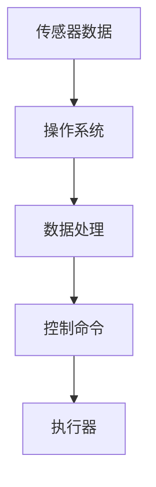
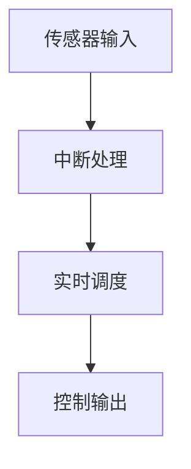

# 操作系统嵌入式优化

嵌入式系统通常运行在资源受限的环境中，例如微控制器或小型处理器。为了确保系统的高效运行，操作系统（OS）的优化至关重要。本文将介绍嵌入式操作系统优化的基本概念、技术以及实际应用。

## 什么是嵌入式操作系统优化？

嵌入式操作系统优化是指通过调整操作系统的配置、算法和资源管理策略，以提高系统的性能、减少资源消耗并满足实时性要求。优化的目标通常包括：

- **减少内存占用**：嵌入式系统通常内存有限，因此需要尽量减少操作系统的内存开销。
- **提高响应速度**：实时系统需要快速响应外部事件，优化调度算法和中断处理是关键。
- **降低功耗**：许多嵌入式设备依赖电池供电，优化操作系统以降低功耗可以延长设备寿命。

## 嵌入式操作系统优化的关键技术

### 1. 内存管理优化

嵌入式系统的内存资源有限，因此内存管理是优化的重点。以下是一些常见的内存优化技术：

- **静态内存分配**：在编译时分配内存，避免运行时动态分配的开销。
- **内存池**：预先分配固定大小的内存块，减少内存碎片。
- **压缩内存**：通过压缩技术减少内存占用。

```c
// 示例：静态内存分配
#define BUFFER_SIZE 1024
static char buffer[BUFFER_SIZE]; // 静态分配内存
```

### 2. 调度算法优化

调度算法决定了任务的执行顺序，优化调度算法可以提高系统的响应速度和实时性。

- **优先级调度**：为任务分配优先级，确保高优先级任务优先执行。
- **时间片轮转**：为每个任务分配固定的时间片，确保公平性。
- **抢占式调度**：允许高优先级任务抢占低优先级任务的执行。

```c
// 示例：优先级调度
void task_high_priority() {
    // 高优先级任务代码
}

void task_low_priority() {
    // 低优先级任务代码
}

// 设置任务优先级
set_task_priority(task_high_priority, 10); // 高优先级
set_task_priority(task_low_priority, 1);  // 低优先级
```

### 3. 中断处理优化

中断处理是嵌入式系统中的关键部分，优化中断处理可以提高系统的响应速度。

- **快速中断服务例程（ISR）**：尽量减少ISR中的代码量，快速处理中断。
- **中断嵌套**：允许高优先级中断打断低优先级中断的处理。

```c
// 示例：快速中断服务例程
void ISR() {
    // 快速处理中断
    clear_interrupt_flag();
}
```

### 4. 功耗管理优化

功耗管理是嵌入式系统优化的重要方面，尤其是在电池供电的设备中。

- **睡眠模式**：在空闲时进入低功耗模式。
- **动态电压和频率调节（DVFS）**：根据负载动态调整处理器的电压和频率。

```c
// 示例：进入睡眠模式
void enter_sleep_mode() {
    // 配置低功耗模式
    set_low_power_mode();
    // 进入睡眠
    sleep();
}
```

## 实际应用案例

### 案例1：智能家居设备

在智能家居设备中，嵌入式操作系统需要处理多种传感器数据和控制命令。通过优化内存管理和调度算法，可以确保设备快速响应并降低功耗。



### 案例2：工业控制系统

在工业控制系统中，实时性至关重要。通过优化中断处理和调度算法，可以确保系统在毫秒级内响应外部事件。



## 总结

嵌入式操作系统优化是确保系统高效运行的关键。通过优化内存管理、调度算法、中断处理和功耗管理，可以显著提高系统的性能和资源利用率。本文介绍了基本概念和实际应用案例，希望能为初学者提供有价值的参考。

## 附加资源

- [嵌入式系统设计](https://example.com/embedded-systems-design)
- [实时操作系统原理](https://example.com/real-time-os)
- [嵌入式系统优化实践](https://example.com/embedded-optimization)

## 练习

1. 尝试在嵌入式系统中实现静态内存分配，并比较其与动态内存分配的性能差异。
2. 设计一个简单的调度算法，确保高优先级任务优先执行。
3. 编写一个快速中断服务例程，并测试其响应时间。

:::tip
优化嵌入式操作系统需要综合考虑系统的需求和资源限制。建议在实际项目中逐步应用这些优化技术，并根据测试结果进行调整。
:::