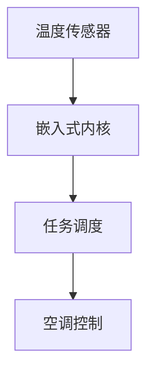
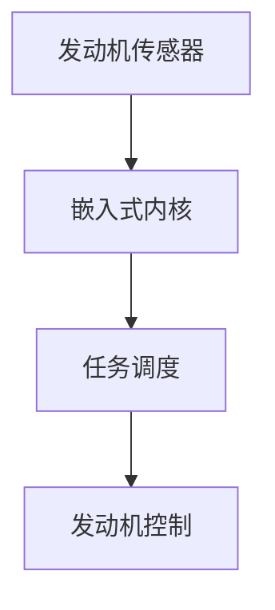

# 操作系统嵌入式内核

嵌入式操作系统是专为嵌入式设备设计的操作系统，而嵌入式内核则是其核心部分。它负责管理硬件资源、调度任务、处理中断以及提供基本的系统服务。本文将带你深入了解嵌入式内核的概念、工作原理以及实际应用。

## 什么是嵌入式内核？

嵌入式内核是嵌入式操作系统的核心组件，负责管理系统的硬件资源和软件任务。它通常包括任务调度、内存管理、设备驱动、中断处理等功能。嵌入式内核的设计目标是高效、可靠且占用资源少，以适应嵌入式设备的资源限制。

:::note
嵌入式内核通常比通用操作系统的内核更轻量级，因为它们需要运行在资源有限的设备上，如微控制器或嵌入式处理器。
:::

## 嵌入式内核的主要功能

### 1. 任务调度

任务调度是嵌入式内核的核心功能之一。它决定了哪个任务可以访问 CPU 资源以及何时访问。常见的调度算法包括：

- **先来先服务（FCFS）**：按照任务到达的顺序进行调度。
- **轮转调度（Round Robin）**：每个任务轮流获得固定的时间片。
- **优先级调度**：根据任务的优先级进行调度。

```c
// 示例：简单的任务调度
void task1() {
    while (1) {
        // 任务1的代码
    }
}

void task2() {
    while (1) {
        // 任务2的代码
    }
}

void scheduler() {
    while (1) {
        task1();
        task2();
    }
}
```

### 2. 内存管理

嵌入式内核需要管理有限的内存资源，确保每个任务都能获得所需的内存。常见的内存管理技术包括：

- **静态内存分配**：在编译时分配内存，适用于资源有限的系统。
- **动态内存分配**：在运行时分配内存，灵活性更高，但可能引入碎片问题。

```c
// 示例：静态内存分配
char buffer[1024]; // 静态分配1KB内存

// 示例：动态内存分配
void* ptr = malloc(512); // 动态分配512字节内存
if (ptr != NULL) {
    // 使用内存
    free(ptr); // 释放内存
}
```

### 3. 中断处理

嵌入式系统通常需要快速响应外部事件，如传感器数据或用户输入。中断处理机制允许系统在发生特定事件时立即暂停当前任务，转而执行中断服务程序（ISR）。

```c
// 示例：中断服务程序
void ISR() {
    // 处理中断
}

void main() {
    // 配置中断
    configure_interrupt(ISR);
    while (1) {
        // 主循环
    }
}
```

### 4. 设备驱动

嵌入式内核通过设备驱动与硬件设备进行交互。设备驱动是软件与硬件之间的桥梁，负责初始化设备、读写数据以及处理设备事件。

```c
// 示例：简单的设备驱动
void init_device() {
    // 初始化设备
}

void read_data() {
    // 从设备读取数据
}

void write_data() {
    // 向设备写入数据
}
```

## 实际应用案例

### 案例1：智能家居系统

在智能家居系统中，嵌入式内核负责管理各种传感器和执行器。例如，温度传感器检测到温度变化时，嵌入式内核会调度任务来调整空调的温度设置。



### 案例2：汽车电子控制单元（ECU）

在汽车中，嵌入式内核用于管理发动机控制、刹车系统、安全气囊等关键功能。它需要实时响应各种传感器数据，并确保系统的可靠性和安全性。



## 总结

嵌入式内核是嵌入式操作系统的核心，负责管理硬件资源、调度任务、处理中断以及提供基本的系统服务。通过本文，你应该对嵌入式内核的基本概念、主要功能以及实际应用有了初步了解。

:::tip
如果你想进一步学习嵌入式内核，可以尝试以下练习：
1. 实现一个简单的任务调度器。
2. 编写一个中断服务程序，处理外部事件。
3. 设计一个设备驱动，控制LED灯的开关。
:::

## 附加资源

- [嵌入式系统设计](https://example.com/embedded-systems-design)
- [实时操作系统（RTOS）](https://example.com/rtos)
- [嵌入式C编程](https://example.com/embedded-c-programming)
