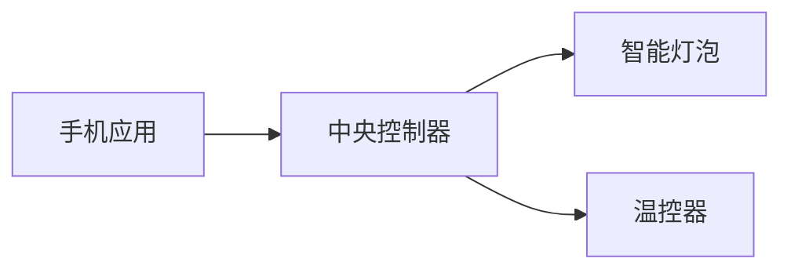

## 介绍

嵌入式操作系统（Embedded Operating System）是专为嵌入式设备设计的操作系统，通常用于资源受限的设备，如智能家居设备、工业控制器、医疗设备等。随着物联网（IoT）的快速发展，嵌入式设备的网络功能变得越来越重要。**操作系统嵌入式网络**是指在嵌入式操作系统中实现网络通信的能力，使设备能够与其他设备或服务器进行数据交换。

本文将逐步讲解嵌入式操作系统中的网络功能，包括其工作原理、实现方法以及实际应用场景。

---

## 嵌入式网络的基本概念

嵌入式网络的核心是使设备能够通过网络协议（如TCP/IP、UDP、HTTP等）与其他设备通信。以下是嵌入式网络的一些基本概念：

1. **网络协议栈**：嵌入式设备通常使用轻量级的网络协议栈（如lwIP）来实现网络通信。这些协议栈经过优化，适合资源受限的设备。
2. **网络接口**：嵌入式设备通过网络接口（如以太网、Wi-Fi、蓝牙）连接到网络。
3. **数据传输**：数据通过协议栈封装成数据包，通过网络接口发送和接收。

:::tip
嵌入式网络的关键是高效利用有限的资源（如内存和处理器），同时确保通信的可靠性和实时性。
:::

---

## 嵌入式网络的实现

### 1. 网络协议栈的选择

嵌入式设备通常使用轻量级的网络协议栈，例如：

- **lwIP（Lightweight IP）**：一个开源的TCP/IP协议栈，专为嵌入式系统设计。
- **uIP**：一个超轻量级的TCP/IP协议栈，适用于资源非常有限的设备。

以下是一个使用lwIP的简单示例：

```c
#include "lwip/opt.h"
#include "lwip/netif.h"
#include "lwip/tcpip.h"

void netif_init(void) {
    struct netif netif;
    ip4_addr_t ipaddr, netmask, gw;

    IP4_ADDR(&ipaddr, 192, 168, 1, 2);
    IP4_ADDR(&netmask, 255, 255, 255, 0);
    IP4_ADDR(&gw, 192, 168, 1, 1);

    netif_add(&netif, &ipaddr, &netmask, &gw, NULL, ethernetif_init, tcpip_input);
    netif_set_default(&netif);
    netif_set_up(&netif);
}
```

### 2. 网络接口配置

嵌入式设备的网络接口可以是硬件（如以太网控制器）或软件（如虚拟网络接口）。以下是一个配置以太网接口的示例：

```c
#include "ethernetif.h"

void ethernetif_init(struct netif *netif) {
    netif->hwaddr_len = ETHARP_HWADDR_LEN;
    netif->mtu = 1500;
    netif->flags = NETIF_FLAG_BROADCAST | NETIF_FLAG_ETHARP;
    netif->output = etharp_output;
    netif->linkoutput = low_level_output;
}
```

### 3. 数据传输

数据传输通常通过套接字（socket）接口实现。以下是一个简单的UDP数据传输示例：

```c
#include "lwip/sockets.h"

void udp_send(void) {
    int sock;
    struct sockaddr_in dest_addr;
    char *message = "Hello, Embedded Network!";

    sock = socket(AF_INET, SOCK_DGRAM, 0);
    dest_addr.sin_family = AF_INET;
    dest_addr.sin_port = htons(1234);
    inet_aton("192.168.1.100", &dest_addr.sin_addr);

    sendto(sock, message, strlen(message), 0, (struct sockaddr *)&dest_addr, sizeof(dest_addr));
    close(sock);
}
```

---

## 实际应用场景

### 1. 智能家居

在智能家居系统中，嵌入式设备（如智能灯泡、温控器）通过网络与中央控制器通信。例如，用户可以通过手机应用程序远程控制家中的灯光。



### 2. 工业物联网（IIoT）

在工业物联网中，嵌入式设备（如传感器、PLC）通过网络将数据发送到云端进行分析和处理。例如，工厂中的温度传感器可以实时监控生产环境。


---

## 总结

嵌入式网络是嵌入式操作系统中不可或缺的一部分，它使设备能够与其他设备或服务器进行通信。通过轻量级的网络协议栈（如lwIP）和高效的网络接口配置，嵌入式设备可以在资源受限的环境中实现可靠的网络通信。

在实际应用中，嵌入式网络广泛应用于智能家居、工业物联网等领域。掌握嵌入式网络的实现方法，对于开发高性能的嵌入式系统至关重要。

---

## 附加资源与练习

### 资源
- [lwIP官方文档](https://savannah.nongnu.org/projects/lwip/)
- [嵌入式网络编程指南](https://www.embedded.com/category/networking/)

### 练习
1. 使用lwIP实现一个简单的TCP服务器，接收客户端发送的数据并回复。
2. 在嵌入式设备上配置Wi-Fi接口，并通过HTTP协议发送数据到远程服务器。
3. 设计一个智能家居系统，使用嵌入式网络实现设备之间的通信。
