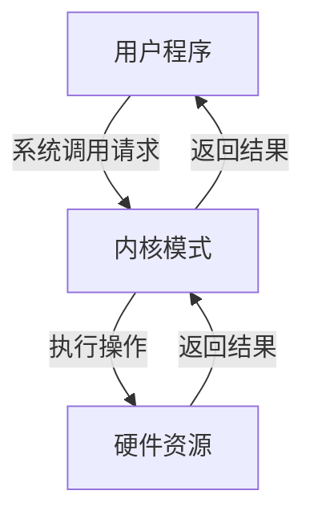

## 什么是系统调用？

系统调用（System Call）是操作系统提供给应用程序的接口，允许应用程序请求操作系统内核执行某些特权操作。由于操作系统内核运行在特权模式下，普通应用程序无法直接访问硬件资源或执行某些关键操作。因此，系统调用充当了应用程序与操作系统之间的桥梁，确保应用程序能够安全地访问系统资源。

:::note
系统调用是操作系统与用户程序之间的主要交互方式，几乎所有与硬件或系统资源相关的操作都需要通过系统调用来完成。
:::

## 系统调用的工作原理

当应用程序需要执行一个系统调用时，它会触发一个特殊的指令（例如 `int 0x80` 或 `syscall`），将控制权从用户模式切换到内核模式。操作系统内核会检查系统调用的参数，执行请求的操作，然后将结果返回给应用程序。



## 常见的系统调用类型

系统调用可以分为以下几类：

1. **进程控制**：创建、终止、等待进程等。
   - 示例：`fork()`、`exec()`、`exit()`
2. **文件操作**：打开、读取、写入、关闭文件等。
   - 示例：`open()`、`read()`、`write()`、`close()`
3. **设备管理**：请求设备、释放设备等。
   - 示例：`ioctl()`、`read()`、`write()`
4. **信息维护**：获取系统时间、设置系统参数等。
   - 示例：`gettimeofday()`、`setpriority()`
5. **通信**：创建管道、发送消息等。
   - 示例：`pipe()`、`send()`、`receive()`

## 系统调用的实际示例

以下是一个简单的 C 语言程序，展示了如何使用 `fork()` 和 `exec()` 系统调用来创建一个新进程并执行另一个程序。

```c
#include <stdio.h>
#include <unistd.h>
#include <sys/types.h>

int main() {
    pid_t pid = fork();  // 创建一个新进程

    if (pid == 0) {
        // 子进程
        printf("Child Process: PID = %d\n", getpid());
        execl("/bin/ls", "ls", "-l", NULL);  // 执行 ls -l 命令
    } else if (pid > 0) {
        // 父进程
        printf("Parent Process: PID = %d, Child PID = %d\n", getpid(), pid);
    } else {
        // fork 失败
        fprintf(stderr, "Fork failed\n");
        return 1;
    }

    return 0;
}
```

**输出示例：**
```
Parent Process: PID = 1234, Child PID = 1235
Child Process: PID = 1235
total 8
-rwxr-xr-x 1 user user 8760 Oct 10 10:00 a.out
-rw-r--r-- 1 user user  300 Oct 10 10:00 main.c
```

:::tip
`fork()` 系统调用会创建一个与父进程几乎完全相同的子进程。子进程从 `fork()` 返回的地方开始执行，但返回值是 0，而父进程返回的是子进程的 PID。
:::

## 系统调用的实际应用场景

1. **文件操作**：在编写文件管理器或文本编辑器时，需要使用 `open()`、`read()`、`write()` 等系统调用来操作文件。
2. **进程管理**：在编写多任务操作系统或并行计算程序时，需要使用 `fork()`、`exec()`、`wait()` 等系统调用来管理进程。
3. **网络通信**：在编写网络应用程序时，需要使用 `socket()`、`bind()`、`listen()` 等系统调用来建立网络连接。

## 总结

系统调用是操作系统与应用程序之间的关键接口，允许应用程序安全地访问系统资源。通过系统调用，应用程序可以执行文件操作、进程管理、设备管理等任务。理解系统调用的工作原理和常见类型，对于编写高效、安全的应用程序至关重要。

## 附加资源与练习

- **推荐阅读**：
  - 《操作系统概念》（Operating System Concepts）
  - 《UNIX 环境高级编程》（Advanced Programming in the UNIX Environment）
- **练习**：
  1. 编写一个程序，使用 `open()` 和 `read()` 系统调用读取一个文件的内容并打印到控制台。
  2. 修改上面的示例程序，使用 `wait()` 系统调用确保父进程等待子进程结束后再退出。
