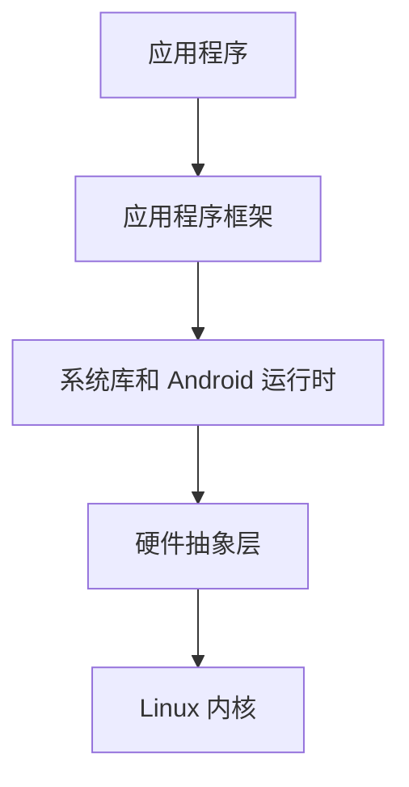

## 介绍

Android 是一个基于 Linux 内核的开源操作系统，主要用于移动设备，如智能手机和平板电脑。它由 Google 主导开发，并得到了全球开发者和设备制造商的支持。Android 提供了丰富的应用程序框架，使开发者能够轻松构建功能强大的移动应用。

## Android 架构

Android 的架构分为多个层次，每一层都有其特定的功能。以下是 Android 的主要架构层次：



### 1. 应用程序层
这是用户直接与之交互的部分，包括预装的应用（如电话、短信、浏览器）以及用户从 Google Play 商店下载的应用。

### 2. 应用程序框架层
这一层提供了开发 Android 应用所需的各种 API，包括活动管理器、内容提供者、视图系统等。

### 3. 系统库和 Android 运行时
系统库包括 C/C++ 库，如 SQLite、OpenGL 等。Android 运行时包括核心库和 Dalvik 虚拟机（在 Android 5.0 之后被 ART 取代）。

### 4. 硬件抽象层
硬件抽象层（HAL）提供了硬件与 Android 系统之间的接口，使开发者无需直接与硬件交互。

### 5. Linux 内核
Android 基于 Linux 内核，负责管理设备硬件、内存、进程等底层功能。

## Android 开发环境

要开发 Android 应用，首先需要设置开发环境。以下是基本步骤：

1. **安装 Java Development Kit (JDK)**：Android 开发需要 JDK。
2. **安装 Android Studio**：这是官方推荐的集成开发环境（IDE）。
3. **配置 Android SDK**：Android Studio 会自动下载并配置 SDK。

### 示例：创建一个简单的 Android 应用

以下是一个简单的 Android 应用示例，显示 "Hello, World!"。

```java
package com.example.myfirstapp;

import android.os.Bundle;
import androidx.appcompat.app.AppCompatActivity;

public class MainActivity extends AppCompatActivity {
    @Override
    protected void onCreate(Bundle savedInstanceState) {
        super.onCreate(savedInstanceState);
        setContentView(R.layout.activity_main);
    }
}
```

```xml
<!-- res/layout/activity_main.xml -->
<RelativeLayout xmlns:android="http://schemas.android.com/apk/res/android"
    android:layout_width="match_parent"
    android:layout_height="match_parent">

    <TextView
        android:id="@+id/textView"
        android:layout_width="wrap_content"
        android:layout_height="wrap_content"
        android:text="Hello, World!"
        android:layout_centerInParent="true"/>
</RelativeLayout>
```

:::note
在 Android Studio 中，你可以通过点击 "Run" 按钮来运行应用，并在模拟器或实际设备上查看结果。
:::

## 实际应用案例

Android 操作系统广泛应用于各种场景，以下是一些实际应用案例：

1. **智能手机和平板电脑**：Android 是世界上最流行的移动操作系统，支持多种品牌和型号的设备。
2. **智能家居设备**：许多智能家居设备（如智能音箱、智能灯泡）运行基于 Android 的系统。
3. **车载娱乐系统**：Android Auto 提供了车载娱乐和信息系统的解决方案。

## 总结

Android 是一个功能强大且灵活的操作系统，广泛应用于移动设备和嵌入式系统。通过本文，你应该对 Android 的基本架构、开发环境以及实际应用有了初步了解。

## 附加资源

- [Android 开发者文档](https://developer.android.com/docs)
- [Android Studio 下载](https://developer.android.com/studio)
- [Android 开源项目](https://source.android.com/)

## 练习

1. 在 Android Studio 中创建一个新的项目，并尝试修改 `activity_main.xml` 文件中的文本内容。
2. 研究 Android 的四大组件（Activity、Service、BroadcastReceiver、ContentProvider），并尝试创建一个简单的 Activity。
