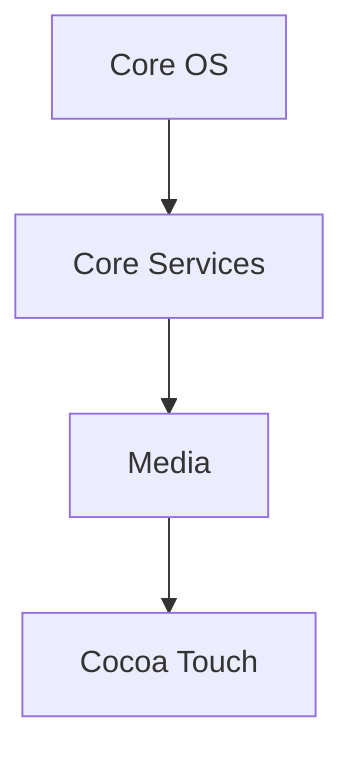

# 操作系统iOS

## 介绍

iOS是由苹果公司开发的移动操作系统，专为iPhone、iPad和iPod Touch等设备设计。自2007年首次发布以来，iOS已成为全球最流行的移动操作系统之一。它以其流畅的用户体验、强大的安全性和丰富的生态系统而闻名。

iOS的核心是基于Unix的Darwin操作系统，采用了微内核架构。它提供了丰富的API和开发工具，使开发者能够创建功能强大的应用程序。

## iOS的架构

iOS的架构可以分为四个主要层次：

1. **Core OS层**：提供底层服务，如文件系统、网络和硬件驱动。
2. **Core Services层**：提供高级服务，如数据库访问、网络通信和位置服务。
3. **Media层**：处理音频、视频和图形渲染。
4. **Cocoa Touch层**：提供用户界面组件和应用程序框架。



## iOS的核心功能

### 1. 多任务处理

iOS支持多任务处理，允许用户同时运行多个应用程序。例如，你可以在浏览网页的同时听音乐。

### 2. 安全性

iOS提供了多层次的安全机制，包括数据加密、应用沙箱和Touch ID/Face ID生物识别技术。

### 3. 应用生态系统

iOS拥有庞大的应用生态系统，用户可以通过App Store下载数百万个应用程序。

## 开发工具

### Xcode

Xcode是苹果公司提供的集成开发环境（IDE），用于开发iOS应用程序。它支持多种编程语言，包括Swift和Objective-C。

### Swift

Swift是苹果公司开发的编程语言，专为iOS应用开发设计。它结合了C和Objective-C的优点，具有简洁、安全和高效的特点。

```swift
import UIKit

class ViewController: UIViewController {
    override func viewDidLoad() {
        super.viewDidLoad()
        // 设置背景颜色
        self.view.backgroundColor = UIColor.blue
    }
}
```

### 输入和输出

在Xcode中运行上述代码，将会看到一个蓝色的背景界面。

## 实际案例

### 案例1：健康应用

iOS的健康应用可以追踪用户的步数、心率和睡眠质量。它利用设备的传感器和API来收集和分析数据。

### 案例2：AR应用

增强现实（AR）应用利用iOS的ARKit框架，将虚拟对象叠加到现实世界中。例如，宜家的AR应用允许用户在家中虚拟放置家具。

## 总结

iOS是一个功能强大且安全的移动操作系统，广泛应用于苹果的移动设备中。通过Xcode和Swift，开发者可以创建各种类型的应用程序。iOS的多任务处理、安全性和丰富的应用生态系统使其成为用户和开发者的首选。

## 附加资源

- [苹果开发者文档](https://developer.apple.com/documentation/)
- [Swift编程语言指南](https://docs.swift.org/swift-book/)
- [Xcode入门指南](https://developer.apple.com/xcode/)

## 练习

1. 在Xcode中创建一个新的iOS项目，并尝试修改背景颜色。
2. 使用Swift编写一个简单的计算器应用。
3. 探索ARKit框架，并尝试创建一个简单的AR应用。

:::tip
建议初学者从简单的项目开始，逐步掌握iOS开发的各个方面。
:::