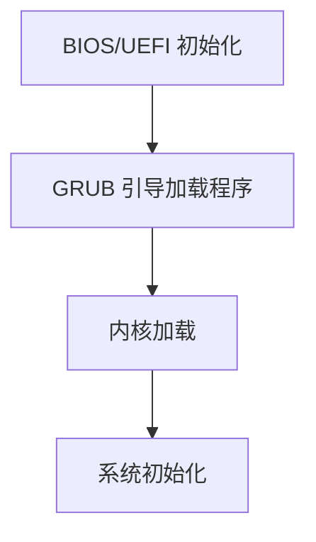

## 介绍

操作系统的启动流程是计算机从按下电源按钮到完全加载操作系统的过程。这个过程涉及多个步骤，包括硬件初始化、引导加载程序执行、内核加载和系统初始化等。理解操作系统的启动流程不仅有助于我们更好地理解计算机的工作原理，还能帮助我们在系统出现问题时进行故障排除。

## 操作系统启动流程概述

操作系统的启动流程可以分为以下几个主要阶段：

1. **BIOS/UEFI 初始化**
2. **引导加载程序（Bootloader）执行**
3. **内核加载**
4. **系统初始化**

接下来，我们将逐步讲解每个阶段的具体内容。

### 1. BIOS/UEFI 初始化

当计算机通电后，首先执行的是 BIOS（基本输入输出系统）或 UEFI（统一可扩展固件接口）。BIOS/UEFI 是存储在主板上的固件，负责在操作系统加载之前进行硬件初始化和自检。

:::note
BIOS 和 UEFI 的主要区别在于 UEFI 提供了更快的启动速度和更大的硬盘支持，而 BIOS 则较为传统。
:::

BIOS/UEFI 的主要任务包括：

- **POST（Power-On Self-Test）**：检查硬件设备是否正常工作。
- **查找引导设备**：BIOS/UEFI 会按照预设的顺序（如硬盘、USB、光盘等）查找可引导的设备。
- **加载引导加载程序**：一旦找到可引导设备，BIOS/UEFI 会将控制权交给引导加载程序。

### 2. 引导加载程序（Bootloader）执行

引导加载程序（如 GRUB、LILO 或 Windows Boot Manager）是位于硬盘上的一个小程序，负责加载操作系统的内核。引导加载程序通常存储在硬盘的 MBR（主引导记录）或 GPT（GUID 分区表）中。

引导加载程序的主要任务包括：

- **加载内核**：从硬盘中读取操作系统的内核文件并将其加载到内存中。
- **传递控制权**：将控制权交给内核，开始操作系统的启动过程。

:::tip
在 Linux 系统中，GRUB 是最常用的引导加载程序。它允许用户选择不同的操作系统或内核版本进行启动。
:::

### 3. 内核加载

内核是操作系统的核心部分，负责管理系统的硬件资源和提供系统调用接口。当引导加载程序将内核加载到内存后，内核会开始执行。

内核加载的主要任务包括：

- **初始化硬件**：内核会初始化 CPU、内存、存储设备等硬件资源。
- **挂载根文件系统**：内核会挂载根文件系统，以便访问操作系统所需的文件和目录。
- **启动 init 进程**：内核会启动第一个用户空间进程（通常是 `init` 或 `systemd`），该进程将负责后续的系统初始化。

### 4. 系统初始化

系统初始化是操作系统启动的最后一个阶段，主要由 `init` 或 `systemd` 进程负责。这个阶段的主要任务是启动系统服务和用户空间程序，使操作系统进入可用状态。

系统初始化的主要任务包括：

- **启动系统服务**：如网络服务、日志服务、用户登录服务等。
- **加载用户环境**：启动图形界面或命令行界面，允许用户与系统交互。

:::caution
不同的操作系统可能使用不同的初始化系统。例如，传统的 Linux 系统使用 `init`，而现代 Linux 系统通常使用 `systemd`。
:::

## 实际案例：Linux 系统的启动流程

让我们以 Linux 系统为例，详细说明操作系统的启动流程。

1. **BIOS/UEFI 初始化**：计算机通电后，BIOS/UEFI 进行硬件自检并查找可引导设备。
2. **GRUB 引导加载程序**：BIOS/UEFI 找到硬盘上的 GRUB 引导加载程序，并将其加载到内存中。
3. **内核加载**：GRUB 加载 Linux 内核（如 `vmlinuz`）到内存中，并传递控制权给内核。
4. **系统初始化**：内核启动 `systemd` 进程，`systemd` 负责启动系统服务和用户环境。

## 总结

操作系统的启动流程是一个复杂但有序的过程，涉及多个阶段的硬件和软件初始化。理解这一流程不仅有助于我们更好地理解计算机的工作原理，还能帮助我们在系统出现问题时进行故障排除。

## 附加资源与练习

- **练习**：尝试在虚拟机中安装一个 Linux 系统，并观察其启动流程。你可以使用 `dmesg` 命令查看内核启动日志。
- **资源**：阅读 Linux 内核文档，了解更多关于内核初始化和系统初始化的细节。

:::warning
在进行系统启动流程的实验时，请确保备份重要数据，以免因操作失误导致数据丢失。
:::