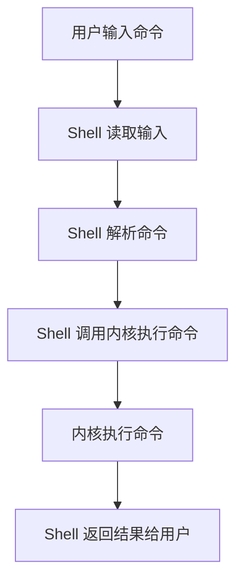

## 介绍

Shell 是操作系统中用户与内核之间的接口。它接收用户输入的命令，并将其传递给操作系统内核执行。Shell 环境不仅是一个命令行解释器，还提供了脚本编程的能力，允许用户自动化任务和管理系统资源。

对于初学者来说，理解 Shell 环境是学习操作系统和编程的重要一步。本文将带你逐步了解 Shell 的基本概念、常用命令以及如何在实际场景中使用 Shell。

## Shell 的基本概念

### 什么是 Shell？

Shell 是一个命令行解释器，它允许用户通过输入命令与操作系统交互。Shell 接收用户输入的命令，解析并执行这些命令，然后将结果返回给用户。

常见的 Shell 包括：

- **Bash**（Bourne Again Shell）：Linux 和 macOS 的默认 Shell。
- **Zsh**（Z Shell）：功能强大的 Shell，支持插件和主题。
- **PowerShell**：Windows 的 Shell，支持脚本和对象操作。

### Shell 的工作原理

当你在终端中输入一个命令时，Shell 会执行以下步骤：

1. **读取输入**：Shell 从终端读取用户输入的命令。
2. **解析命令**：Shell 解析命令，确定要执行的程序或脚本。
3. **执行命令**：Shell 调用操作系统内核执行命令。
4. **返回结果**：Shell 将命令的执行结果返回给用户。



## 常用 Shell 命令

以下是一些常用的 Shell 命令及其功能：

- `ls`：列出当前目录中的文件和文件夹。
- `cd`：切换当前工作目录。
- `mkdir`：创建新目录。
- `rm`：删除文件或目录。
- `echo`：输出文本或变量值。
- `cat`：显示文件内容。
- `grep`：在文件中搜索文本。

### 示例：使用 `ls` 命令

```bash
$ ls
file1.txt  file2.txt  directory1
```

输出结果显示了当前目录中的文件和文件夹。

### 示例：使用 `echo` 命令

```bash
$ echo "Hello, World!"
Hello, World!
```

`echo` 命令将文本 "Hello, World!" 输出到终端。

## Shell 脚本编程

Shell 不仅是一个命令行工具，还可以用于编写脚本来自动化任务。Shell 脚本是一系列命令的集合，存储在文件中，可以通过 Shell 解释器执行。

### 示例：简单的 Shell 脚本

创建一个名为 `hello.sh` 的文件，内容如下：

```bash
#!/bin/bash
echo "Hello, World!"
```

然后，通过以下命令执行脚本：

```bash
$ chmod +x hello.sh
$ ./hello.sh
Hello, World!
```

:::note
`#!/bin/bash` 是脚本的第一行，称为 shebang，它指定了脚本的解释器。
:::

## 实际应用场景

### 自动化备份

假设你需要定期备份某个目录，可以使用 Shell 脚本来自动化这一任务。

```bash
#!/bin/bash
backup_dir="/path/to/backup"
source_dir="/path/to/source"
timestamp=$(date +"%Y%m%d%H%M%S")
backup_file="$backup_dir/backup_$timestamp.tar.gz"

tar -czf $backup_file $source_dir
echo "Backup completed: $backup_file"
```

这个脚本会将 `source_dir` 目录中的内容打包并压缩，保存到 `backup_dir` 目录中，文件名包含当前时间戳。

### 系统监控

你可以使用 Shell 脚本来监控系统资源，如 CPU 和内存使用情况。

```bash
#!/bin/bash
cpu_usage=$(top -bn1 | grep "Cpu(s)" | sed "s/.*, *$[0-9.]*$%* id.*/\1/" | awk '{print 100 - $1}')
memory_usage=$(free -m | awk 'NR==2{printf "%.2f%%", $3*100/$2 }')

echo "CPU Usage: $cpu_usage%"
echo "Memory Usage: $memory_usage"
```

这个脚本会输出当前的 CPU 和内存使用情况。

## 总结

Shell 环境是操作系统中不可或缺的一部分，它为用户提供了与系统交互的强大工具。通过掌握基本的 Shell 命令和脚本编程，你可以更高效地管理系统和自动化任务。

:::tip
如果你想深入学习 Shell，可以尝试以下练习：
1. 编写一个脚本，自动清理指定目录中超过 30 天的文件。
2. 使用 `grep` 命令在一个大型日志文件中查找特定的错误信息。
:::

## 附加资源

- [Bash 脚本教程](https://ryanstutorials.net/bash-scripting-tutorial/)
- [Linux 命令行基础](https://linuxcommand.org/)
- [Shell 脚本编程指南](https://www.shellscript.sh/)
