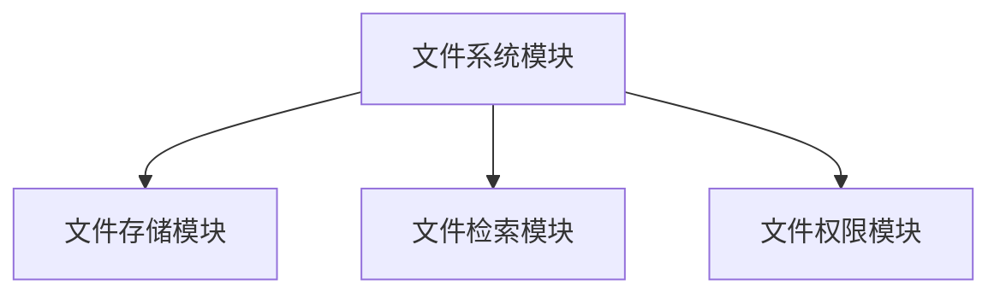

# 操作系统模块化设计

## 介绍

操作系统的设计是一个复杂的过程，涉及多个组件的协同工作。为了简化这一过程，**模块化设计**被广泛采用。模块化设计是一种将系统分解为多个独立模块的方法，每个模块负责特定的功能。这种设计方式不仅提高了代码的可维护性，还增强了系统的灵活性和可扩展性。

在本文中，我们将探讨操作系统模块化设计的基本概念、优势以及实际应用场景。

## 什么是模块化设计？

模块化设计是一种将系统分解为多个独立模块的设计方法。每个模块都是一个独立的单元，具有特定的功能。模块之间通过定义良好的接口进行通信。这种设计方式使得系统更易于理解、维护和扩展。

### 模块化设计的优势

1. **可维护性**：模块化设计使得代码更易于理解和维护。每个模块都是独立的，修改一个模块不会影响其他模块。
2. **可扩展性**：通过添加新的模块，可以轻松扩展系统的功能。
3. **可重用性**：模块可以在不同的系统中重复使用，减少了开发时间和成本。
4. **并行开发**：不同的团队可以同时开发不同的模块，提高了开发效率。

## 模块化设计的基本概念

### 模块

模块是系统中的一个独立单元，负责特定的功能。模块通常包含以下几个部分：

- **接口**：定义了模块与其他模块之间的通信方式。
- **实现**：包含了模块的具体实现代码。
- **依赖**：模块可能依赖于其他模块的功能。

### 接口

接口是模块之间通信的桥梁。它定义了模块提供的功能以及如何使用这些功能。接口的设计应该尽量简单、清晰，以减少模块之间的耦合。

### 依赖

模块之间的依赖关系需要谨慎管理。过多的依赖会导致系统变得复杂，难以维护。因此，在设计模块时，应尽量减少模块之间的依赖。

## 实际案例

### 案例：文件系统模块

假设我们正在设计一个操作系统的文件系统模块。文件系统模块负责管理文件的存储和检索。我们可以将文件系统模块分解为以下几个子模块：

1. **文件存储模块**：负责文件的物理存储。
2. **文件检索模块**：负责文件的查找和读取。
3. **文件权限模块**：负责文件的访问控制。

每个子模块都是独立的，通过定义良好的接口进行通信。例如，文件检索模块可以通过接口调用文件存储模块来读取文件内容。



### 代码示例

以下是一个简单的文件检索模块的伪代码示例：

```python
class FileStorage:
    def read_file(self, file_path):
        # 读取文件内容
        pass

class FileRetrieval:
    def __init__(self, storage):
        self.storage = storage

    def get_file_content(self, file_path):
        return self.storage.read_file(file_path)

# 使用示例
storage = FileStorage()
retrieval = FileRetrieval(storage)
content = retrieval.get_file_content("/path/to/file.txt")
print(content)
```

在这个示例中，`FileRetrieval` 模块依赖于 `FileStorage` 模块来读取文件内容。通过这种方式，我们可以轻松地替换 `FileStorage` 模块的实现，而不影响 `FileRetrieval` 模块的功能。

## 总结

模块化设计是操作系统设计中的一种重要方法。通过将系统分解为多个独立的模块，可以提高系统的可维护性、可扩展性和可重用性。在实际应用中，模块化设计可以帮助我们更好地管理复杂的系统，提高开发效率。

## 附加资源

- **书籍**：《操作系统概念》 by Abraham Silberschatz
- **在线课程**：Coursera 上的《操作系统原理》
- **练习**：尝试设计一个简单的操作系统模块，例如内存管理模块，并实现其基本功能。

:::tip
在设计和实现模块时，务必确保接口的清晰和简洁，以减少模块之间的耦合。
:::

:::caution
过多的依赖关系会导致系统变得复杂，难以维护。因此，在设计模块时，应尽量减少模块之间的依赖。
:::