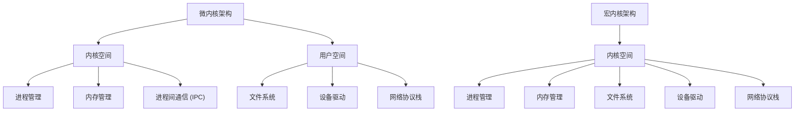

## 介绍

操作系统微内核（Microkernel）是一种操作系统设计架构，其核心思想是将操作系统的基本功能最小化，仅保留最核心的部分（如进程管理、内存管理和进程间通信），而将其他功能（如文件系统、设备驱动等）移到用户空间运行。这种设计方式与传统的**宏内核**（Monolithic Kernel）形成鲜明对比，宏内核将所有功能都集成在内核中。

微内核的主要优势在于其**模块化**和**可扩展性**。由于内核功能被最小化，系统的稳定性和安全性得以提高，同时更容易进行功能扩展和调试。

## 微内核的设计原则

微内核的设计遵循以下几个核心原则：

1. **最小化内核功能**：内核仅负责最基础的任务，如进程调度、内存管理和进程间通信（IPC）。
2. **用户空间服务**：其他功能（如文件系统、设备驱动等）作为用户空间的服务运行。
3. **模块化设计**：每个功能模块独立运行，便于维护和扩展。
4. **高可靠性**：由于内核功能简单，出错概率降低，系统更加稳定。

## 微内核的架构

为了更好地理解微内核的架构，我们可以通过以下图表展示其与宏内核的区别：



从图中可以看出，微内核将大部分功能移到了用户空间，而宏内核则将所有功能集中在内核空间。

## 微内核的实际应用

微内核的设计理念被广泛应用于现代操作系统中。以下是一些著名的微内核操作系统：

1. **Mach**：由卡内基梅隆大学开发，是早期微内核操作系统的代表，后来被苹果公司用于 macOS 和 iOS 的核心。
2. **QNX**：一种实时操作系统，广泛应用于嵌入式系统和汽车电子领域。
3. **MINIX**：由 Andrew S. Tanenbaum 开发，主要用于教学和研究。

## 微内核的代码示例

为了更好地理解微内核的工作原理，我们可以通过一个简单的进程间通信（IPC）示例来说明。以下是一个使用微内核 IPC 机制的伪代码：

```c
// 内核空间：提供 IPC 机制
void send_message(int process_id, char* message) {
    // 将消息发送到指定进程
    // ...
}

char* receive_message() {
    // 接收来自其他进程的消息
    // ...
    return message;
}

// 用户空间：文件系统服务
void file_system_service() {
    while (true) {
        char* message = receive_message();
        // 处理文件系统请求
        // ...
        send_message(requester_id, response);
    }
}

// 用户空间：设备驱动服务
void device_driver_service() {
    while (true) {
        char* message = receive_message();
        // 处理设备驱动请求
        // ...
        send_message(requester_id, response);
    }
}
```

在这个示例中，内核仅负责消息的传递，而文件系统和设备驱动的具体实现则在用户空间中运行。

## 微内核的优缺点

### 优点
1. **高可靠性**：内核功能简单，出错概率低。
2. **模块化**：功能模块独立，易于维护和扩展。
3. **安全性**：用户空间的服务崩溃不会影响内核。

### 缺点
1. **性能开销**：由于频繁的进程间通信，性能可能不如宏内核。
2. **复杂性**：设计和实现微内核系统需要更高的技术水平。

## 总结

微内核是一种模块化、可扩展的操作系统设计架构，通过将大部分功能移到用户空间，提高了系统的可靠性和安全性。尽管存在一定的性能开销，但其设计理念在现代操作系统中得到了广泛应用。

## 附加资源与练习

如果你想进一步学习微内核的相关知识，可以参考以下资源：

1. **书籍**：
   - 《操作系统设计与实现》 by Andrew S. Tanenbaum
   - 《现代操作系统》 by Andrew S. Tanenbaum
2. **在线课程**：
   - Coursera 上的操作系统课程
   - edX 上的操作系统基础课程

### 练习
1. 尝试编写一个简单的微内核 IPC 机制。
2. 比较微内核与宏内核的性能差异，并分析其原因。
3. 研究 QNX 或 MINIX 的源码，了解其微内核实现细节。

希望本文能帮助你更好地理解操作系统微内核的概念！如果有任何问题，欢迎在评论区留言讨论。