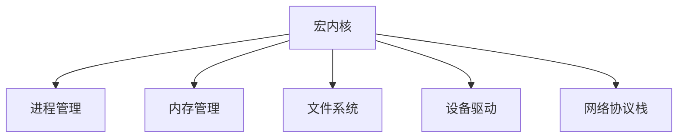

# 操作系统宏内核

## 介绍

操作系统宏内核（Monolithic Kernel）是一种操作系统内核的设计方式。在这种设计中，操作系统的核心功能（如内存管理、进程调度、文件系统、设备驱动等）都运行在内核空间中。宏内核的特点是所有核心功能都紧密集成在一起，形成一个单一的大型程序。

与微内核（Microkernel）不同，宏内核将所有功能都放在内核中，而不是将部分功能移到用户空间。这种设计方式在性能和开发复杂性上有其独特的优势和劣势。

## 宏内核的基本结构

宏内核的结构可以简化为以下几个主要模块：

1. **进程管理**：负责进程的创建、调度和销毁。
2. **内存管理**：负责内存的分配、回收和保护。
3. **文件系统**：负责文件的存储、检索和管理。
4. **设备驱动**：负责与硬件设备的通信。
5. **网络协议栈**：负责网络通信的管理。

这些模块通常都运行在内核空间中，彼此之间通过函数调用直接交互。



## 宏内核的优势

1. **性能高**：由于所有核心功能都在内核空间中运行，模块之间的通信开销较小，系统调用速度快。
2. **开发简单**：所有功能都在一个地址空间中，模块之间的交互可以直接通过函数调用实现，开发相对简单。

## 宏内核的劣势

1. **稳定性问题**：由于所有功能都运行在内核空间，任何一个模块的崩溃都可能导致整个系统崩溃。
2. **可维护性差**：随着功能的增加，内核代码会变得越来越复杂，维护和扩展的难度也会增加。

## 实际案例：Linux 内核

Linux 是一个典型的宏内核操作系统。Linux 内核包含了进程管理、内存管理、文件系统、设备驱动等所有核心功能。以下是一个简单的 Linux 内核模块示例，展示了如何在内核中创建一个简单的字符设备驱动。

```c
#include <linux/module.h>
#include <linux/fs.h>
#include <linux/uaccess.h>

#define DEVICE_NAME "my_device"
#define BUF_LEN 80

static int major_number;
static char msg[BUF_LEN];
static int msg_size;

static int device_open(struct inode *inode, struct file *file) {
    printk(KERN_INFO "Device opened\n");
    return 0;
}

static int device_release(struct inode *inode, struct file *file) {
    printk(KERN_INFO "Device closed\n");
    return 0;
}

static ssize_t device_read(struct file *filp, char *buffer, size_t length, loff_t *offset) {
    if (*offset >= msg_size) return 0;
    if (copy_to_user(buffer, msg + *offset, length)) return -EFAULT;
    *offset += length;
    return length;
}

static ssize_t device_write(struct file *filp, const char *buffer, size_t length, loff_t *offset) {
    if (length > BUF_LEN) length = BUF_LEN;
    if (copy_from_user(msg, buffer, length)) return -EFAULT;
    msg_size = length;
    return length;
}

static struct file_operations fops = {
    .read = device_read,
    .write = device_write,
    .open = device_open,
    .release = device_release,
};

static int __init my_device_init(void) {
    major_number = register_chrdev(0, DEVICE_NAME, &fops);
    if (major_number < 0) {
        printk(KERN_ALERT "Failed to register device\n");
        return major_number;
    }
    printk(KERN_INFO "Device registered with major number %d\n", major_number);
    return 0;
}

static void __exit my_device_exit(void) {
    unregister_chrdev(major_number, DEVICE_NAME);
    printk(KERN_INFO "Device unregistered\n");
}

module_init(my_device_init);
module_exit(my_device_exit);

MODULE_LICENSE("GPL");
MODULE_AUTHOR("Your Name");
MODULE_DESCRIPTION("A simple character device driver");
```

:::note
**注意**：上述代码是一个简单的 Linux 内核模块示例，展示了如何在内核中创建一个字符设备驱动。在实际开发中，内核模块的开发需要特别注意内存管理和错误处理。
:::

## 总结

宏内核是一种将操作系统核心功能紧密集成在一起的设计方式。它的优势在于性能高、开发简单，但也存在稳定性问题和可维护性差的劣势。Linux 是一个典型的宏内核操作系统，广泛应用于各种场景中。

## 附加资源

- [Linux 内核源码](https://www.kernel.org/)
- [操作系统概念（第10版）](https://www.os-book.com/)
- [Understanding the Linux Kernel](https://www.oreilly.com/library/view/understanding-the-linux/0596005652/)

## 练习

1. 尝试编译并加载上述 Linux 内核模块，观察系统日志中的输出。
2. 修改上述代码，增加一个简单的 IOCTL 接口，用于控制设备的行为。
3. 阅读 Linux 内核源码中的 `fs/` 目录，了解文件系统的实现细节。
