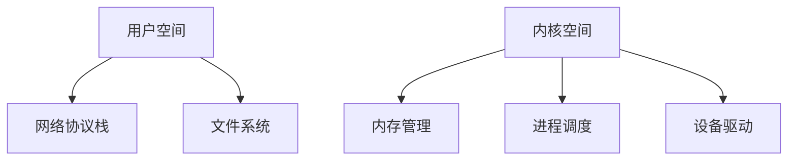

# 操作系统混合内核

## 介绍

操作系统内核是操作系统的核心部分，负责管理系统的硬件资源和提供基本的服务。根据设计方式的不同，内核可以分为**单体内核**、**微内核**和**混合内核**。本文将重点介绍**混合内核**的设计原理及其在实际中的应用。

混合内核结合了单体内核和微内核的优点。它像单体内核一样将一些关键服务（如文件系统、设备驱动）放在内核空间以提高性能，同时又像微内核一样将一些非关键服务（如网络协议栈）放在用户空间以提高系统的模块化和安全性。

## 混合内核的设计原理

混合内核的设计目标是兼顾性能和模块化。它通过以下方式实现这一目标：

1. **内核空间的关键服务**：将一些对性能要求较高的服务（如内存管理、进程调度）放在内核空间，以减少用户空间和内核空间之间的切换开销。
2. **用户空间的非关键服务**：将一些对性能要求较低的服务（如网络协议栈、文件系统）放在用户空间，以提高系统的模块化和安全性。

### 混合内核的架构

以下是一个典型的混合内核架构图：



在这个架构中，**内存管理**、**进程调度**和**设备驱动**等关键服务位于内核空间，而**网络协议栈**和**文件系统**等非关键服务位于用户空间。

## 混合内核的实际应用

混合内核的设计在许多现代操作系统中得到了广泛应用。以下是一些典型的例子：

### Windows NT 内核

Windows NT 内核是一个典型的混合内核。它将一些关键服务（如内存管理、进程调度）放在内核空间，而将一些非关键服务（如网络协议栈、文件系统）放在用户空间。这种设计使得 Windows NT 内核在性能和模块化之间取得了良好的平衡。

### macOS XNU 内核

macOS 的 XNU 内核也是一个混合内核。它结合了 Mach 微内核和 BSD 单体内核的优点。Mach 微内核负责基本的进程管理和内存管理，而 BSD 单体内核负责文件系统和网络协议栈等高级功能。

## 代码示例

以下是一个简单的混合内核代码示例，展示了如何在内核空间和用户空间之间进行通信：

```c
// 内核空间的代码
#include <linux/kernel.h>
#include <linux/module.h>

static int __init my_module_init(void) {
    printk(KERN_INFO "Hello from kernel space!\n");
    return 0;
}

static void __exit my_module_exit(void) {
    printk(KERN_INFO "Goodbye from kernel space!\n");
}

module_init(my_module_init);
module_exit(my_module_exit);

MODULE_LICENSE("GPL");
MODULE_AUTHOR("Your Name");
MODULE_DESCRIPTION("A simple kernel module");
```

```c
// 用户空间的代码
#include <stdio.h>

int main() {
    printf("Hello from user space!\n");
    return 0;
}
```

在这个示例中，内核空间的代码通过 `printk` 函数输出信息，而用户空间的代码通过 `printf` 函数输出信息。两者之间的通信可以通过系统调用或其他机制实现。

## 总结

混合内核结合了单体内核和微内核的优点，既保证了性能，又提高了系统的模块化和安全性。它在许多现代操作系统中得到了广泛应用，如 Windows NT 和 macOS XNU。

## 附加资源

- [Operating System Concepts by Abraham Silberschatz](https://www.os-book.com/)
- [Understanding the Linux Kernel by Daniel P. Bovet and Marco Cesati](https://www.oreilly.com/library/view/understanding-the-linux/0596005652/)

## 练习

1. 尝试编写一个简单的内核模块，并在用户空间中调用它。
2. 研究 Windows NT 内核的架构，并比较它与 macOS XNU 内核的异同。
3. 思考混合内核在嵌入式系统中的应用场景。

:::tip
如果你对内核编程感兴趣，建议深入学习 Linux 内核源码，并尝试编写自己的内核模块。
:::