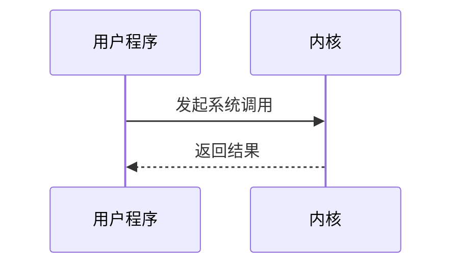

## 引言

操作系统内核是计算机系统的核心部分，负责管理硬件资源并为应用程序提供服务。内核接口是操作系统内核与用户空间程序之间的桥梁，允许应用程序通过系统调用与内核交互。理解内核接口的设计和功能，是学习操作系统设计的重要一步。

本文将逐步介绍操作系统内核接口的基本概念、工作原理以及实际应用场景，帮助初学者建立扎实的基础。

---

## 什么是操作系统内核接口？

操作系统内核接口是一组定义良好的函数或系统调用，允许用户空间程序与内核进行交互。这些接口提供了对硬件资源（如 CPU、内存、磁盘和网络）的访问权限，同时确保系统的安全性和稳定性。

内核接口的主要功能包括：
- **资源管理**：分配和管理硬件资源。
- **进程管理**：创建、调度和终止进程。
- **文件系统操作**：读写文件、管理目录。
- **设备管理**：与硬件设备通信。
- **安全控制**：确保用户程序不会破坏系统。

---

## 内核接口的类型

内核接口通常分为以下几类：

### 1. 系统调用（System Calls）
系统调用是用户程序请求内核服务的标准方式。例如，在 Linux 中，`read()` 和 `write()` 是用于文件操作的系统调用。

```c
#include <unistd.h>

int main() {
    char buffer[100];
    int bytes_read = read(0, buffer, sizeof(buffer)); // 从标准输入读取数据
    write(1, buffer, bytes_read); // 将数据写入标准输出
    return 0;
}
```

:::note
**注意**：系统调用是用户程序与内核交互的主要方式，但频繁的系统调用可能会导致性能开销。
:::

### 2. 设备驱动程序接口
设备驱动程序是内核与硬件设备之间的桥梁。它们通过内核接口与用户程序通信。例如，在 Linux 中，设备文件（如 `/dev/sda`）允许用户程序与磁盘设备交互。

### 3. 文件系统接口
文件系统接口允许用户程序访问和管理文件。例如，`open()`、`close()`、`read()` 和 `write()` 是常见的文件系统操作。

---

## 内核接口的工作原理

当用户程序调用系统调用时，会发生以下步骤：
1. 用户程序通过库函数（如 `glibc`）发起系统调用。
2. CPU 切换到内核模式，执行内核代码。
3. 内核处理请求并返回结果。
4. CPU 切换回用户模式，用户程序继续执行。

以下是一个简单的系统调用流程示意图：



---

## 实际案例：Linux 中的系统调用

Linux 是一个广泛使用的操作系统，其内核接口设计非常经典。以下是一个使用 `fork()` 系统调用创建子进程的示例：

```c
#include <stdio.h>
#include <unistd.h>

int main() {
    pid_t pid = fork(); // 创建子进程
    if (pid == 0) {
        printf("这是子进程，PID: %d\n", getpid());
    } else {
        printf("这是父进程，子进程 PID: %d\n", pid);
    }
    return 0;
}
```

**输出示例**：
```
这是父进程，子进程 PID: 1234
这是子进程，PID: 1234
```

:::tip
**提示**：`fork()` 系统调用会创建一个与父进程几乎完全相同的子进程，子进程从 `fork()` 返回的地方开始执行。
:::

---

## 内核接口的设计原则

设计内核接口时，需要遵循以下原则：
1. **简洁性**：接口应简单易用，避免复杂的设计。
2. **一致性**：接口的行为应保持一致，便于用户理解。
3. **安全性**：确保用户程序无法直接访问内核数据或破坏系统。
4. **性能**：尽量减少系统调用的开销。

---

## 总结

操作系统内核接口是用户程序与内核交互的关键机制。通过系统调用、设备驱动程序接口和文件系统接口，用户程序可以安全地访问硬件资源和管理系统功能。理解内核接口的设计和实现，是学习操作系统设计的重要基础。

---

## 附加资源与练习

### 推荐资源
- 《操作系统概念》（Abraham Silberschatz 等著）：深入讲解操作系统内核及其接口设计。
- Linux 手册页（`man` 命令）：查看系统调用的详细文档。

### 练习
1. 编写一个程序，使用 `open()` 和 `read()` 系统调用读取文件内容并打印到终端。
2. 研究 `exec()` 系统调用的工作原理，并编写一个程序替换当前进程的映像。

通过实践和深入学习，你将更好地掌握操作系统内核接口的核心概念！