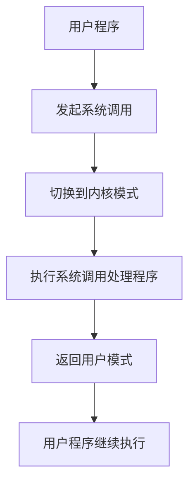

# 操作系统系统调用实现

## 介绍

系统调用（System Call）是操作系统提供给用户程序访问内核功能的接口。通过系统调用，用户程序可以请求操作系统执行特权操作，例如文件读写、进程管理、网络通信等。系统调用是用户空间和内核空间之间的桥梁，确保了系统的安全性和稳定性。

在本节中，我们将深入探讨系统调用的实现原理，并通过代码示例和实际案例帮助你理解这一重要概念。

## 系统调用的基本概念

系统调用是操作系统内核提供的一组接口，允许用户程序请求内核执行某些特权操作。由于用户程序运行在用户空间，无法直接访问硬件资源或执行特权指令，因此需要通过系统调用来请求内核的帮助。

### 系统调用的工作流程

1. **用户程序发起系统调用**：用户程序通过调用特定的库函数（如 `open()`、`read()`）来发起系统调用。
2. **切换到内核模式**：系统调用触发一个软中断（如 `int 0x80` 或 `syscall` 指令），将 CPU 从用户模式切换到内核模式。
3. **执行系统调用处理程序**：内核根据系统调用号（syscall number）找到对应的处理函数并执行。
4. **返回用户模式**：系统调用执行完毕后，内核将结果返回给用户程序，并将 CPU 切换回用户模式。



## 系统调用的实现

### 系统调用表

内核维护了一个系统调用表（syscall table），其中每个系统调用都有一个唯一的编号（syscall number）。当用户程序发起系统调用时，内核会根据系统调用号找到对应的处理函数。

例如，Linux 内核中的系统调用表定义如下：

```c
// 示例：Linux 内核系统调用表
const sys_call_ptr_t sys_call_table[] = {
    [0] = sys_read,
    [1] = sys_write,
    [2] = sys_open,
    // 其他系统调用...
};
```

### 系统调用的触发

在 x86 架构中，系统调用通常通过软中断 `int 0x80` 或 `syscall` 指令触发。以下是一个简单的示例，展示如何通过汇编代码触发系统调用：

```c
// 示例：使用汇编触发系统调用
#include <unistd.h>

int main() {
    char msg[] = "Hello, World!\n";
    // 系统调用号：1 (sys_write)
    // 文件描述符：1 (stdout)
    // 缓冲区：msg
    // 长度：14
    __asm__ (
        "movl $1, %%eax\n"  // syscall number for sys_write
        "movl $1, %%ebx\n"  // file descriptor (stdout)
        "movl %0, %%ecx\n"  // buffer address
        "movl $14, %%edx\n" // buffer length
        "int $0x80\n"       // trigger interrupt
        :
        : "r" (msg)
        : "%eax", "%ebx", "%ecx", "%edx"
    );
    return 0;
}
```

:::note
在现代操作系统中，`syscall` 指令通常比 `int 0x80` 更高效，因为它不需要通过中断描述符表（IDT）进行查找。
:::

### 系统调用的返回值

系统调用执行完毕后，内核会将结果存储在特定的寄存器中（如 `eax`）。用户程序可以通过检查返回值来判断系统调用是否成功。

```c
// 示例：检查系统调用返回值
#include <unistd.h>
#include <stdio.h>

int main() {
    int ret = write(1, "Hello, World!\n", 14);
    if (ret < 0) {
        perror("write failed");
    }
    return 0;
}
```

## 实际应用场景

### 文件操作

文件操作是系统调用的常见应用场景之一。例如，`open()`、`read()`、`write()` 和 `close()` 系统调用用于文件的打开、读取、写入和关闭。

```c
// 示例：使用系统调用进行文件操作
#include <fcntl.h>
#include <unistd.h>
#include <stdio.h>

int main() {
    int fd = open("example.txt", O_WRONLY | O_CREAT, 0644);
    if (fd < 0) {
        perror("open failed");
        return 1;
    }
    write(fd, "Hello, File!\n", 13);
    close(fd);
    return 0;
}
```

### 进程管理

进程管理是另一个常见的系统调用应用场景。例如，`fork()` 系统调用用于创建新进程，`exec()` 系统调用用于执行新程序。

```c
// 示例：使用系统调用进行进程管理
#include <unistd.h>
#include <stdio.h>

int main() {
    pid_t pid = fork();
    if (pid < 0) {
        perror("fork failed");
        return 1;
    } else if (pid == 0) {
        // 子进程
        execl("/bin/ls", "ls", NULL);
    } else {
        // 父进程
        wait(NULL);
    }
    return 0;
}
```

## 总结

系统调用是操作系统中的重要机制，它为用户程序提供了访问内核功能的接口。通过系统调用，用户程序可以执行文件操作、进程管理、网络通信等特权操作。理解系统调用的实现原理对于深入学习操作系统至关重要。

## 附加资源与练习

- **练习 1**：编写一个程序，使用 `read()` 和 `write()` 系统调用实现文件复制功能。
- **练习 2**：研究 Linux 内核源码，找到系统调用表的定义，并尝试添加一个自定义系统调用。
- **推荐阅读**：
  - 《操作系统概念》（Operating System Concepts）
  - 《深入理解 Linux 内核》（Understanding the Linux Kernel）

通过以上内容，你应该对操作系统系统调用的实现有了初步的了解。继续深入学习，你将能够更好地理解操作系统的内部机制。