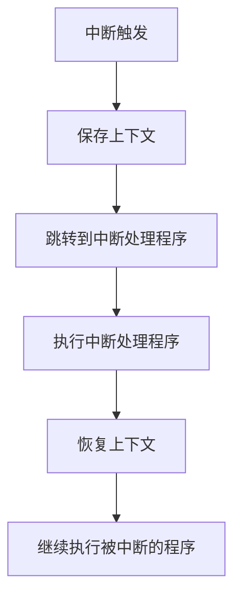

# 操作系统中断处理设计

## 介绍

在操作系统中，**中断**是一种硬件或软件发出的信号，用于通知 CPU 需要立即处理某个事件。中断处理是操作系统设计中的核心机制之一，它允许系统在运行过程中快速响应外部事件，例如键盘输入、磁盘 I/O 完成或定时器超时。

中断处理的设计目标是确保系统能够高效地处理多个并发事件，同时保持系统的稳定性和响应性。本文将逐步讲解中断处理的基本概念、流程以及如何在实际操作系统中实现中断处理。

## 中断的基本概念

### 什么是中断？

中断是计算机系统中的一种机制，用于暂停当前正在执行的程序，转而执行另一个程序（称为中断处理程序或中断服务例程，ISR）。中断可以由硬件（如键盘、鼠标、定时器）或软件（如系统调用）触发。

### 中断的类型

1. **硬件中断**：由外部设备触发，例如键盘输入、鼠标点击或网络数据包到达。
2. **软件中断**：由程序主动触发，例如系统调用或异常处理。
3. **异常**：由 CPU 检测到的错误或特殊情况触发，例如除零错误或页面错误。

### 中断处理的基本流程

中断处理通常包括以下步骤：

1. **中断触发**：硬件或软件发出中断信号。
2. **保存上下文**：CPU 保存当前程序的执行状态（如寄存器值、程序计数器等）。
3. **跳转到中断处理程序**：CPU 根据中断类型跳转到相应的中断处理程序。
4. **执行中断处理程序**：处理中断事件。
5. **恢复上下文**：恢复之前保存的执行状态，继续执行被中断的程序。



## 中断处理的设计

### 中断向量表

中断向量表是一个存储中断处理程序地址的数据结构。每个中断类型对应一个唯一的索引（中断号），CPU 通过中断号查找中断向量表，找到对应的中断处理程序地址。

```c
// 示例：中断向量表
void (*interrupt_vector_table[256])();

// 注册中断处理程序
void register_interrupt_handler(int interrupt_number, void (*handler)()) {
    interrupt_vector_table[interrupt_number] = handler;
}

// 中断处理程序示例
void keyboard_interrupt_handler() {
    // 处理键盘输入
}
```

### 中断屏蔽与优先级

在多任务操作系统中，某些中断可能需要被屏蔽（禁用），以防止在处理一个中断时被另一个中断打断。此外，中断通常具有优先级，高优先级的中断可以打断低优先级的中断处理。

```c
// 示例：中断屏蔽
void disable_interrupts() {
    asm volatile ("cli"); // 清除中断标志位
}

void enable_interrupts() {
    asm volatile ("sti"); // 设置中断标志位
}
```

### 中断处理的代码示例

以下是一个简单的中断处理程序示例，假设我们正在处理一个定时器中断：

```c
#include <stdio.h>

// 定时器中断处理程序
void timer_interrupt_handler() {
    printf("Timer interrupt occurred!\n");
}

int main() {
    // 注册定时器中断处理程序
    register_interrupt_handler(0, timer_interrupt_handler);

    // 模拟定时器中断
    printf("Simulating timer interrupt...\n");
    interrupt_vector_table[0]();

    return 0;
}
```

**输出：**
```
Simulating timer interrupt...
Timer interrupt occurred!
```

## 实际应用场景

### 键盘输入处理

在操作系统中，键盘输入通常通过中断处理来实现。当用户按下键盘上的某个键时，硬件会触发一个中断，操作系统会调用相应的中断处理程序来读取键盘输入并更新系统状态。

```c
void keyboard_interrupt_handler() {
    char key = read_keyboard_input();
    printf("Key pressed: %c\n", key);
}
```

### 磁盘 I/O 完成通知

当磁盘 I/O 操作完成时，硬件会触发一个中断，通知操作系统可以继续处理相关的任务。例如，当文件读取完成时，操作系统可以将数据从磁盘缓冲区复制到用户空间。

```c
void disk_interrupt_handler() {
    printf("Disk I/O operation completed.\n");
    // 处理磁盘数据
}
```

## 总结

中断处理是操作系统设计中的关键机制，它允许系统快速响应外部事件并保持高效运行。本文介绍了中断的基本概念、处理流程以及如何在实际操作系统中实现中断处理。通过理解中断处理的设计原理，初学者可以更好地掌握操作系统的核心机制。

## 附加资源与练习

### 附加资源
- [操作系统概念（第 10 版）](https://www.os-book.com/)：深入讲解操作系统中的中断处理机制。
- [Linux 内核中断处理](https://www.kernel.org/doc/html/latest/core-api/interrupts.html)：了解 Linux 内核中的中断处理实现。

### 练习
1. 编写一个简单的操作系统内核，实现定时器中断处理。
2. 修改上述键盘输入处理程序，使其能够处理多个按键输入并存储到缓冲区中。
3. 研究 Linux 内核中的中断处理机制，并尝试编写一个简单的内核模块来处理自定义中断。

:::tip
**提示**：在编写中断处理程序时，务必注意保存和恢复上下文，以避免系统崩溃或数据丢失。
:::