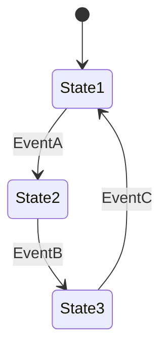

# 操作系统形式化验证

## 介绍

操作系统（OS）是计算机系统的核心，负责管理硬件资源并为应用程序提供运行环境。由于其复杂性，操作系统的设计和实现中可能存在难以察觉的错误。**形式化验证**是一种数学方法，用于证明系统设计的正确性，确保其符合预期行为。在操作系统领域，形式化验证可以帮助开发者发现并修复潜在的错误，从而提高系统的可靠性和安全性。

形式化验证的核心思想是将系统的设计和行为转化为数学模型，然后通过逻辑推理或自动化工具验证这些模型是否满足特定的属性。这种方法可以避免传统测试方法中可能遗漏的边界情况。

## 形式化验证的基本方法

形式化验证通常分为以下几种方法：

1. **定理证明（Theorem Proving）**：通过数学定理证明系统的正确性。这种方法需要人工参与，通常用于验证复杂系统的关键部分。
2. **模型检查（Model Checking）**：通过遍历系统的所有可能状态，验证系统是否满足给定的属性。这种方法适用于有限状态系统。
3. **抽象解释（Abstract Interpretation）**：通过抽象化系统的行为，分析系统是否满足某些属性。这种方法适用于大规模系统。

### 模型检查示例

以下是一个简单的模型检查示例，使用形式化工具验证一个状态机的行为。

假设我们希望验证“系统永远不会进入 `State3`”。通过模型检查工具，我们可以遍历所有可能的状态转换路径，验证这一属性是否成立。

## 实际案例：seL4 微内核

**seL4** 是一个经过形式化验证的微内核操作系统。它被证明在功能正确性、安全性和实时性方面满足严格的数学规范。seL4 的验证过程包括：

1. **功能正确性**：证明内核的实现与其高级规范完全一致。
2. **安全性**：证明内核不会泄露敏感信息或允许未经授权的访问。
3. **实时性**：证明内核能够满足实时任务的调度需求。

seL4 的成功验证表明，形式化验证可以显著提高操作系统的可靠性，尤其是在安全关键领域（如航空航天、医疗设备）中。

## 形式化验证的挑战

尽管形式化验证具有显著的优势，但它也面临一些挑战：

1. **复杂性**：形式化验证需要深厚的数学和逻辑知识，对初学者来说可能难以掌握。
2. **工具支持**：虽然有许多形式化验证工具（如 Coq、Isabelle、Z3），但这些工具的学习曲线较陡峭。
3. **规模限制**：形式化验证通常适用于中小规模系统，对于大规模系统，验证过程可能非常耗时。

## 总结

形式化验证是一种强大的方法，可以帮助开发者确保操作系统的正确性和安全性。尽管它具有一定的复杂性，但在关键系统中，形式化验证的价值是不可替代的。通过学习和实践，初学者可以逐步掌握这一技术，并将其应用到实际项目中。

## 附加资源与练习

### 资源
- [seL4 官方网站](https://sel4.systems/)：了解 seL4 微内核及其形式化验证过程。
- [Coq 证明助手](https://coq.inria.fr/)：学习如何使用 Coq 进行定理证明。
- [Z3 求解器](https://github.com/Z3Prover/z3)：探索如何使用 Z3 进行模型检查。

### 练习
1. 使用 Coq 或 Z3 验证一个简单的状态机是否满足特定属性。
2. 阅读 seL4 的形式化验证论文，总结其验证过程的关键步骤。
3. 尝试为一个简单的操作系统模块编写形式化规范，并使用工具验证其正确性。

:::tip
形式化验证是一个需要长期学习和实践的领域。建议从简单的例子开始，逐步深入理解其原理和应用。
:::