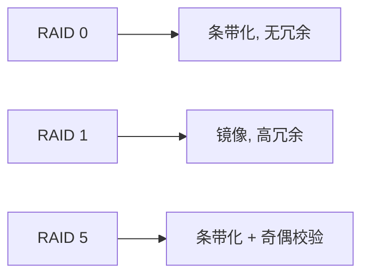

# 操作系统容灾技术

## 介绍

在现代计算机系统中，**容灾技术**（Disaster Recovery, DR）是确保系统在发生故障或灾难时能够快速恢复并继续运行的关键技术。无论是硬件故障、软件错误，还是自然灾害，容灾技术都能帮助系统保持高可用性和数据完整性。

容灾技术的核心目标是通过冗余设计、备份机制和故障转移策略，最大限度地减少系统停机时间和数据丢失。本文将逐步讲解操作系统中的容灾技术，并通过实际案例帮助初学者理解其应用。

---

## 容灾技术的基本原理

容灾技术主要依赖于以下几个核心概念：

1. **冗余设计**：通过增加额外的硬件或软件资源，确保在部分组件失效时，系统仍能正常运行。
2. **备份机制**：定期将数据复制到安全的存储位置，以便在数据丢失时能够快速恢复。
3. **故障转移**：当主系统发生故障时，自动将工作负载切换到备用系统，确保服务不中断。

:::tip
容灾技术不仅仅是硬件层面的设计，还需要操作系统和应用程序的配合。例如，操作系统需要支持热备份和故障检测功能。
:::

---

## 容灾技术的实现方式

### 1. 数据备份

数据备份是容灾技术的基础。操作系统通常提供以下备份方式：

- **完全备份**：将所有数据复制到备份存储中。
- **增量备份**：仅备份自上次备份以来发生变化的数据。
- **差异备份**：备份自上次完全备份以来发生变化的数据。

#### 示例：Linux 中的备份命令

```bash
# 完全备份
tar -cvzf backup.tar.gz /path/to/data

# 增量备份
rsync -av --compare-dest=/path/to/last_backup /path/to/data /path/to/new_backup
```

:::note
增量备份和差异备份的区别在于，增量备份依赖于上一次备份（无论完全还是增量），而差异备份始终基于上一次完全备份。
:::

### 2. 冗余存储

冗余存储通过 RAID（Redundant Array of Independent Disks）技术实现。RAID 将多个磁盘组合成一个逻辑单元，提供数据冗余和性能提升。

#### RAID 级别示例



:::caution
RAID 0 不提供冗余，仅用于性能提升。如果其中一个磁盘损坏，所有数据都会丢失。
:::

### 3. 故障转移

故障转移通过集群技术实现。集群中的多个节点共享工作负载，当某个节点失效时，其他节点会自动接管其任务。

#### 示例：Linux 高可用性集群

```bash
# 安装 Pacemaker 和 Corosync
sudo apt-get install pacemaker corosync

# 配置集群
sudo pcs cluster setup --name my_cluster node1 node2
sudo pcs cluster start --all
```

:::warning
故障转移需要确保备用节点的状态与主节点一致，否则可能导致数据不一致或服务中断。
:::

---

## 实际应用场景

### 案例 1：云服务提供商

云服务提供商（如 AWS、Azure）使用容灾技术确保用户数据的高可用性。例如：

- **多区域备份**：将用户数据复制到多个地理区域，防止自然灾害导致的数据丢失。
- **自动故障转移**：当某个数据中心发生故障时，自动将用户流量切换到其他数据中心。

### 案例 2：金融系统

金融系统对数据完整性和系统可用性要求极高。例如：

- **实时数据同步**：通过数据库复制技术，确保主数据库和备用数据库的数据一致。
- **灾难恢复演练**：定期模拟灾难场景，测试系统的恢复能力。

---

## 总结

容灾技术是操作系统和现代计算机系统中不可或缺的一部分。通过冗余设计、备份机制和故障转移策略，容灾技术能够最大限度地减少系统停机时间和数据丢失。对于初学者来说，理解这些核心概念是掌握操作系统高级话题的重要一步。

---

## 附加资源与练习

### 资源
- [RAID 技术详解](https://en.wikipedia.org/wiki/RAID)
- [Linux 高可用性集群指南](https://access.redhat.com/documentation/en-us/red_hat_enterprise_linux/7/html/high_availability_add-on_administration/)

### 练习
1. 在 Linux 系统中，尝试使用 `tar` 和 `rsync` 命令创建完全备份和增量备份。
2. 配置一个简单的 RAID 1 镜像，并模拟磁盘故障，观察系统的恢复过程。
3. 使用 Pacemaker 和 Corosync 搭建一个双节点高可用性集群，并测试故障转移功能。

:::tip
实践是掌握容灾技术的最佳方式。建议在虚拟机或测试环境中完成上述练习，以避免对生产环境造成影响。
:::