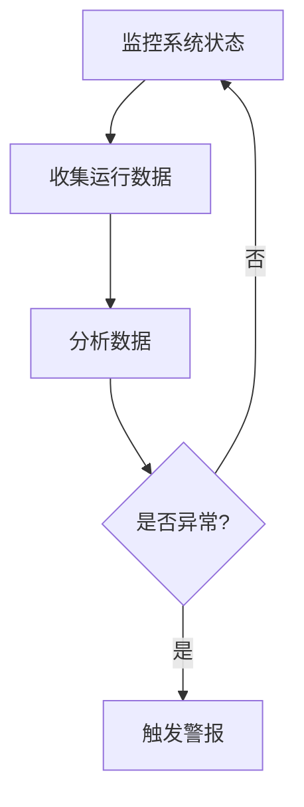

# 操作系统自愈机制

## 介绍

操作系统自愈机制是指操作系统在检测到错误或故障时，能够自动采取措施进行修复或恢复，从而保证系统的稳定性和可靠性。这种机制在现代操作系统中变得越来越重要，尤其是在高可用性和容错性要求较高的场景中。

自愈机制的核心思想是通过监控系统的运行状态，及时发现异常，并采取相应的措施进行修复。这些措施可能包括重启服务、切换备用资源、修复损坏的文件等。

## 自愈机制的工作原理

### 1. 监控与检测

自愈机制的第一步是监控系统的运行状态。操作系统会通过各种监控工具和日志系统来收集系统的运行数据，如CPU使用率、内存使用情况、磁盘I/O等。当这些数据超出预设的阈值时，系统会触发警报。



### 2. 错误诊断

一旦检测到异常，系统会进入错误诊断阶段。在这个阶段，系统会尝试确定问题的根源。这可能涉及到分析日志文件、检查系统配置、运行诊断工具等。

### 3. 自动修复

在确定了问题的根源后，系统会尝试自动修复。修复措施可能包括：

- **重启服务**：如果某个服务崩溃，系统可能会尝试重启该服务。
- **切换备用资源**：如果某个硬件设备出现故障，系统可能会切换到备用设备。
- **修复文件系统**：如果文件系统损坏，系统可能会运行文件系统检查工具（如 `fsck`）来修复损坏的文件。

### 4. 恢复与验证

修复完成后，系统会进入恢复阶段。在这个阶段，系统会验证修复是否成功，并确保系统恢复到正常状态。如果修复失败，系统可能会尝试其他修复措施，或者通知管理员进行手动干预。

## 实际案例

### 案例1：Linux 系统的 `systemd` 服务管理器

`systemd` 是 Linux 系统中广泛使用的服务管理器。它具备强大的自愈能力。例如，如果一个服务崩溃，`systemd` 可以自动重启该服务，并记录相关日志。

```bash
# 查看某个服务的状态
systemctl status myservice

# 如果服务崩溃，systemd 会自动重启
```

### 案例2：Windows 系统的自动修复工具

Windows 操作系统提供了多种自动修复工具，如 `Windows Recovery Environment (WinRE)`。当系统启动失败时，WinRE 可以自动检测问题并尝试修复。

```powershell
# 进入 Windows 恢复环境
shutdown /r /o
```

## 总结

操作系统自愈机制是现代操作系统的重要组成部分，它通过监控、诊断、修复和恢复等步骤，确保系统在出现故障时能够自动恢复。这种机制不仅提高了系统的可靠性，还减少了管理员的工作负担。

## 附加资源与练习

### 资源

- [Linux `systemd` 官方文档](https://www.freedesktop.org/wiki/Software/systemd/)
- [Windows Recovery Environment 官方指南](https://docs.microsoft.com/en-us/windows-hardware/manufacture/desktop/windows-recovery-environment--windows-re--technical-reference)

### 练习

1. 在 Linux 系统中，尝试配置一个服务，使其在崩溃时自动重启。
2. 在 Windows 系统中，模拟系统启动失败，并使用 WinRE 进行修复。

通过这些练习，你可以更深入地理解操作系统自愈机制的工作原理和实际应用。