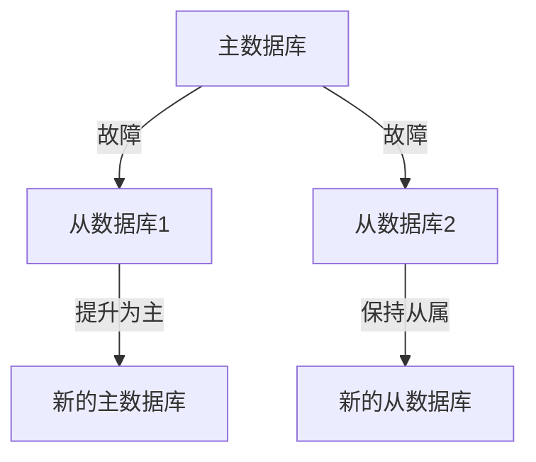
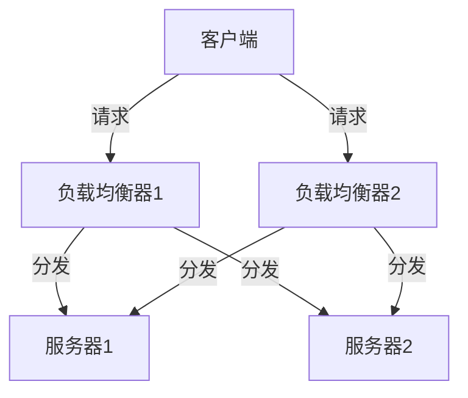

## 介绍

**高可用性（High Availability, HA）** 是指系统能够在预定的时间内持续运行，尽量减少因故障导致的停机时间。在操作系统中，高可用性是一个关键的设计目标，尤其是在需要24/7不间断运行的服务中，如银行系统、电子商务平台和云计算基础设施。

高可用性通常通过冗余、故障检测和自动恢复等技术来实现。本文将逐步介绍这些概念，并通过实际案例帮助你理解高可用性在操作系统中的应用。

## 高可用性的核心概念

### 1. 冗余（Redundancy）

冗余是高可用性的基础。通过增加额外的硬件或软件资源，系统可以在某个组件发生故障时继续运行。常见的冗余方式包括：

- **硬件冗余**：例如使用多个电源、硬盘或网络接口。
- **软件冗余**：例如使用多个实例或副本运行相同的服务。

:::tip
冗余并不意味着浪费资源，而是为了确保系统在故障时仍能正常运行。
:::

### 2. 故障检测（Fault Detection）

故障检测是确保系统能够及时发现问题的关键。操作系统通常通过心跳机制（Heartbeat）或健康检查（Health Check）来监控系统的状态。

```bash
# 示例：简单的健康检查脚本
#!/bin/bash
if curl -I http://localhost:8080/health 2>&1 | grep "200 OK"; then
  echo "Service is healthy"
else
  echo "Service is down"
  # 触发故障恢复机制
fi
```

### 3. 自动恢复（Automatic Recovery）

当系统检测到故障时，自动恢复机制会尝试修复问题或切换到备用资源。例如，操作系统可以通过重启服务、切换到备用服务器或重新分配资源来恢复服务。

## 实际案例

### 案例 1：数据库集群的高可用性

假设我们有一个数据库集群，其中包含一个主数据库和两个从数据库。当主数据库发生故障时，系统会自动将其中一个从数据库提升为主数据库，以确保服务不中断。



### 案例 2：负载均衡器的高可用性

负载均衡器用于将流量分发到多个服务器。为了提高可用性，通常会部署多个负载均衡器，并使用虚拟IP地址（VIP）来确保即使一个负载均衡器发生故障，流量仍能被正确分发。



## 总结

高可用性是现代操作系统设计中的一个重要目标，尤其是在需要持续运行的关键系统中。通过冗余、故障检测和自动恢复等技术，系统可以在发生故障时继续运行，从而减少停机时间。

:::note
高可用性不仅仅是技术问题，还需要考虑成本、复杂性和实际需求。在设计高可用性系统时，务必权衡这些因素。
:::

## 附加资源

- [Understanding High Availability in Distributed Systems](https://example.com)
- [Practical Guide to Fault Tolerance in Operating Systems](https://example.com)

## 练习

1. 设计一个简单的健康检查脚本，监控一个Web服务的状态，并在服务不可用时发送警报。
2. 研究一个开源的高可用性解决方案（如 Kubernetes 或 Pacemaker），并尝试在本地环境中部署一个高可用性集群。