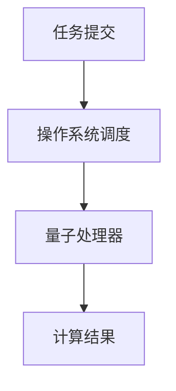

# 操作系统量子计算支持

## 介绍

量子计算是一种利用量子力学原理进行计算的新型计算模式。与传统计算机使用比特（bit）作为基本单位不同，量子计算机使用量子比特（qubit），这些量子比特可以同时处于多个状态，从而大幅提升计算能力。随着量子计算技术的快速发展，操作系统也需要适应这一变化，提供对量子计算的支持。

本文将介绍操作系统如何支持量子计算，包括其基本原理、实际应用场景以及未来发展方向。

## 量子计算的基本原理

### 量子比特（Qubit）

量子比特是量子计算的基本单位。与传统比特只能处于0或1的状态不同，量子比特可以同时处于0和1的叠加态。这种叠加态使得量子计算机能够并行处理大量信息。

### 量子纠缠

量子纠缠是量子计算中的另一个重要概念。当两个量子比特纠缠在一起时，它们的状态会相互依赖，即使它们相隔很远。这种特性使得量子计算机能够进行高效的通信和计算。

### 量子门

量子门是量子计算中的基本操作单元，类似于传统计算机中的逻辑门。量子门可以对量子比特进行操作，例如改变其状态或使其与其他量子比特纠缠。

## 操作系统对量子计算的支持

### 量子计算资源的调度

操作系统需要能够有效地调度量子计算资源。由于量子计算机的计算能力远超传统计算机，操作系统需要确保量子计算任务能够高效地分配到量子处理器上。



### 量子计算任务的隔离

由于量子计算任务的特殊性，操作系统需要确保不同任务之间的隔离，以防止量子态的干扰。这可以通过虚拟化技术实现，为每个量子计算任务提供一个独立的执行环境。

### 量子计算结果的存储与传输

量子计算结果的存储和传输也是一个重要问题。由于量子态的特殊性，操作系统需要提供专门的存储和传输机制，以确保量子信息的完整性和安全性。

## 实际应用场景

### 量子化学计算

量子计算机在化学计算中具有巨大潜力。例如，量子计算机可以模拟分子的量子态，从而加速新药物的研发。

### 优化问题

量子计算机在解决优化问题方面也具有优势。例如，量子计算机可以用于优化供应链管理、交通流量控制等复杂问题。

### 密码学

量子计算机对传统密码学构成了挑战，但也为新型量子密码学提供了可能。操作系统需要支持量子密码学的实现，以确保数据的安全性。

## 代码示例

以下是一个简单的量子计算代码示例，使用Qiskit库进行量子门操作：

```python
from qiskit import QuantumCircuit, Aer, execute

# 创建一个量子电路，包含2个量子比特
qc = QuantumCircuit(2)

# 在第一个量子比特上应用Hadamard门
qc.h(0)

# 在第二个量子比特上应用Pauli-X门
qc.x(1)

# 执行量子电路
simulator = Aer.get_backend('statevector_simulator')
result = execute(qc, simulator).result()

# 输出结果
print(result.get_statevector())
```

**输入：**
- 量子电路包含2个量子比特。
- 在第一个量子比特上应用Hadamard门。
- 在第二个量子比特上应用Pauli-X门。

**输出：**
- 量子电路的最终状态向量。

## 总结

操作系统对量子计算的支持是未来计算技术发展的重要方向。通过有效地调度量子计算资源、隔离量子计算任务以及提供专门的存储和传输机制，操作系统可以为量子计算提供强大的支持。随着量子计算技术的不断进步，操作系统在这一领域的角色将变得越来越重要。

## 附加资源

- [Qiskit官方文档](https://qiskit.org/documentation/)
- [量子计算入门指南](https://quantum-computing.ibm.com/composer/docs/iqx/guide)
- [量子计算与操作系统](https://arxiv.org/abs/2005.13409)

## 练习

1. 使用Qiskit库创建一个包含3个量子比特的量子电路，并应用不同的量子门操作。
2. 研究量子计算在密码学中的应用，并尝试实现一个简单的量子加密算法。
3. 探讨操作系统如何通过虚拟化技术实现量子计算任务的隔离。

:::tip
量子计算是一个快速发展的领域，建议持续关注最新的研究进展和技术动态。
:::