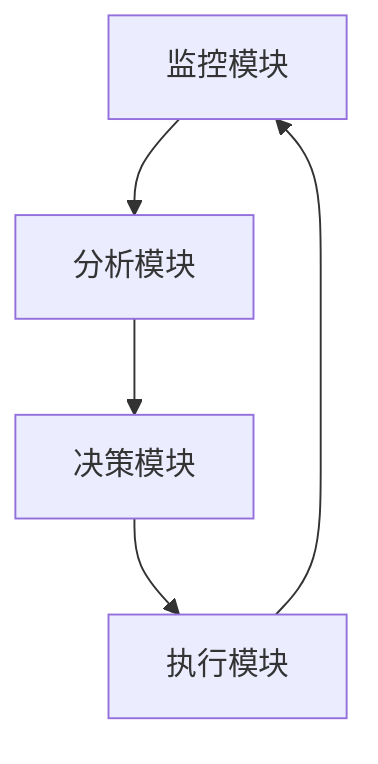

# 操作系统自适应系统

## 介绍

操作系统自适应系统（Adaptive Operating System）是一种能够根据环境变化、用户需求或系统负载动态调整其行为和资源分配的操作系统。这种系统通过实时监控和分析系统状态，自动优化性能、资源利用率和用户体验。自适应系统的核心目标是提高系统的灵活性和效率，同时减少人工干预。

在现代计算环境中，自适应系统变得越来越重要，尤其是在云计算、物联网（IoT）和边缘计算等领域。这些场景中，系统需要处理动态变化的工作负载和资源需求，而自适应系统能够确保系统始终以最佳状态运行。

## 自适应系统的工作原理

自适应系统通常包括以下几个关键组件：

1. **监控模块**：实时收集系统状态数据，如 CPU 使用率、内存占用、网络带宽等。
2. **分析模块**：对收集到的数据进行分析，识别潜在的性能瓶颈或资源浪费。
3. **决策模块**：根据分析结果，制定调整策略，如动态分配资源、调整任务优先级等。
4. **执行模块**：实施决策模块的策略，动态调整系统行为。

以下是一个简单的自适应系统工作流程示意图：



## 实际案例：动态资源分配

假设我们有一个运行在云环境中的 Web 服务器，它需要处理来自不同用户的请求。随着用户数量的增加，服务器的负载也会增加。自适应系统可以通过以下步骤动态调整资源分配：

1. **监控**：系统实时监控 CPU 使用率和内存占用。
2. **分析**：当 CPU 使用率超过 80% 时，系统识别到性能瓶颈。
3. **决策**：系统决定增加 CPU 资源或启动新的服务器实例。
4. **执行**：系统自动分配更多 CPU 资源或启动新的实例。

以下是一个简单的伪代码示例，展示了自适应系统的动态资源分配逻辑：

```python
def monitor_system():
    cpu_usage = get_cpu_usage()
    memory_usage = get_memory_usage()
    return cpu_usage, memory_usage

def analyze_data(cpu_usage, memory_usage):
    if cpu_usage > 80:
        return "increase_cpu"
    elif memory_usage > 70:
        return "increase_memory"
    else:
        return "no_action"

def execute_action(action):
    if action == "increase_cpu":
        allocate_more_cpu()
    elif action == "increase_memory":
        allocate_more_memory()
    else:
        pass

def adaptive_system():
    while True:
        cpu_usage, memory_usage = monitor_system()
        action = analyze_data(cpu_usage, memory_usage)
        execute_action(action)
```

:::note
**注意**：上述代码仅为伪代码，实际实现可能需要考虑更多细节，如资源限制、成本控制等。
:::

## 实际应用场景

### 1. 云计算中的弹性伸缩

在云计算环境中，自适应系统可以根据工作负载的变化自动调整计算资源的分配。例如，当用户访问量激增时，系统可以自动增加服务器实例以应对高负载；当访问量减少时，系统可以自动减少实例以节省成本。

### 2. 物联网设备中的能耗管理

在物联网设备中，自适应系统可以根据设备的电池电量和任务优先级动态调整能耗策略。例如，当电池电量较低时，系统可以降低设备的计算频率或关闭不必要的功能以延长电池寿命。

### 3. 边缘计算中的延迟优化

在边缘计算场景中，自适应系统可以根据网络延迟和计算需求动态调整任务的分配。例如，系统可以将高延迟的任务迁移到更靠近用户的边缘节点，以减少延迟并提高响应速度。

## 总结

操作系统自适应系统通过实时监控、分析和动态调整，能够有效提高系统的性能和资源利用率。它在云计算、物联网和边缘计算等领域有着广泛的应用前景。通过理解自适应系统的工作原理和实际应用场景，我们可以更好地设计和优化现代计算系统。

## 附加资源与练习

### 附加资源
- [操作系统自适应调度算法研究](https://example.com)
- [云计算中的弹性伸缩技术](https://example.com)

### 练习
1. 尝试编写一个简单的自适应系统模拟程序，模拟动态资源分配的过程。
2. 思考并设计一个适用于智能家居设备的自适应系统，考虑如何根据设备状态和用户需求动态调整系统行为。
