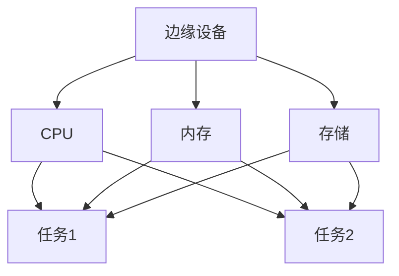
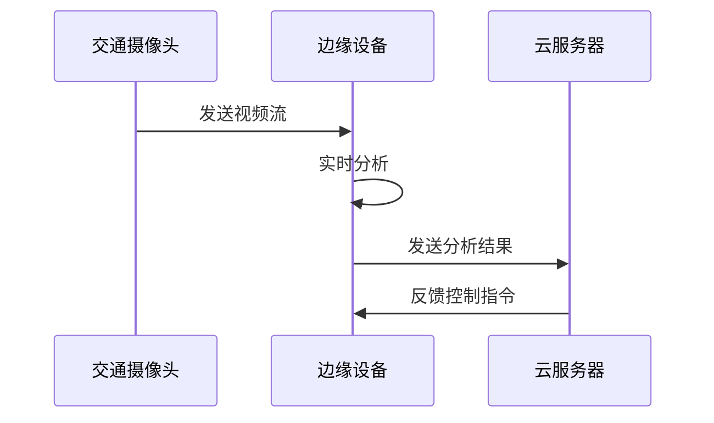

# 操作系统边缘计算

## 介绍

边缘计算（Edge Computing）是一种分布式计算范式，它将数据处理和存储从中心化的云服务器转移到靠近数据源的边缘设备上。这种架构能够减少延迟、节省带宽，并提高系统的响应速度。操作系统在边缘计算中扮演着至关重要的角色，因为它负责管理硬件资源、调度任务以及确保数据的安全性和可靠性。

本文将逐步介绍操作系统在边缘计算中的作用，并通过实际案例展示其应用场景。

## 边缘计算的基本概念

边缘计算的核心思想是将计算任务分散到网络的边缘，而不是集中在云端。这样可以减少数据传输的延迟，并提高系统的实时性。操作系统在边缘设备上需要具备以下特点：

1. **轻量级**：边缘设备通常资源有限，因此操作系统需要尽可能轻量化。
2. **实时性**：许多边缘计算应用需要快速响应，因此操作系统需要支持实时任务调度。
3. **安全性**：边缘设备可能暴露在不安全的环境中，因此操作系统需要提供强大的安全机制。

## 操作系统在边缘计算中的作用

### 资源管理

边缘设备通常具有有限的资源，如CPU、内存和存储。操作系统需要高效地管理这些资源，以确保多个任务能够同时运行而不发生冲突。



### 任务调度

在边缘计算中，任务调度是一个关键问题。操作系统需要根据任务的优先级和实时性要求，合理地分配CPU时间。

```python
# 示例：简单的任务调度
tasks = [
    {"name": "Task1", "priority": 1},
    {"name": "Task2", "priority": 2},
    {"name": "Task3", "priority": 3},
]

# 按优先级排序
tasks.sort(key=lambda x: x["priority"])

for task in tasks:
    print(f"Executing {task['name']}")
```

**输出：**
```
Executing Task1
Executing Task2
Executing Task3
```

### 安全性

边缘设备可能面临各种安全威胁，如数据泄露、恶意软件攻击等。操作系统需要提供多层次的安全机制，包括访问控制、加密和防火墙等。

:::tip
在实际应用中，通常会使用硬件安全模块（HSM）来增强边缘设备的安全性。
:::

## 实际案例

### 智能交通系统

在智能交通系统中，边缘计算可以用于实时处理交通摄像头的数据。操作系统需要快速分析视频流，检测交通违规行为，并及时发出警报。



### 工业物联网（IIoT）

在工业物联网中，边缘计算可以用于监控生产线的状态。操作系统需要实时采集传感器数据，并根据预设的规则进行决策。

```python
# 示例：监控生产线状态
sensor_data = {
    "temperature": 75,
    "pressure": 120,
    "vibration": 0.5,
}

if sensor_data["temperature"] > 70:
    print("Warning: High temperature detected!")
```

**输出：**
```
Warning: High temperature detected!
```

## 总结

操作系统在边缘计算中扮演着至关重要的角色，它不仅需要高效地管理资源，还需要支持实时任务调度和提供强大的安全机制。通过实际案例，我们可以看到边缘计算在智能交通系统和工业物联网中的广泛应用。

## 附加资源

- [边缘计算入门指南](https://example.com/edge-computing-guide)
- [操作系统与边缘计算的关系](https://example.com/os-edge-computing)
- [边缘计算安全最佳实践](https://example.com/edge-security)

## 练习

1. 编写一个简单的任务调度程序，模拟边缘设备上的任务执行顺序。
2. 研究一个实际的边缘计算应用场景，并分析操作系统在其中所起的作用。
