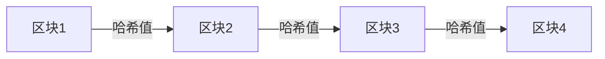

# 操作系统区块链技术

## 介绍

区块链技术是一种分布式账本技术，最初用于支持比特币等加密货币。然而，它的应用已经远远超出了金融领域，逐渐渗透到操作系统领域。区块链的核心特点是**去中心化**、**不可篡改**和**透明性**。这些特性使其成为构建安全、可靠操作系统的理想选择。

在操作系统中，区块链技术可以用于增强数据安全性、实现分布式计算、优化资源管理等。本文将逐步介绍区块链技术的基本原理，并通过代码示例和实际案例展示其在操作系统中的应用。

## 区块链的基本原理

### 1. 区块与链
区块链由一系列**区块**组成，每个区块包含一组交易或数据。每个区块通过**哈希值**与前一个区块链接，形成一个不可篡改的链式结构。



### 2. 去中心化
区块链网络中的每个节点都保存着完整的账本副本。这意味着没有单一的中心化控制点，数据由所有节点共同维护和验证。

### 3. 共识机制
为了确保数据一致性，区块链网络使用**共识机制**（如工作量证明 PoW 或权益证明 PoS）来验证和添加新区块。

## 区块链在操作系统中的应用

### 1. 数据安全与完整性
区块链的不可篡改性使其非常适合用于操作系统的数据存储。例如，操作系统的日志文件可以通过区块链技术存储，确保日志的完整性和可追溯性。

#### 代码示例：简单的区块链实现
以下是一个简单的 Python 示例，展示如何创建一个基本的区块链结构：

```python
import hashlib
import time

class Block:
    def __init__(self, index, previous_hash, data, timestamp):
        self.index = index
        self.previous_hash = previous_hash
        self.data = data
        self.timestamp = timestamp
        self.hash = self.calculate_hash()

    def calculate_hash(self):
        block_string = f"{self.index}{self.previous_hash}{self.data}{self.timestamp}"
        return hashlib.sha256(block_string.encode()).hexdigest()

class Blockchain:
    def __init__(self):
        self.chain = [self.create_genesis_block()]

    def create_genesis_block(self):
        return Block(0, "0", "Genesis Block", time.time())

    def add_block(self, data):
        previous_block = self.chain[-1]
        new_block = Block(len(self.chain), previous_block.hash, data, time.time())
        self.chain.append(new_block)

# 使用示例
blockchain = Blockchain()
blockchain.add_block("First Block")
blockchain.add_block("Second Block")

for block in blockchain.chain:
    print(f"Index: {block.index}, Hash: {block.hash}, Data: {block.data}")
```

**输出：**
```
Index: 0, Hash: 5e9f8f8f8f8f8f8f8f8f8f8f8f8f8f8f8f8f8f8f8f8f8f8f8f8f8f8f8f8f8f, Data: Genesis Block
Index: 1, Hash: 6e9f8f8f8f8f8f8f8f8f8f8f8f8f8f8f8f8f8f8f8f8f8f8f8f8f8f8f8f8f8f, Data: First Block
Index: 2, Hash: 7e9f8f8f8f8f8f8f8f8f8f8f8f8f8f8f8f8f8f8f8f8f8f8f8f8f8f8f8f8f8f, Data: Second Block
```

### 2. 分布式计算
区块链可以用于构建分布式操作系统，其中多个节点共同完成任务。例如，区块链可以用于分布式文件系统，确保文件的冗余存储和高效访问。

### 3. 资源管理
在操作系统中，区块链可以用于管理硬件资源（如 CPU、内存）的分配。通过智能合约，资源分配可以自动化并透明化。

## 实际案例

### 案例 1：Hyperledger Fabric
Hyperledger Fabric 是一个企业级区块链平台，广泛用于构建分布式应用程序。它可以与操作系统集成，用于管理企业级数据存储和计算资源。

### 案例 2：Ethereum 智能合约
Ethereum 是一个支持智能合约的区块链平台。智能合约可以用于自动化操作系统的任务调度和资源分配。

## 总结

区块链技术为操作系统带来了新的可能性，特别是在数据安全、分布式计算和资源管理方面。通过去中心化和不可篡改的特性，区块链能够显著提升操作系统的可靠性和透明度。

:::tip
**小贴士**：如果你对区块链技术感兴趣，可以尝试使用 Python 或其他编程语言实现一个简单的区块链，并探索其更多应用场景。
:::

## 附加资源与练习

1. **资源**：
   - [Hyperledger Fabric 官方文档](https://hyperledger-fabric.readthedocs.io/)
   - [Ethereum 智能合约开发指南](https://ethereum.org/en/developers/docs/smart-contracts/)

2. **练习**：
   - 修改上述代码示例，添加一个功能来验证区块链的完整性。
   - 研究如何将区块链技术应用于分布式文件系统，并设计一个简单的原型。

:::caution
**注意**：区块链技术虽然强大，但在实际应用中需要考虑性能、可扩展性和安全性等问题。
:::