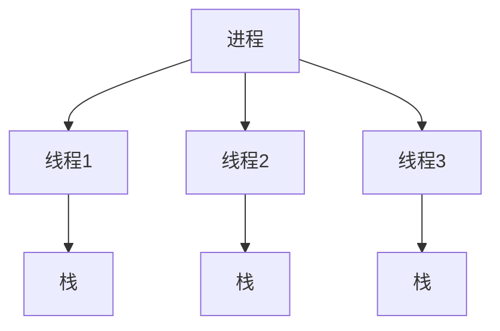

# 操作系统线程概念

## 介绍

在操作系统中，**线程**是程序执行的最小单位。线程是进程的一部分，一个进程可以包含多个线程。线程共享进程的资源（如内存、文件句柄等），但每个线程有自己的执行路径和栈空间。理解线程的概念对于编写高效、并发的程序至关重要。

## 什么是线程？

线程是操作系统能够进行运算调度的最小单位。它被包含在进程之中，是进程中的实际运作单位。一个进程可以包含多个线程，这些线程共享进程的资源，但每个线程有自己的执行路径和栈空间。

:::note
线程与进程的区别：
- **进程**：操作系统资源分配的基本单位，每个进程有独立的内存空间。
- **线程**：CPU调度的基本单位，线程共享进程的内存空间。
:::

## 线程的工作原理

线程通过共享进程的资源来实现并发执行。每个线程都有自己的栈空间，用于存储局部变量和函数调用信息。线程之间的通信可以通过共享内存来实现。



## 线程的实际应用场景

线程在实际应用中有多种用途，以下是一些常见的场景：

1. **多任务处理**：在图形用户界面（GUI）应用程序中，主线程负责处理用户输入，而其他线程可以执行后台任务，如文件下载或数据处理。
2. **并发服务器**：在服务器应用程序中，每个客户端连接可以由一个独立的线程处理，从而实现并发处理多个客户端请求。
3. **并行计算**：在科学计算或数据处理中，线程可以用于将任务分解为多个子任务，并行执行以提高计算速度。

## 代码示例

以下是一个简单的Python代码示例，展示了如何使用线程来并发执行任务：

```python
import threading
import time

def print_numbers():
    for i in range(5):
        print(f"Number: {i}")
        time.sleep(1)

def print_letters():
    for letter in ['A', 'B', 'C', 'D', 'E']:
        print(f"Letter: {letter}")
        time.sleep(1)

# 创建线程
thread1 = threading.Thread(target=print_numbers)
thread2 = threading.Thread(target=print_letters)

# 启动线程
thread1.start()
thread2.start()

# 等待线程完成
thread1.join()
thread2.join()

print("任务完成")
```

**输出**：
```
Number: 0
Letter: A
Number: 1
Letter: B
Number: 2
Letter: C
Number: 3
Letter: D
Number: 4
Letter: E
任务完成
```

:::tip
在实际应用中，线程的创建和管理可能会涉及更复杂的同步机制，如锁、信号量等，以避免资源竞争和数据不一致的问题。
:::

## 总结

线程是操作系统中的重要概念，它允许程序并发执行多个任务，从而提高效率和响应性。通过理解线程的工作原理和应用场景，你可以编写出更高效、更灵活的并发程序。

## 附加资源与练习

- **推荐阅读**：
  - 《操作系统概念》 - Abraham Silberschatz
  - 《现代操作系统》 - Andrew S. Tanenbaum

- **练习**：
  1. 修改上面的代码示例，使其包含更多的线程，并观察输出结果。
  2. 尝试使用线程锁（`threading.Lock`）来同步多个线程对共享资源的访问。

通过不断实践和探索，你将更深入地理解线程的概念及其在实际编程中的应用。