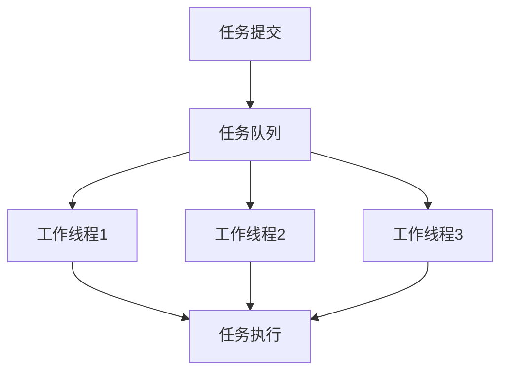

# 操作系统线程池

## 介绍

在现代操作系统中，线程是执行任务的基本单位。然而，频繁地创建和销毁线程会带来显著的性能开销。为了解决这个问题，操作系统引入了**线程池**的概念。线程池是一种管理线程的技术，它通过预先创建一组线程并重复使用它们来执行任务，从而减少线程创建和销毁的开销。

线程池的核心思想是**线程复用**。通过维护一个线程池，操作系统可以更高效地管理线程资源，避免频繁的线程创建和销毁操作，从而提高系统的性能和响应速度。

## 线程池的工作原理

线程池通常由以下几个组件组成：

1. **线程池管理器**：负责创建、销毁和管理线程池。
2. **工作线程**：线程池中的线程，用于执行任务。
3. **任务队列**：用于存放待执行的任务。
4. **任务接口**：定义任务的执行方式。

当有任务需要执行时，线程池管理器会将任务放入任务队列中。工作线程会从任务队列中取出任务并执行。执行完毕后，工作线程会继续从任务队列中取出下一个任务，直到任务队列为空。



## 代码示例

以下是一个简单的线程池实现示例，使用 Python 的 `concurrent.futures` 模块：

```python
import concurrent.futures
import time

def task(name):
    print(f"Task {name} started")
    time.sleep(2)
    print(f"Task {name} finished")
    return f"Task {name} result"

# 创建一个包含 3 个工作线程的线程池
with concurrent.futures.ThreadPoolExecutor(max_workers=3) as executor:
    # 提交任务到线程池
    futures = [executor.submit(task, i) for i in range(5)]
    
    # 获取任务结果
    for future in concurrent.futures.as_completed(futures):
        print(future.result())
```

**输出：**
```
Task 0 started
Task 1 started
Task 2 started
Task 0 finished
Task 3 started
Task 1 finished
Task 4 started
Task 2 finished
Task 3 finished
Task 4 finished
Task 0 result
Task 1 result
Task 2 result
Task 3 result
Task 4 result
```

在这个示例中，我们创建了一个包含 3 个工作线程的线程池，并提交了 5 个任务。由于线程池中只有 3 个线程，因此前 3 个任务会立即开始执行，而剩下的任务会等待线程空闲后再执行。

## 实际应用场景

线程池在许多实际应用中都有广泛的使用，以下是一些常见的应用场景：

1. **Web 服务器**：Web 服务器通常需要处理大量的并发请求。使用线程池可以有效地管理这些请求，避免频繁创建和销毁线程。
2. **数据库连接池**：数据库连接是一种昂贵的资源，使用线程池可以复用数据库连接，减少连接创建和销毁的开销。
3. **并行计算**：在需要执行大量并行计算任务的场景中，线程池可以有效地分配计算资源，提高计算效率。

:::tip
在实际应用中，线程池的大小需要根据具体的应用场景进行调整。过小的线程池可能导致任务等待时间过长，而过大的线程池可能会消耗过多的系统资源。
:::

## 总结

线程池是一种高效管理线程的技术，通过预先创建一组线程并重复使用它们来执行任务，从而减少线程创建和销毁的开销。线程池在 Web 服务器、数据库连接池和并行计算等场景中都有广泛的应用。

通过合理配置线程池的大小，可以显著提高系统的性能和响应速度。希望本文能帮助你理解线程池的概念及其在实际应用中的重要性。

## 附加资源与练习

- **练习**：尝试修改上面的代码示例，增加线程池的大小，观察任务执行顺序的变化。
- **进一步学习**：阅读操作系统相关的书籍或文档，深入了解线程调度和资源管理的更多细节。
- **参考资源**：
  - [Python `concurrent.futures` 官方文档](https://docs.python.org/3/library/concurrent.futures.html)
  - 《操作系统概念》—— Abraham Silberschatz 等

:::caution
在使用线程池时，务必注意线程安全问题，确保多个线程不会同时访问和修改共享资源。
:::