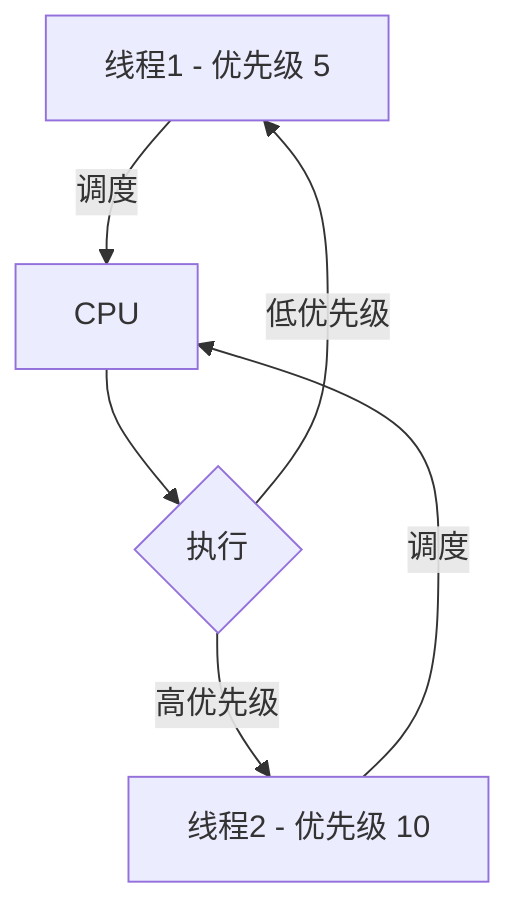

## 介绍

在多线程编程中，操作系统需要决定哪个线程应该优先执行。线程优先级（Thread Priority）是操作系统用来管理线程执行顺序的一种机制。通过为线程分配不同的优先级，操作系统可以确保高优先级的任务能够更快地获得 CPU 时间，从而满足实时性要求或关键任务的需求。

## 什么是线程优先级？

线程优先级是一个整数值，通常范围从 1（最低优先级）到 10（最高优先级）。操作系统根据线程的优先级来决定哪个线程应该优先执行。高优先级的线程会抢占低优先级的线程，从而更快地获得 CPU 资源。

:::note
不同的操作系统可能对优先级的范围和实现方式有所不同。例如，Windows 和 Linux 的线程优先级机制可能略有差异。
:::

## 线程优先级的实现

### 1. 设置线程优先级

在大多数编程语言中，你可以通过 API 来设置线程的优先级。以下是一个使用 Python 的 `threading` 模块设置线程优先级的示例：

```python
import threading

def worker():
    print(f"线程 {threading.current_thread().name} 正在运行")

# 创建线程
thread1 = threading.Thread(target=worker, name="线程1")
thread2 = threading.Thread(target=worker, name="线程2")

# 设置线程优先级（Python 的 threading 模块不支持直接设置优先级）
# 通常需要通过操作系统提供的 API 来设置优先级
# 例如，在 Windows 上可以使用 win32api 模块

# 启动线程
thread1.start()
thread2.start()

# 等待线程完成
thread1.join()
thread2.join()
```

:::caution
需要注意的是，Python 的 `threading` 模块本身并不直接支持设置线程优先级。如果你需要设置线程优先级，通常需要使用操作系统提供的 API 或第三方库。
:::

### 2. 操作系统调度

操作系统会根据线程的优先级来决定哪个线程应该优先执行。以下是一个简单的调度示例：



在这个示例中，线程2的优先级高于线程1，因此线程2会优先获得 CPU 时间。

## 实际应用场景

### 1. 实时系统

在实时系统中，某些任务必须在特定的时间内完成。通过为这些任务分配高优先级，可以确保它们能够及时获得 CPU 资源，从而满足实时性要求。

### 2. 多媒体应用

在多媒体应用中，音频和视频处理通常需要较高的优先级，以确保流畅的播放体验。通过为这些任务分配高优先级，可以避免因其他低优先级任务导致的卡顿。

### 3. 游戏开发

在游戏开发中，渲染线程通常需要较高的优先级，以确保游戏画面的流畅性。通过为渲染线程分配高优先级，可以避免因其他后台任务导致的帧率下降。

## 总结

线程优先级是操作系统用来管理线程执行顺序的重要机制。通过合理设置线程优先级，可以确保关键任务能够及时获得 CPU 资源，从而提升程序的性能和响应速度。

:::tip
在实际开发中，设置线程优先级时需要谨慎。过高的优先级可能导致低优先级任务长时间得不到执行，从而影响系统的整体性能。
:::

## 附加资源

- [Python threading 模块文档](https://docs.python.org/3/library/threading.html)
- [操作系统线程调度机制](https://en.wikipedia.org/wiki/Scheduling_(computing))
- [实时系统中的线程优先级](https://www.embedded.com/real-time-systems-thread-priority/)

## 练习

1. 尝试在你的编程环境中设置线程优先级，并观察不同优先级线程的执行顺序。
2. 编写一个多线程程序，模拟实时系统中的任务调度，观察高优先级任务如何影响低优先级任务的执行。
3. 研究不同操作系统（如 Windows 和 Linux）中的线程优先级机制，比较它们的异同。
