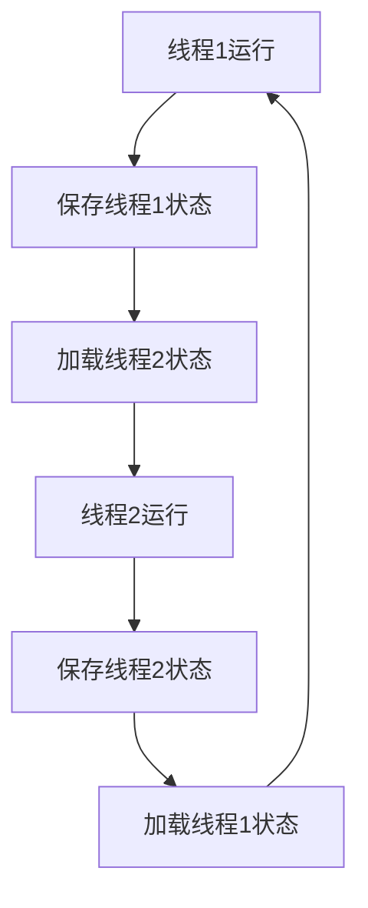

## 介绍

在现代操作系统中，线程是并发执行的基本单位。线程允许程序同时执行多个任务，从而提高应用程序的响应性和性能。然而，尽管线程提供了许多优势，但它们也存在一些局限性。本文将探讨操作系统线程的局限性，包括资源消耗、上下文切换开销以及线程管理的复杂性。

## 线程的局限性

### 1. 资源消耗

每个线程都需要一定的系统资源，包括内存和 CPU 时间。创建大量线程可能会导致系统资源耗尽，从而影响系统的整体性能。

```python
import threading

def worker():
    print("Worker thread is running")

threads = []
for i in range(1000):
    t = threading.Thread(target=worker)
    threads.append(t)
    t.start()

for t in threads:
    t.join()
```

在上面的代码中，我们尝试创建 1000 个线程。虽然这在某些系统上可能运行良好，但在资源有限的系统上，这可能会导致内存不足或 CPU 过载。

### 2. 上下文切换开销

线程之间的切换（称为上下文切换）需要保存和恢复线程的状态。这个过程会消耗 CPU 时间，尤其是在线程数量较多的情况下。



:::note
上下文切换的开销随着线程数量的增加而增加，这可能会降低系统的整体性能。
:::

### 3. 线程管理的复杂性

管理多个线程可能会变得非常复杂，尤其是在需要同步和通信的情况下。线程之间的竞争条件和死锁是常见的问题。

```python
import threading

counter = 0
lock = threading.Lock()

def increment():
    global counter
    for _ in range(100000):
        with lock:
            counter += 1

threads = []
for i in range(10):
    t = threading.Thread(target=increment)
    threads.append(t)
    t.start()

for t in threads:
    t.join()

print(f"Final counter value: {counter}")
```

在上面的代码中，我们使用锁来确保线程安全地增加计数器。然而，锁的使用增加了代码的复杂性，并且可能导致性能下降。

## 实际案例

### 案例 1: Web 服务器

在一个高并发的 Web 服务器中，每个请求通常由一个单独的线程处理。如果同时有数千个请求，服务器可能会创建大量线程，导致资源耗尽和性能下降。

### 案例 2: 游戏服务器

在游戏服务器中，每个玩家可能需要一个线程来处理其动作。如果游戏中有大量玩家，线程数量可能会迅速增加，导致上下文切换开销增加，从而影响游戏性能。

## 总结

尽管线程提供了并发执行的能力，但它们也存在一些局限性，包括资源消耗、上下文切换开销以及线程管理的复杂性。理解这些局限性有助于我们在设计和实现多线程应用程序时做出更好的决策。

## 附加资源

- [Python 官方文档 - 线程](https://docs.python.org/3/library/threading.html)
- [操作系统概念 - 线程管理](https://www.os-book.com/)

## 练习

1. 修改上面的 Python 代码，尝试创建 5000 个线程，观察系统行为。
2. 研究并实现一个线程池，以减少线程创建和销毁的开销。
3. 编写一个多线程程序，模拟生产者-消费者问题，并观察线程同步的复杂性。

:::tip
在实际应用中，考虑使用线程池或其他并发模型（如异步编程）来减少线程管理的复杂性。
:::