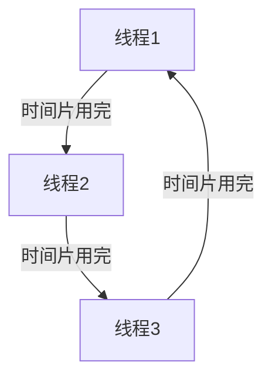

## 介绍

线程是操作系统中的基本执行单元，它允许程序在同一进程中并发执行多个任务。线程的实现方式对程序的性能和资源管理有重要影响。操作系统通常通过两种方式实现线程：**用户级线程**和**内核级线程**。本文将详细介绍这两种实现方式，并探讨它们的优缺点。

## 用户级线程

用户级线程（User-Level Threads, ULT）是由用户空间的线程库（如 POSIX 的 `pthread` 库）管理的线程。操作系统并不知道这些线程的存在，线程的创建、调度和同步都由用户空间的库处理。

### 优点
- **轻量级**：用户级线程的创建和销毁开销较小，因为它们不需要操作系统的干预。
- **灵活性**：线程调度策略可以由应用程序自定义，而不受操作系统的限制。

### 缺点
- **阻塞问题**：如果一个用户级线程执行了阻塞操作（如 I/O 操作），整个进程都会被阻塞，因为操作系统只看到进程，而不是线程。
- **多核利用不足**：用户级线程无法直接利用多核处理器的并行能力，因为它们被限制在单个内核上运行。

### 代码示例

以下是一个简单的用户级线程示例，使用 `pthread` 库创建两个线程：

```c
#include <pthread.h>
#include <stdio.h>

void* print_message(void* message) {
    printf("%s\n", (char*)message);
    return NULL;
}

int main() {
    pthread_t thread1, thread2;
    char* message1 = "Hello from Thread 1";
    char* message2 = "Hello from Thread 2";

    pthread_create(&thread1, NULL, print_message, (void*)message1);
    pthread_create(&thread2, NULL, print_message, (void*)message2);

    pthread_join(thread1, NULL);
    pthread_join(thread2, NULL);

    return 0;
}
```

**输出：**
```
Hello from Thread 1
Hello from Thread 2
```

## 内核级线程

内核级线程（Kernel-Level Threads, KLT）是由操作系统内核直接管理的线程。每个内核级线程都对应一个内核中的调度实体，操作系统可以独立调度这些线程。

### 优点
- **多核利用**：内核级线程可以在多个 CPU 核心上并行执行，充分利用多核处理器的性能。
- **阻塞处理**：如果一个内核级线程阻塞，其他线程仍然可以继续执行，因为操作系统知道每个线程的存在。

### 缺点
- **开销较大**：内核级线程的创建、销毁和上下文切换需要操作系统的干预，因此开销较大。
- **灵活性较低**：线程调度策略由操作系统决定，应用程序无法自定义。

### 代码示例

以下是一个简单的内核级线程示例，使用 `pthread` 库创建两个线程：

```c
#include <pthread.h>
#include <stdio.h>

void* print_message(void* message) {
    printf("%s\n", (char*)message);
    return NULL;
}

int main() {
    pthread_t thread1, thread2;
    char* message1 = "Hello from Kernel Thread 1";
    char* message2 = "Hello from Kernel Thread 2";

    pthread_create(&thread1, NULL, print_message, (void*)message1);
    pthread_create(&thread2, NULL, print_message, (void*)message2);

    pthread_join(thread1, NULL);
    pthread_join(thread2, NULL);

    return 0;
}
```

**输出：**
```
Hello from Kernel Thread 1
Hello from Kernel Thread 2
```

:::note
虽然代码示例看起来与用户级线程相似，但在内核级线程的实现中，操作系统会为每个线程分配独立的调度实体。
:::

## 线程调度

线程调度是操作系统决定哪个线程在何时执行的过程。调度策略可以是**抢占式**或**非抢占式**的。

### 抢占式调度
在抢占式调度中，操作系统可以随时中断当前运行的线程，并将 CPU 分配给另一个线程。这种调度方式适用于需要快速响应的系统。

### 非抢占式调度
在非抢占式调度中，线程会一直运行，直到它主动放弃 CPU 或完成执行。这种调度方式适用于需要高吞吐量的系统。



## 实际应用场景

### 1. Web 服务器
Web 服务器通常使用多线程来处理多个客户端请求。每个请求可以由一个独立的线程处理，从而提高并发性能。

### 2. 游戏开发
在游戏开发中，线程可以用于并行处理图形渲染、物理模拟和用户输入等任务，以提高游戏的响应速度和流畅度。

### 3. 数据库系统
数据库系统使用线程来并行处理多个查询请求，从而提高查询效率和系统吞吐量。

## 总结

线程是操作系统中的重要概念，它允许程序在同一进程中并发执行多个任务。用户级线程和内核级线程各有优缺点，适用于不同的应用场景。理解线程的实现方式和调度策略对于编写高效、并发的程序至关重要。

## 附加资源

- **书籍**：《操作系统概念》（Operating System Concepts）是一本深入讲解操作系统原理的经典书籍。
- **练习**：尝试编写一个多线程程序，模拟一个简单的任务调度系统，观察不同调度策略的效果。

:::tip
如果你对线程的实现和调度有更多疑问，可以参考操作系统的官方文档或相关的开源项目代码。
:::