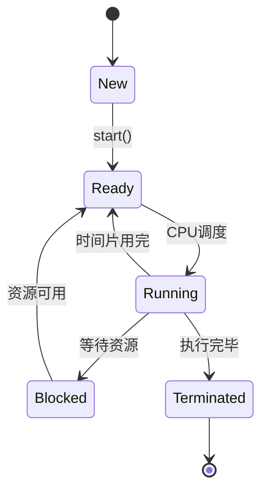

# 操作系统线程状态

在操作系统中，线程是执行程序的最小单位。线程的状态描述了线程在其生命周期中的不同阶段。理解线程状态及其转换是掌握多线程编程的基础。本文将详细介绍操作系统中的线程状态及其实际应用。

## 线程状态概述

线程在其生命周期中会经历多种状态。常见的线程状态包括：

1. **新建（New）**：线程被创建但尚未启动。
2. **就绪（Ready）**：线程已准备好运行，等待CPU调度。
3. **运行（Running）**：线程正在CPU上执行。
4. **阻塞（Blocked）**：线程因等待某些资源（如I/O操作）而暂停执行。
5. **终止（Terminated）**：线程执行完毕或被强制终止。

## 线程状态转换

线程状态之间的转换是动态的，通常由操作系统的调度器管理。以下是线程状态之间的典型转换：



### 1. 新建（New）到就绪（Ready）

当线程被创建后，它处于新建状态。调用 `start()` 方法后，线程进入就绪状态，等待CPU调度。

```python
import threading

def worker():
    print("线程正在运行")

# 创建线程
t = threading.Thread(target=worker)
# 线程处于新建状态
t.start()  # 线程进入就绪状态
```

### 2. 就绪（Ready）到运行（Running）

当CPU调度器选择了一个就绪状态的线程时，线程进入运行状态，开始执行其任务。

### 3. 运行（Running）到阻塞（Blocked）

当线程需要等待某些资源（如I/O操作）时，它会从运行状态转换为阻塞状态。例如，线程在读取文件时可能会进入阻塞状态。

```python
import time

def worker():
    print("线程开始运行")
    time.sleep(2)  # 模拟I/O操作，线程进入阻塞状态
    print("线程恢复运行")

t = threading.Thread(target=worker)
t.start()
```

### 4. 阻塞（Blocked）到就绪（Ready）

当线程等待的资源可用时，它会从阻塞状态转换回就绪状态，等待CPU调度。

### 5. 运行（Running）到终止（Terminated）

当线程完成任务或被强制终止时，它会进入终止状态。

```python
def worker():
    print("线程正在运行")
    # 线程执行完毕，进入终止状态

t = threading.Thread(target=worker)
t.start()
t.join()  # 等待线程终止
print("线程已终止")
```

## 实际应用场景

### 多线程下载器

在多线程下载器中，每个下载任务可以作为一个独立的线程运行。当一个线程等待网络数据时，它会进入阻塞状态，而其他线程可以继续下载其他文件。

```python
import threading
import requests

def download_file(url, filename):
    response = requests.get(url)
    with open(filename, 'wb') as file:
        file.write(response.content)
    print(f"{filename} 下载完成")

urls = ["http://example.com/file1", "http://example.com/file2"]
threads = []

for i, url in enumerate(urls):
    t = threading.Thread(target=download_file, args=(url, f"file{i+1}.txt"))
    threads.append(t)
    t.start()

for t in threads:
    t.join()

print("所有文件下载完成")
```

## 总结

线程状态是操作系统管理线程执行的基础。理解线程状态及其转换有助于编写高效的多线程程序。通过实际案例，我们可以看到线程状态在多线程应用中的重要性。

## 附加资源

- [Python threading 模块文档](https://docs.python.org/3/library/threading.html)
- [操作系统线程管理](https://en.wikipedia.org/wiki/Thread_(computing))

## 练习

1. 编写一个多线程程序，模拟多个线程同时执行任务，并观察线程状态的转换。
2. 修改上述多线程下载器，使其能够处理更多的下载任务，并优化线程的调度。
