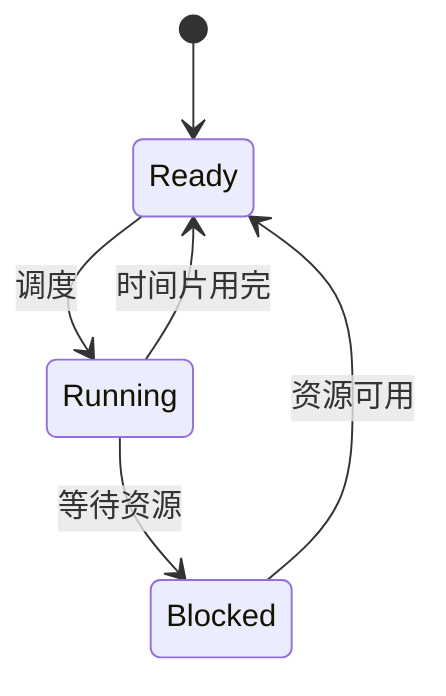
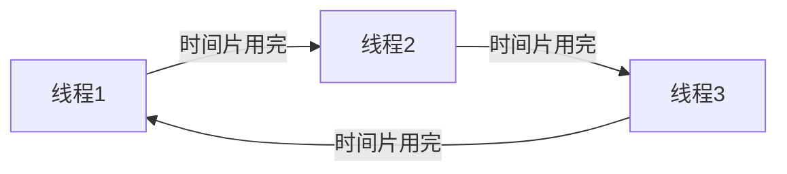

## 介绍

在现代操作系统中，线程是执行任务的基本单位。为了高效地利用 CPU 资源，操作系统需要决定哪个线程在何时运行。这个过程被称为**线程调度**。线程调度是操作系统的核心功能之一，它直接影响系统的性能、响应时间和资源利用率。

本文将逐步讲解线程调度的基本概念、常见的调度算法以及实际应用场景，帮助你理解操作系统如何管理线程的执行。

## 线程调度的基本概念

### 什么是线程调度？

线程调度是指操作系统决定哪个线程在何时使用 CPU 的过程。操作系统通过调度算法从多个就绪状态的线程中选择一个线程，并将其分配给 CPU 执行。

### 线程的状态

在了解调度之前，我们需要先了解线程的几种状态：

1. **就绪状态（Ready）**：线程已经准备好运行，等待 CPU 分配时间片。
2. **运行状态（Running）**：线程正在 CPU 上执行。
3. **阻塞状态（Blocked）**：线程由于等待某些资源（如 I/O 操作）而暂时无法运行。

### 调度器（Scheduler）

调度器是操作系统的一部分，负责管理线程的调度。它根据调度算法决定哪个线程应该获得 CPU 时间。

## 常见的线程调度算法

### 1. 先来先服务（FCFS, First-Come, First-Served）

FCFS 是最简单的调度算法，它按照线程到达就绪队列的顺序进行调度。先到达的线程先执行，直到完成。

**优点**：实现简单，公平。

**缺点**：可能导致“饥饿”现象，即长任务阻塞短任务的执行。

### 2. 最短作业优先（SJF, Shortest Job First）

SJF 算法优先调度执行时间最短的线程。它可以是抢占式的（Preemptive）或非抢占式的（Non-Preemptive）。

**优点**：减少平均等待时间。

**缺点**：可能导致长任务长时间得不到执行。

### 3. 时间片轮转（Round Robin）

时间片轮转算法为每个线程分配一个固定的时间片（Time Slice），当时间片用完后，线程被放回就绪队列的末尾，等待下一次调度。

**优点**：公平，每个线程都能获得 CPU 时间。

**缺点**：时间片设置过小会导致频繁的上下文切换，降低系统性能。

### 4. 优先级调度（Priority Scheduling）

优先级调度算法根据线程的优先级进行调度。优先级高的线程优先获得 CPU 时间。优先级可以是静态的（固定不变）或动态的（根据运行情况调整）。

**优点**：灵活，可以根据任务的重要性进行调度。

**缺点**：低优先级线程可能长时间得不到执行。

## 实际应用场景

### 案例：多任务操作系统

在现代多任务操作系统中，线程调度是确保多个应用程序能够同时运行的关键。例如，当你同时打开浏览器、音乐播放器和文本编辑器时，操作系统需要在这些应用程序之间分配 CPU 时间，以确保它们都能正常运行。

### 案例：实时系统

在实时系统中，线程调度需要确保关键任务能够在规定的时间内完成。例如，在自动驾驶汽车中，传感器数据的处理线程必须优先于其他非关键任务，以确保车辆能够及时做出反应。

## 总结

线程调度是操作系统管理 CPU 资源的核心机制。通过合理的调度算法，操作系统能够高效地分配 CPU 时间，确保系统的性能和响应时间。常见的调度算法包括 FCFS、SJF、时间片轮转和优先级调度，每种算法都有其优缺点，适用于不同的应用场景。

## 附加资源与练习

### 附加资源

- [操作系统概念（第10版）](https://www.os-book.com/)：深入讲解操作系统的基本概念，包括线程调度。
- [Linux 内核调度器](https://www.kernel.org/doc/html/latest/scheduler/index.html)：了解 Linux 内核中的调度器实现。

### 练习

1. 编写一个简单的多线程程序，模拟 FCFS 和 Round Robin 调度算法。
2. 研究你使用的操作系统（如 Windows 或 Linux）的调度算法，并尝试调整线程优先级，观察其对程序运行的影响。

:::tip
在编写多线程程序时，务必注意线程安全问题，避免竞态条件和死锁。
:::